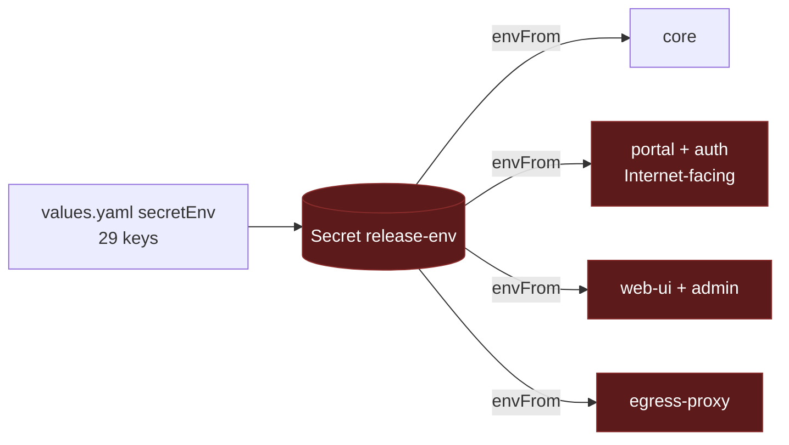
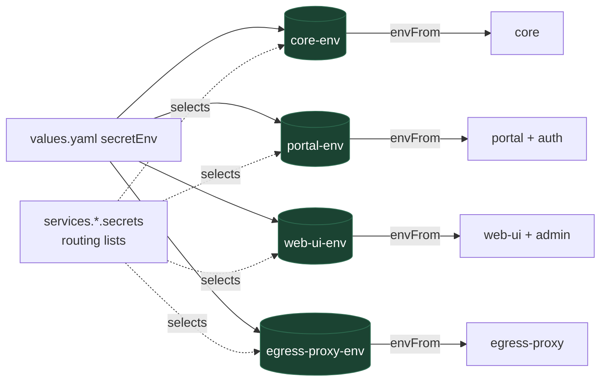

# One Secret per workload in the Helm chart

Stop handing every secret to every pod.

This is the implementation plan for the first, self-contained step of the
secretless work: make the Helm chart render one `Secret` per Deployment and
attach only that one. It needs no change to core, the plugins, or the CLI, and
it is a prerequisite for per-workload identity, which lands separately. File
and line citations are against the tree at upstream `bfb1ed1`. The proposal for
upstream is
[`adrs/helm-per-service-secrets.md`](../adrs/helm-per-service-secrets.md).

## Context

The chart at `deploy/helm/` renders `values.yaml` `secretEnv` into a single
`Secret` named `<fullname>-env` and attaches it with an unconditional `envFrom`
to every Deployment it creates, which are core, web-ui, portal, and egress-proxy[^helmenvfrom]. Admin runs inside web-ui and auth inside portal, so four
Deployments carry the whole map.

The consequence is that the one Internet-facing pod, portal, holds
`ANTHROPIC_API_KEY`, `DATABASE_URL`, `CONNECTOR_SECRET_KEY`,
`SKILL_SIGNING_SECRET`, `CAPABILITY_SECRET`, and the Admin-role
`PORTER_DEPLOY_API_TOKEN`, none of which it reads. A portal compromise is a
database compromise, a model-billing compromise, and a Porter-project
compromise in one step. The web-ui and egress-proxy pods hold the same set.

The per-service routing already exists on the other targets. In the CLI,
`SecretSpec.service` names the service each secret belongs to,
`computedSecrets` collapses the specs into one entry per secret with a service
list and per-service aliases, `secretDestinations` maps each entry to the
workload that hosts the service, and `secretsForService` answers "what does
this task definition get"[^clirouting]. `docs/porter.md` hand-copies the same
table for operators applying with `porter apply --secrets`[^portersecrets].
The chart ignores both, and the CLI has no Kubernetes target that could emit
into it[^clibackends].

Non-secrets live in the same Secret: `PUBLIC_API_URL`, `SANDBOX_BACKEND`,
`DEPLOY_PROVIDER`, the `PORTER_*_ID` values, the two image names, the two apps
domains, `AUTH_ALLOWED_EMAILS`, `AUTH_CLIENT_ID`, `OIDC_CLIENT_ID`, and
`AUTH_EMAIL_FROM`. They are there because `secretEnv` is the only per-release
map the chart offers that reaches every pod.



## Goals

- Each Deployment receives exactly the secrets its processes read, and nothing
  else. The portal pod stops holding the database, model, and Porter
  credentials.
- The routing lives in the chart as data an operator can read and override,
  and matches the CLI's routing for the services the CLI knows about.
- A change to one workload's secrets rolls only that workload.
- Existing releases upgrade with one values change and one rolling restart.

## Non-goals

- Changing what any process reads. Core, the plugins, and the egress authz
  keep reading `process.env`; only the environment they are given shrinks.
- Per-service ServiceAccounts, projected tokens, or any identity change. Those
  are the next step and depend on this one.
- External Secrets Operator or any other carrier. This design decides which
  keys reach which pod; where the values come from is unchanged. An
  `ExternalSecret` per workload slots into the same shape later.
- Teaching the CLI about Kubernetes. The chart carries its own routing table
  for now; rendering it from the CLI's spec list is a later reconciliation.
- Changing the Porter manifests. `porter apply --secrets` already scopes per
  app; the table below becomes the reference it should follow.

## Who reads what

The routing is derived from the code, not from the current `secretEnv`. Core
is `src/config.ts` and the modules it wires; portal, auth, web-ui, and admin
are their plugin entrypoints plus the chassis, which reads the two shared keys
on behalf of every plugin[^chassisreads]; egress-proxy is
`src/egress-authz-main.ts`, which the CLI's spec list does not know at
all[^egressenv].

| Deployment       | Hosts         | Secrets read                                                                                                                                                                                                                                                                                                                                                                                                                                                                                                                                                                                                                                                                                                                                                                                                                                                        | Non-secrets currently in `secretEnv`                                                                                                                                                                                                                                                                                            |
| ---------------- | ------------- | ------------------------------------------------------------------------------------------------------------------------------------------------------------------------------------------------------------------------------------------------------------------------------------------------------------------------------------------------------------------------------------------------------------------------------------------------------------------------------------------------------------------------------------------------------------------------------------------------------------------------------------------------------------------------------------------------------------------------------------------------------------------------------------------------------------------------------------------------------------------- | ------------------------------------------------------------------------------------------------------------------------------------------------------------------------------------------------------------------------------------------------------------------------------------------------------------------------------- |
| **core**         | core, slack   | `CORE_SIGNING_SECRET`, `CAPABILITY_SECRET`, `PORTAL_IDENTITY_SECRET`, `CONNECTOR_SECRET_KEY`, `SKILL_SIGNING_SECRET`, `ANTHROPIC_API_KEY`, `OPENAI_API_KEY`, `OPENROUTER_API_KEY`, `MODEL_GATEWAY_API_KEY`, `DATABASE_URL`, `DATABASE_POOL_URL`, `PORTER_DEPLOY_API_TOKEN`, `FLY_DEPLOY_API_TOKEN`, the sandbox vendor keys, `AWS_DEPLOY_GATE_SECRET`, `DEPLOY_APPS_SESSION_SECRET`, the seven `*_OAUTH_CLIENT_SECRET` values, `SLACK_BOT_TOKEN`, `SLACK_APP_TOKEN`, `SLACK_USER_TOKEN`, `SLACK_COPILOT_BOT_TOKEN`, `SLACK_SIGNING_SECRET`, `SECURITY_SCREEN_PROXY_TOKEN`, `RESEND_API_KEY`, the harness credentials `ANTHROPIC_AUTH_TOKEN`, `CLAUDE_CODE_OAUTH_TOKEN`, `CLAUDE_AUTH_CREDENTIAL`, `CODEX_ACCESS_TOKEN`, and `CODEX_AUTH_CREDENTIAL`[^harnesscreds], and `PORTAL_SESSION_SECRET` only as the fallback for `DEPLOY_APPS_SESSION_SECRET`[^coresession] | `PUBLIC_API_URL`, `ADMIN_GRANTS`, `SANDBOX_BACKEND`, `DEPLOY_PROVIDER`, `PORTER_DEPLOY_URL`, `PORTER_DEPLOY_PROJECT_ID`, `PORTER_DEPLOY_CLUSTER_ID`, `PORTER_SANDBOX_IMAGE`, `PORTER_DEPLOY_RUNNER_IMAGE`, `DEPLOY_APPS_DOMAIN`, `PORTER_DEPLOY_APPS_DOMAIN`, `AUTH_ALLOWED_EMAILS`, `AUTH_EMAIL_FROM`, the two CA certificates |
| **portal**       | portal, auth  | `CORE_SIGNING_SECRET`, `PORTAL_IDENTITY_SECRET`, `PORTAL_SESSION_SECRET`, `PORTAL_TRUSTED_OIDC_CLIENT_SECRET`, `OIDC_CLIENT_SECRET` (aliased from `AUTH_CLIENT_SECRET` when unset), `AUTH_CLIENT_SECRET`, `AUTH_TOKEN_SECRET`, `AUTH_SIGNING_JWK`, `RESEND_API_KEY`, `SMTP_PASSWORD`[^authmail]                                                                                                                                                                                                                                                                                                                                                                                                                                                                                                                                                                     | `OIDC_CLIENT_ID` (aliased from `AUTH_CLIENT_ID`), `AUTH_CLIENT_ID`, `AUTH_ALLOWED_EMAILS` and its `OIDC_ALLOWED_EMAILS` alias, `AUTH_EMAIL_FROM`, `SMTP_HOST`, `SMTP_USERNAME`, `DEPLOY_APPS_DOMAIN`[^portaldomain]                                                                                                             |
| **web-ui**       | web-ui, admin | `CORE_SIGNING_SECRET`, `PORTAL_IDENTITY_SECRET`[^chassisreads]                                                                                                                                                                                                                                                                                                                                                                                                                                                                                                                                                                                                                                                                                                                                                                                                      | `DEPLOY_APPS_DOMAIN`, for the frame-ancestors policy[^webuidomain]                                                                                                                                                                                                                                                              |
| **egress-proxy** | egress authz  | `CORE_SIGNING_SECRET`, `CAPABILITY_SECRET`; `DATABASE_URL` only when no core relay is configured, and the chart always wires one[^egressenv]                                                                                                                                                                                                                                                                                                                                                                                                                                                                                                                                                                                                                                                                                                                        | none                                                                                                                                                                                                                                                                                                                            |

Four rows deserve a note.

- The core list is longer than the chart's `secretEnv` declares. The current
  template forwards any key an operator adds to the map[^secretrange], so a
  Slack-enabled release already carries `SLACK_BOT_TOKEN` and `SLACK_APP_TOKEN`
  through it, and a Modal-backed one carries `MODAL_TOKEN_ID` and
  `MODAL_TOKEN_SECRET`. The defaults have to list every secret name core reads,
  not just the 29 the values file mentions, or those releases fail to upgrade.
  The list is the CLI's spec list plus core's runtime schema plus the reads
  outside both[^coresecrets], and the reads outside both include the
  alternative harness credentials: a Claude subscription token or keychain
  credential instead of `ANTHROPIC_API_KEY`, and a ChatGPT token or keychain
  credential instead of `OPENAI_API_KEY`[^harnesscreds]. The first draft of
  this list missed those, which is why the render check does not trust the
  list alone.
- The web-ui pod today holds every one of the 29 values and needs three: the
  two shared keys the chassis reads, and the apps domain for its
  `frame-ancestors` policy. The first draft of this table said two; the domain
  read is in the server, not the plugin, and a missing value degrades silently
  to no framing rather than failing.
- The egress-proxy authz reads `DATABASE_URL`, but only as the audit sink it
  falls back to when it has no core relay, and the chart wires `CORE_API_URL`
  on every non-core Deployment[^egressenv]. So the routed set is the two keys,
  and the database credential reaches one pod, not two.
- Core's `PORTAL_SESSION_SECRET` read is a fallback for a cookie key the CLI
  never declares[^coresession]. Routing the portal's cookie key into core keeps
  today's behavior; the cleaner state is to set `DEPLOY_APPS_SESSION_SECRET` in
  core and keep `PORTAL_SESSION_SECRET` in the portal alone, which the default
  routing supports by listing both keys and leaving the operator to fill one.

## Proposed design

### Values shape

`secretEnv` keeps its shape: one flat map, the one place an operator types
values, so no value is entered twice. Routing is a list of key names per
declared service, shipped with defaults that encode the table above. The
defaults list every secret name the code reads, including the ones the chart's
`secretEnv` does not declare today (`SLACK_BOT_TOKEN`, the sandbox vendor
keys, `OPENAI_API_KEY`, `DEPLOY_APPS_SESSION_SECRET`,
`PORTAL_TRUSTED_OIDC_CLIENT_SECRET`[^trustedentry], and the rest of the core
row); an empty or absent value is skipped, so listing them costs nothing and
routes them correctly once set.

```yaml
services:
  core:
    secrets:
      - CORE_SIGNING_SECRET
      - CAPABILITY_SECRET
      - PORTAL_IDENTITY_SECRET
      - CONNECTOR_SECRET_KEY
      - SKILL_SIGNING_SECRET
      - ANTHROPIC_API_KEY
      - OPENAI_API_KEY
      - OPENROUTER_API_KEY
      - MODEL_GATEWAY_API_KEY
      - DATABASE_URL
      - DATABASE_POOL_URL
      - DATABASE_POOL_CA_CERT
      - DATABASE_CA_CERT
      - PORTER_DEPLOY_API_TOKEN
      - FLY_DEPLOY_API_TOKEN
      - SPRITES_TOKEN
      - E2B_API_KEY
      - MODAL_TOKEN_ID
      - MODAL_TOKEN_SECRET
      - SMOLMACHINES_TOKEN
      - AGENT37_API_KEY
      - AWS_DEPLOY_GATE_SECRET
      - DEPLOY_APPS_SESSION_SECRET
      - PORTAL_SESSION_SECRET
      - GOOGLE_OAUTH_CLIENT_SECRET
      - DROPBOX_OAUTH_CLIENT_SECRET
      - LINEAR_OAUTH_CLIENT_SECRET
      - SLACK_OAUTH_CLIENT_SECRET
      - NOTION_OAUTH_CLIENT_SECRET
      - GITHUB_OAUTH_CLIENT_SECRET
      - X_OAUTH_CLIENT_SECRET
      - SLACK_BOT_TOKEN
      - SLACK_APP_TOKEN
      - SLACK_USER_TOKEN
      - SLACK_COPILOT_BOT_TOKEN
      - SLACK_SIGNING_SECRET
      - ANTHROPIC_AUTH_TOKEN
      - CLAUDE_CODE_OAUTH_TOKEN
      - CLAUDE_AUTH_CREDENTIAL
      - CODEX_ACCESS_TOKEN
      - CODEX_AUTH_CREDENTIAL
      - SECURITY_SCREEN_PROXY_TOKEN
      - RESEND_API_KEY
      - PUBLIC_API_URL
      - ADMIN_GRANTS
      - SANDBOX_BACKEND
      - DEPLOY_PROVIDER
      - PORTER_DEPLOY_URL
      - PORTER_DEPLOY_PROJECT_ID
      - PORTER_DEPLOY_CLUSTER_ID
      - PORTER_SANDBOX_IMAGE
      - PORTER_DEPLOY_RUNNER_IMAGE
      - DEPLOY_APPS_DOMAIN
      - PORTER_DEPLOY_APPS_DOMAIN
      - AUTH_ALLOWED_EMAILS
      - AUTH_EMAIL_FROM
  auth:
    secrets:
      - AUTH_CLIENT_ID
      - AUTH_CLIENT_SECRET
      - AUTH_TOKEN_SECRET
      - AUTH_SIGNING_JWK
      - AUTH_ALLOWED_EMAILS
      - AUTH_EMAIL_FROM
      - RESEND_API_KEY
      - SMTP_HOST
      - SMTP_USERNAME
      - SMTP_PASSWORD
  portal:
    secrets:
      - CORE_SIGNING_SECRET
      - PORTAL_IDENTITY_SECRET
      - PORTAL_SESSION_SECRET
      - PORTAL_TRUSTED_OIDC_CLIENT_SECRET
      - OIDC_CLIENT_ID
      - OIDC_CLIENT_SECRET
      - OIDC_ALLOWED_EMAILS
      - DEPLOY_APPS_DOMAIN
  admin:
    secrets: []
  web-ui:
    secrets:
      - CORE_SIGNING_SECRET
      - PORTAL_IDENTITY_SECRET
      - DEPLOY_APPS_DOMAIN
  egress-proxy:
    secrets:
      - CORE_SIGNING_SECRET
      - CAPABILITY_SECRET
```

A list rather than a map, because the values already live in `secretEnv` and
a second map would invite typing them twice. A list per declared service
rather than per Deployment, because admin and auth are declared services with
their own reads, and the chart already merges an embedded component's `env`
into its host[^helmembed]; the same merge applies to `secrets`. Helm replaces
a list wholesale on override, which is the right semantics for a routing
table: an operator who overrides `services.portal.secrets` states the whole
set.

A name in `secretEnv` with a non-empty value that no enabled workload
_consumes_ is a render failure naming the key. Consumed means one of two
things: an enabled workload lists the name, or an enabled workload emits an
alias whose source the name is. The renderer builds each workload's output
map and records which inputs it read while doing so, then checks every
non-empty input against that set. The distinction matters for the aliases:
with the embedded broker disabled, `AUTH_CLIENT_ID` and `AUTH_CLIENT_SECRET`
are listed only by the disabled `auth` service, yet an external-OIDC release
that supplies them as its only client credentials gets `OIDC_CLIENT_ID` and
`OIDC_CLIENT_SECRET` from the aliases today and must keep doing so. A rule
that looked only at enabled lists would fail that upgrade. Under the
consumed-input rule the portal reads both sources while emitting the aliases,
so they count; an `AUTH_*` value shadowed by an explicit `OIDC_*` value is not
read by the alias and, if no enabled service lists it, fails as unused, which
is the right answer for a leftover. That catches the habit this change is
removing: adding a key to `secretEnv` and expecting it to appear everywhere.
It also means an operator who has been carrying a non-secret setting or a
plugin's secret through `secretEnv` sees each such key named at `helm upgrade`
and moves it, one line each, to `env`, to `services.<name>.env`, or to the
service's `secrets` list. A listed name with an empty or absent value is
skipped, as today, so the defaults can list optional keys without forcing
them.

Each service also gains `services.<name>.envFrom`, the scoped form of the
top-level `envFrom` list. The top-level list stays and keeps its meaning,
which is shared by every Deployment[^envfromvalue]; it is the operator's
escape hatch, and the values file says so.

### Templates

A named template, `qm.workloadSecret`, takes `(dict "root" $ "service"
$name)` and renders one `Secret` named `<fullname>-<service>-env` containing
the union of the host's list and its embedded component's list, filtered to
non-empty values. `templates/secret.yaml` ranges over the rendered
Deployments and includes it once each. The three aliases the current template renders[^helmalias] move with their
consumer and keep their rule: `OIDC_CLIENT_ID`, `OIDC_CLIENT_SECRET`, and
`OIDC_ALLOWED_EMAILS` are filled from `AUTH_CLIENT_ID`, `AUTH_CLIENT_SECRET`,
and `AUTH_ALLOWED_EMAILS` inside the portal Secret whenever the `AUTH_*` source
is set and the `OIDC_*` value is unset, with no dependence on
`services.auth.enabled`. The current template has no such dependence either,
and an earlier draft of this document added one. That would have been a
silent behavior change: an external-OIDC deployment with the embedded broker
disabled that sets `AUTH_ALLOWED_EMAILS` and not `OIDC_ALLOWED_EMAILS` today
gets `OIDC_ALLOWED_EMAILS` from the alias, and the portal applies its
allow-list only when that value is non-empty[^portalallow]. Dropping the alias when auth is disabled would have removed that sign-in
restriction, and the unrouted-key check would not have noticed, because core
lists `AUTH_ALLOWED_EMAILS` too. With `OIDC_ALLOWED_EMAIL_DOMAIN` or
`PORTAL_EXPECTED_TEAM_ID` also set, the restriction would have widened
silently from a list to a domain or a team; with neither set, the portal
refuses to boot in production, which is the one fail-closed case[^portalallow]. So the alias condition is exactly today's. An
explicitly supplied `OIDC_*` value always wins over the alias, and
`OIDC_ALLOWED_EMAILS` is on the portal's routing list so an operator who
supplies it directly is routed rather than failed. The CLI expresses the same
alias with `envName`[^clialias].

`templates/deployment.yaml` attaches `<fullname>-<service>-env` by
`secretRef`, then the workload's own `envFrom`, then its enabled embedded
component's `envFrom` (auth into portal, admin into web-ui, the same merge the
chart applies to `env` and this design applies to `secrets`), then the shared top-level list. A disabled component contributes nothing.
Kubernetes resolves a key that appears in more than one `envFrom` entry to
the last one, so the shared list wins over the chart's Secret, which is
today's order as well[^envfromvalue]. Nothing else from `secretEnv` reaches
the pod.

The `checksum/secret-env` annotation includes `qm.workloadSecret` with the
same `dict` and hashes that, rather than the whole `secret.yaml`
render[^helmchecksum]. Including the file would hash every workload's Secret
and roll every pod on any change, which is what happens today; including the named template for this service hashes this service's Secret
only. Rotating `AUTH_SIGNING_JWK`, which only the portal Secret carries, rolls
the portal and nothing else; rotating `PORTAL_SESSION_SECRET` rolls the portal
and core, because core lists it as the fallback cookie key, until the operator
sets `DEPLOY_APPS_SESSION_SECRET` and drops the shared one from core's list.



### What the rendered portal Secret contains afterwards

With the defaults and the embedded broker, the portal pod's Secret holds
`CORE_SIGNING_SECRET`, `PORTAL_IDENTITY_SECRET`, `PORTAL_SESSION_SECRET`,
`AUTH_CLIENT_ID`, `AUTH_CLIENT_SECRET`, `AUTH_TOKEN_SECRET`,
`AUTH_SIGNING_JWK`, `AUTH_ALLOWED_EMAILS`, `AUTH_EMAIL_FROM`, `RESEND_API_KEY`,
`DEPLOY_APPS_DOMAIN`, and the three `OIDC_*` aliases. It no longer holds
`ANTHROPIC_API_KEY`, `DATABASE_URL`, `CONNECTOR_SECRET_KEY`,
`SKILL_SIGNING_SECRET`, `CAPABILITY_SECRET`, `PORTER_DEPLOY_API_TOKEN`, or any
`PORTER_*` value. That is the acceptance test, and it is checked in CI.

### Verification

The repository has no chart test today; `scripts/deploy-helm.sh` packages and
installs, and nothing renders the chart in CI[^helmci]. This change adds a
render check that any contributor can run:

```sh
helm lint deploy/helm
helm template qm deploy/helm -f deploy/helm/ci/values.yaml > /tmp/render.yaml
```

with assertions over the render: exactly one `Secret` per enabled
Deployment; each Secret's keys equal to the table above for a values file that
sets every routed key; the portal Secret free of the six keys above and of
every `PORTER_*` value; every Deployment's `envFrom` carrying exactly one
chart-rendered `secretRef` and it its own; and a values file with an unrouted
key failing with the key's name in the message. Fixtures cover the alternative
harness credential paths (`CLAUDE_CODE_OAUTH_TOKEN` and `CODEX_ACCESS_TOKEN`
set, the API keys unset) and assert core's Secret carries them.

Comparing the render to a hand-maintained table cannot catch a name missing
from both, so a second check derives the expected set from the code. It scans `src/`
and the plugins for member reads of the form `env.NAME` and
`process.env.NAME`, because core reads its environment through a function
parameter named `env` rather than `process.env`[^envparam], and for
string-valued env-name fields such as `clientSecretEnv`. Computed reads
through `process.env[name]` are invisible to a scan and are listed by
hand[^computedreads]. Every name found that matches `TOKEN`, `SECRET`, `KEY`,
`PASSWORD`, or `CREDENTIAL` must appear in some routing list or in a short,
explicit exclusion list of names that match the pattern and are not secrets
(`MAX_CONTEXT_TOKENS`, `EGRESS_TOKENLESS`, `SECRETS_BACKEND`,
`SECRETS_PREFIX`, `AWS_DEPLOY_TOKEN_TTL_MIN`, `MODEL_GATEWAY_API_KEY_HEADER`,
`OIDC_TOKEN_ENDPOINT`) or are minted at runtime and never deployed
(`AGENT_CREDENTIAL_TOKEN`, `OPENCODE_BRIDGE_SECRET`). A new credential read
fails that check until someone routes it.

The alias and embedded-component behavior has its own fixtures: an
external-OIDC values file with `services.auth.enabled=false`,
`AUTH_CLIENT_ID`, `AUTH_CLIENT_SECRET`, and `AUTH_ALLOWED_EMAILS` set as the
only client-credential inputs, and every `OIDC_*` value unset, must render
all three aliases into the portal Secret and must not fail on the two
`AUTH_CLIENT_*` inputs; the same file with `OIDC_ALLOWED_EMAILS` set must
render that value instead; the same file with `OIDC_CLIENT_SECRET` also set must render the explicit
value and fail on the now-unused `AUTH_CLIENT_SECRET`, and likewise for
`OIDC_CLIENT_ID` over `AUTH_CLIENT_ID`; the same file with
`OIDC_ALLOWED_EMAILS` also set must render the explicit value and _not_ fail
on `AUTH_ALLOWED_EMAILS`, because core lists that name and consumes it
directly, which is the one asymmetry among the three sources; and an
unrelated unused key in any of these files must still fail; `services.auth.envFrom` must reach the portal Deployment and no
other, `services.admin.envFrom` the web-ui Deployment and no other, and
disabling the component must remove its references. The assertions live in a shell test next
to the chart and run in the existing `Lint` job, which already checks the
tree's formatting and is the job that touches chart files.

## Migration

Chart `version` moves from `0.2.7` to `0.3.0`[^chartver]. The upgrade path
for an existing release:

1. `helm upgrade`. If every non-empty key in `secretEnv` is one the defaults
   route, which covers every secret name the code reads, there is no values
   change. Every Deployment's checksum annotation changes, because its Secret
   is new, so every pod rolls once, and each comes back with a strict subset
   of what it had.
2. If the operator had put anything else into `secretEnv`, a non-secret
   setting or a plugin's secret, the render fails and names each such key.
   They move each one to `env`, to `services.<name>.env`, or to the service's
   `secrets` list, and upgrade again. That is a values change, it is
   one line per key, and it happens at render rather than at runtime.
3. The old `<fullname>-env` Secret is removed by Helm as part of the upgrade,
   since it is no longer in the render.

The probes will not catch a lost key, so the render check is the safety net
and not the roll. Only core has an HTTP health path; portal, web-ui, and
egress-proxy use `tcpSocket` probes[^probes], and every process treats a
missing key as optional at runtime: the egress authz falls back to an
in-memory audit sink[^egressenv], the chassis falls `PORTAL_IDENTITY_SECRET`
back to `CORE_SIGNING_SECRET` with a warning[^chassisreads], and web-ui
without the apps domain serves a `frame-ancestors` policy that frames
nothing[^webuidomain]. A missing key is a quiet regression, which is why the
render check compares each Secret's keys to the table rather than checking
only that the pods come up.

A downgrade is `helm rollback`, which restores the single Secret and the
`envFrom` on every pod.

## Alternatives considered

**A `secretEnv` map per service.** `services.<name>.secretEnv` with the values
inside. Simplest template, but `CORE_SIGNING_SECRET` would be typed four times
and `PORTAL_IDENTITY_SECRET` three, and a rotation that misses one copy is a
signature-mismatch outage. Rejected in favor of one value store plus routing.

**Render the routing from the CLI's spec list.** The right end state, and the
reason this document calls the lists "for now". It needs a Kubernetes emitter
in the CLI and a shared spec between `cli/src/secrets.ts` and
`src/deployment/secret-schema.ts`, neither of which exists, and the CLI does
not know egress-proxy at all. That is the reconciliation the secretless plan
schedules as its first phase; this change should not wait for it.

**Keep one Secret and use `env.valueFrom.secretKeyRef` per key.** Same
per-pod outcome, one Secret to manage, but every key becomes a template entry,
the checksum cannot distinguish workloads, and RBAC or an `ExternalSecret`
cannot later scope the Secret itself. Rejected.

**Move the non-secrets to `services.<name>.env` in the same change.** Cleaner,
and the defaults do not stop an operator doing it. Doing it for them means an
upgrade that changes values files, which this change deliberately avoids. Left
as a recommendation in the Helm section of `docs/porter.md`.

## Risks

| Risk                                                                                       | Mitigation                                                                                                                                                                                                                                         |
| ------------------------------------------------------------------------------------------ | -------------------------------------------------------------------------------------------------------------------------------------------------------------------------------------------------------------------------------------------------- |
| The table misses a read and a pod loses a key it needs                                     | The render check compares each Secret's keys to the table; the probes do not catch it, so the check gates the merge; `helm rollback` restores the previous state in one command                                                                    |
| A release carries a key through `secretEnv` that the defaults do not route                 | The render fails naming the key before anything rolls; secret names the code reads are all routed by default, so this bites non-secret settings and plugin secrets, each a one-line move                                                           |
| The chart's routing drifts from the CLI's spec list                                        | The lists are data in one file, next to the table in this document; the later CLI emitter replaces them rather than reconciling by hand                                                                                                            |
| The one-time roll interrupts in-flight agent turns                                         | Core has no PodDisruptionBudget or Kubernetes task protection[^ecstaskprot]; schedule the upgrade like any other core roll                                                                                                                         |
| The alias rule drifts from today's and an external-OIDC release loses its email allow-list | The alias condition is today's, with no dependence on `services.auth.enabled`, and the unused-input check counts an alias source as consumed; the external-OIDC fixtures assert all three aliases reach the portal Secret with the broker disabled |
| The shared `envFrom` is used to reintroduce a map every pod receives                       | It keeps that meaning on purpose and the values file says so; `services.<name>.envFrom` is the scoped form; the render check asserts each Deployment carries exactly one chart-rendered `secretRef`, its own                                       |

## Open questions

None. The routing table is derived from the code and the render check pins
it.

## References

[^helmenvfrom]: `deploy/helm/templates/secret.yaml` renders every `secretEnv` value into one `Secret`; `deploy/helm/templates/deployment.yaml:122` attaches it by `secretRef` inside an `envFrom` that every rendered Deployment receives. Admin and auth are embedded in web-ui and portal respectively, so the four Deployments are core, web-ui, portal, and egress-proxy.

[^clirouting]: `cli/src/secrets.ts:21` (`SecretSpec.service`), `:531` (`computedSecrets`), `:649` (`secretDestinations`, which routes through `serviceHost` in `cli/src/services.ts:14` so admin lands on web-ui, auth on portal, and slack on core), `:678` (`secretsForService`).

[^portersecrets]: `docs/porter.md:121` — secrets are passed with `--secrets KEY=value`; the wiring table at `:127` lists them per service by hand; `:147` names `src/deployment/secret-schema.ts` as the authoritative list.

[^clibackends]: `cli/src/backends/registry.ts` registers `docker`, `fly`, and `aws` only.

[^egressenv]: `src/egress-authz-main.ts:233` (`CAPABILITY_SECRET`), `:234` (`DATABASE_URL`), `:236` (`CORE_SIGNING_SECRET`); `:243` uses the core relay when `CORE_API_URL` and `CORE_SIGNING_SECRET` are set, the Postgres sink when only `DATABASE_URL` is, and an in-memory sink otherwise. `deploy/helm/templates/deployment.yaml:50` wires `CORE_API_URL` on every non-core Deployment. `egress-proxy` appears nowhere in `cli/src/secrets.ts` or `cli/src/services.ts`.

[^coresession]: `src/config.ts:615` — `DEPLOY_APPS_SESSION_SECRET` with `PORTAL_SESSION_SECRET` as the shared fallback. `DEPLOY_APPS_SESSION_SECRET` is not declared in `cli/src/secrets.ts` or `deploy/helm/values.yaml`.

[^portaldomain]: `plugins/portal/src/index.ts:71` — `PORTAL_APPS_DOMAIN || DEPLOY_APPS_DOMAIN`.

[^chassisreads]: `plugins/chassis/src/env.ts:5` reads `CORE_SIGNING_SECRET` and `:6` reads `PORTAL_IDENTITY_SECRET`, falling back to `CORE_SIGNING_SECRET` with a warning at `:7`; every plugin imports both from there, including web-ui at `plugins/web-ui/server/index.ts:33` and admin at `plugins/admin/src/index.ts:14`.

[^webuidomain]: `plugins/web-ui/server/index.ts:215` — `APPS_FRAME_DOMAIN` from `DEPLOY_APPS_DOMAIN`, used to build the `frame-ancestors` directive on the following lines.

[^authmail]: `plugins/auth/src/config.ts:102` (`RESEND_API_KEY`), `:104` (`SMTP_HOST`), `:106` (`SMTP_USERNAME`), `:107` (`SMTP_PASSWORD`).

[^secretrange]: `deploy/helm/templates/secret.yaml:10` — `range $k, $v := .Values.secretEnv` renders every non-empty key, declared in `values.yaml` or not.

[^coresecrets]: `src/deployment/secret-schema.ts:29` lists the names core validates at boot; `cli/src/secrets.ts:246` (`SLACK_BOT_TOKEN`) and the specs around it route the Slack values to the `slack` service, which `serviceHost` places on core; `MODEL_GATEWAY_API_KEY` (`src/config.ts:937`), `DEPLOY_APPS_SESSION_SECRET` (`:615`), `SECURITY_SCREEN_PROXY_TOKEN`, and the four undeclared `*_OAUTH_CLIENT_SECRET` names (`src/connectors/oauth.ts:46`, `clientSecretEnv`) are read by core and declared in neither list.

[^harnesscreds]: `src/config.ts:215` reads `CLAUDE_CODE_OAUTH_TOKEN` and `ANTHROPIC_AUTH_TOKEN` from the Claude harness environment and `:221` reads `CODEX_ACCESS_TOKEN` from the Codex one; `:998` reads `CODEX_AUTH_CREDENTIAL` and `:999` `CLAUDE_AUTH_CREDENTIAL`; `src/harness/claude-harness.ts:98` and `:100` pass the two Claude tokens to the child, and `src/harness/codex-harness.ts:234` passes `CODEX_ACCESS_TOKEN`. `src/slack/config.ts:65` and `:66` read `SLACK_USER_TOKEN` and `SLACK_COPILOT_BOT_TOKEN`.

[^portalallow]: `plugins/portal/src/index.ts:199` builds `allowedEmails` from `OIDC_ALLOWED_EMAILS`; `plugins/portal/src/oidc.ts:142` enforces it only when the list is non-empty; `plugins/portal/src/index.ts:1489` refuses to boot in production when no allow-list, domain, or team ID is set.

[^envparam]: `src/config.ts:993` — `loadConfig(env = process.env)`; the reads below it are `env.NAME`, not `process.env.NAME`.

[^computedreads]: `src/harness/opencode-plugin.ts:49` reads `OPENCODE_BRIDGE_URL` and `OPENCODE_BRIDGE_SECRET` by name, the latter minted per run at `src/harness/opencode-harness.ts:746`; `plugins/portal/src/index.ts:92` reads a caller-supplied name.

[^probes]: `deploy/helm/templates/deployment.yaml:129` — an HTTP probe only when the service sets `healthPath`, otherwise `tcpSocket` at `:140`; `deploy/helm/values.yaml:72` sets `healthPath` on core alone.

[^helmembed]: `deploy/helm/templates/deployment.yaml:97` — the portal Deployment merges `services.auth.env` and the web-ui Deployment merges `services.admin.env`, failing on a conflicting value.

[^helmalias]: `deploy/helm/templates/secret.yaml:15`, `:18`, `:21` render `OIDC_CLIENT_ID`, `OIDC_CLIENT_SECRET`, and `OIDC_ALLOWED_EMAILS` from the `AUTH_*` values when the `OIDC_*` value is unset.

[^clialias]: `cli/src/secrets.ts` — the portal's `AUTH_CLIENT_SECRET` spec carries `envName: "OIDC_CLIENT_SECRET"`, and `AUTH_ALLOWED_EMAILS` carries `envName: "OIDC_ALLOWED_EMAILS"`, both required only when the `auth` service is enabled.

[^envfromvalue]: `deploy/helm/values.yaml:21` — `envFrom: []`, appended after the chart's own `secretRef` at `deploy/helm/templates/deployment.yaml:125`.

[^helmchecksum]: `deploy/helm/templates/deployment.yaml:26` — the annotation hashes the whole `secret.yaml` render, so any value change rolls every Deployment.

[^helmci]: `.github/workflows/cicd.yml` has no job that runs `helm`; `scripts/deploy-helm.sh:32` packages and `:38` installs, with no render assertion.

[^chartver]: `deploy/helm/Chart.yaml:5` — `version: 0.2.7`.

[^trustedentry]: `plugins/portal/src/trusted-entry.ts:7` reads `PORTAL_TRUSTED_OIDC_CLIENT_SECRET`; the name appears in neither `cli/src/secrets.ts` nor `deploy/helm/values.yaml`.

[^ecstaskprot]: `src/wiring.ts:2019` — `createEcsTaskProtection` exists for ECS only; nothing equivalent exists for Kubernetes.
