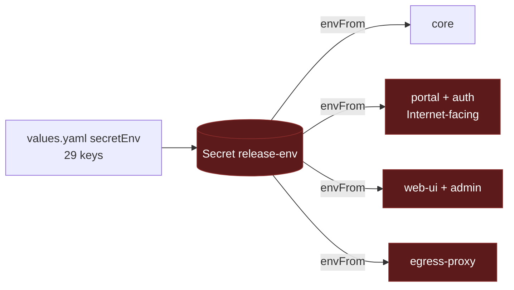
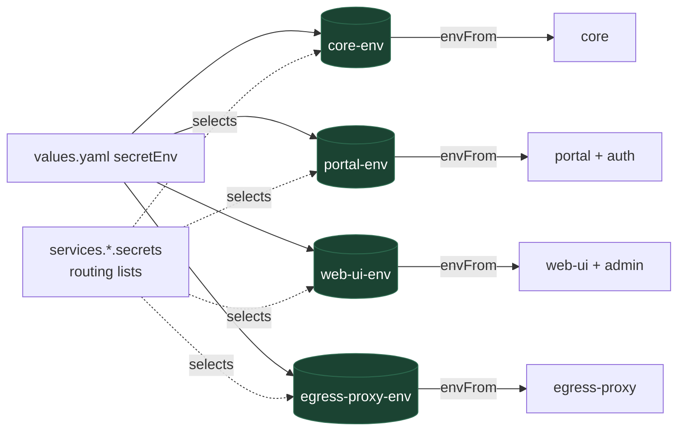

# One Secret per workload in the Helm chart

Stop handing every secret to every pod.

This is the implementation plan for the first, self-contained step of the
secretless work: make the Helm chart render one `Secret` per Deployment and
attach only that one. It needs no change to core, the plugins, or the CLI, and
it is a prerequisite for per-workload identity, which lands separately. File
and line citations are against the tree at upstream `bfb1ed1`. The proposal for
upstream is
[`adrs/helm-per-service-secrets.md`](../adrs/helm-per-service-secrets.md).

## Context

The chart at `deploy/helm/` renders `values.yaml` `secretEnv` into a single
`Secret` named `<release>-env` and attaches it with an unconditional `envFrom`
to every Deployment it creates, which are core, web-ui, portal, and egress-proxy[^helmenvfrom]. Admin runs inside web-ui and auth inside portal, so four
Deployments carry the whole map.

The consequence is that the one Internet-facing pod, portal, holds
`ANTHROPIC_API_KEY`, `DATABASE_URL`, `CONNECTOR_SECRET_KEY`,
`SKILL_SIGNING_SECRET`, `CAPABILITY_SECRET`, and the Admin-role
`PORTER_DEPLOY_API_TOKEN`, none of which it reads. A portal compromise is a
database compromise, a model-billing compromise, and a Porter-project
compromise in one step. The web-ui and egress-proxy pods hold the same set.

The per-service routing already exists on the other targets. In the CLI,
`SecretSpec.service` names the service each secret belongs to,
`computedSecrets` collapses the specs into one entry per secret with a service
list and per-service aliases, `secretDestinations` maps each entry to the
workload that hosts the service, and `secretsForService` answers "what does
this task definition get"[^clirouting]. `docs/porter.md` hand-copies the same
table for operators applying with `porter apply --secrets`[^portersecrets].
The chart ignores both, and the CLI has no Kubernetes target that could emit
into it[^clibackends].

Non-secrets live in the same Secret: `PUBLIC_API_URL`, `SANDBOX_BACKEND`,
`DEPLOY_PROVIDER`, the `PORTER_*_ID` values, the two image names, the two apps
domains, `AUTH_ALLOWED_EMAILS`, `AUTH_CLIENT_ID`, `OIDC_CLIENT_ID`, and
`AUTH_EMAIL_FROM`. They are there because `secretEnv` is the only per-release
map the chart offers that reaches every pod.



## Goals

- Each Deployment receives exactly the secrets its processes read, and nothing
  else. The portal pod stops holding the database, model, and Porter
  credentials.
- The routing lives in the chart as data an operator can read and override,
  and matches the CLI's routing for the services the CLI knows about.
- A change to one workload's secrets rolls only that workload.
- Existing releases upgrade with one values change and one rolling restart.

## Non-goals

- Changing what any process reads. Core, the plugins, and the egress authz
  keep reading `process.env`; only the environment they are given shrinks.
- Per-service ServiceAccounts, projected tokens, or any identity change. Those
  are the next step and depend on this one.
- External Secrets Operator or any other carrier. This design decides which
  keys reach which pod; where the values come from is unchanged. An
  `ExternalSecret` per workload slots into the same shape later.
- Teaching the CLI about Kubernetes. The chart carries its own routing table
  for now; rendering it from the CLI's spec list is a later reconciliation.
- Changing the Porter manifests. `porter apply --secrets` already scopes per
  app; the table below becomes the reference it should follow.

## Who reads what

The routing is derived from the code, not from the current `secretEnv`. Core
is `src/config.ts`; portal, auth, web-ui, and admin are their plugin
entrypoints; egress-proxy is `src/egress-authz-main.ts`, which the CLI's spec
list does not know at all[^egressenv].

| Deployment       | Hosts         | Secrets read                                                                                                                                                                                                                                                                                            | Non-secrets currently in `secretEnv`                                                                                                                                                                                                                                                                   |
| ---------------- | ------------- | ------------------------------------------------------------------------------------------------------------------------------------------------------------------------------------------------------------------------------------------------------------------------------------------------------- | ------------------------------------------------------------------------------------------------------------------------------------------------------------------------------------------------------------------------------------------------------------------------------------------------------ |
| **core**         | core, slack   | `CORE_SIGNING_SECRET`, `CAPABILITY_SECRET`, `PORTAL_IDENTITY_SECRET`, `CONNECTOR_SECRET_KEY`, `SKILL_SIGNING_SECRET`, `ANTHROPIC_API_KEY`, `DATABASE_URL`, `PORTER_DEPLOY_API_TOKEN`, `RESEND_API_KEY`, and `PORTAL_SESSION_SECRET` only as the fallback for `DEPLOY_APPS_SESSION_SECRET`[^coresession] | `PUBLIC_API_URL`, `ADMIN_GRANTS`, `SANDBOX_BACKEND`, `DEPLOY_PROVIDER`, `PORTER_DEPLOY_URL`, `PORTER_DEPLOY_PROJECT_ID`, `PORTER_DEPLOY_CLUSTER_ID`, `PORTER_SANDBOX_IMAGE`, `PORTER_DEPLOY_RUNNER_IMAGE`, `DEPLOY_APPS_DOMAIN`, `PORTER_DEPLOY_APPS_DOMAIN`, `AUTH_ALLOWED_EMAILS`, `AUTH_EMAIL_FROM` |
| **portal**       | portal, auth  | `CORE_SIGNING_SECRET`, `PORTAL_IDENTITY_SECRET`, `PORTAL_SESSION_SECRET`, `OIDC_CLIENT_SECRET` (aliased from `AUTH_CLIENT_SECRET` when the broker is embedded), `AUTH_CLIENT_SECRET`, `AUTH_TOKEN_SECRET`, `AUTH_SIGNING_JWK`, `RESEND_API_KEY`                                                         | `OIDC_CLIENT_ID` (aliased from `AUTH_CLIENT_ID`), `AUTH_CLIENT_ID`, `AUTH_ALLOWED_EMAILS` and its `OIDC_ALLOWED_EMAILS` alias, `AUTH_EMAIL_FROM`, `DEPLOY_APPS_DOMAIN`[^portaldomain]                                                                                                                  |
| **web-ui**       | web-ui, admin | `CORE_SIGNING_SECRET`, `PORTAL_IDENTITY_SECRET`[^adminreads]                                                                                                                                                                                                                                            | none                                                                                                                                                                                                                                                                                                   |
| **egress-proxy** | egress authz  | `CORE_SIGNING_SECRET`, `CAPABILITY_SECRET`, `DATABASE_URL`                                                                                                                                                                                                                                              | none                                                                                                                                                                                                                                                                                                   |

Three rows deserve a note.

- The web-ui pod today holds every one of the 29 `secretEnv` values and needs two. It is the largest
  single reduction.
- The egress-proxy pod needs `DATABASE_URL`. That is a real read, not a
  leftover, and it means the database credential reaches two pods rather than
  one after this change. The identity work removes it from both.
- Core's `PORTAL_SESSION_SECRET` read is a fallback for a cookie key the CLI
  never declares[^coresession]. Routing the portal's cookie key into core
  keeps today's behavior; the cleaner state is to set
  `DEPLOY_APPS_SESSION_SECRET` in core and keep `PORTAL_SESSION_SECRET` in the
  portal alone, which the default routing supports by listing both keys and
  leaving the operator to fill one.

## Proposed design

### Values shape

`secretEnv` keeps its shape: one flat map, the one place an operator types
values, so no value is entered twice. Routing is a list of key names per
service, shipped with defaults that encode the table above. The defaults also
list keys the chart's `secretEnv` does not declare today but the code reads
(`OPENAI_API_KEY`, `OPENROUTER_API_KEY`, `DEPLOY_APPS_SESSION_SECRET`,
`PORTAL_TRUSTED_OIDC_CLIENT_SECRET`[^trustedentry]); an empty value is skipped,
so listing them costs nothing and routes them correctly once set.

```yaml
services:
  core:
    secrets:
      - CORE_SIGNING_SECRET
      - CAPABILITY_SECRET
      - PORTAL_IDENTITY_SECRET
      - CONNECTOR_SECRET_KEY
      - SKILL_SIGNING_SECRET
      - ANTHROPIC_API_KEY
      - OPENAI_API_KEY
      - OPENROUTER_API_KEY
      - DATABASE_URL
      - PORTER_DEPLOY_API_TOKEN
      - RESEND_API_KEY
      - PORTAL_SESSION_SECRET
      - DEPLOY_APPS_SESSION_SECRET
      - PUBLIC_API_URL
      - ADMIN_GRANTS
      - SANDBOX_BACKEND
      - DEPLOY_PROVIDER
      - PORTER_DEPLOY_URL
      - PORTER_DEPLOY_PROJECT_ID
      - PORTER_DEPLOY_CLUSTER_ID
      - PORTER_SANDBOX_IMAGE
      - PORTER_DEPLOY_RUNNER_IMAGE
      - DEPLOY_APPS_DOMAIN
      - PORTER_DEPLOY_APPS_DOMAIN
      - AUTH_ALLOWED_EMAILS
      - AUTH_EMAIL_FROM
  auth:
    secrets:
      - AUTH_CLIENT_ID
      - AUTH_CLIENT_SECRET
      - AUTH_TOKEN_SECRET
      - AUTH_SIGNING_JWK
      - AUTH_ALLOWED_EMAILS
      - AUTH_EMAIL_FROM
      - RESEND_API_KEY
  portal:
    secrets:
      - CORE_SIGNING_SECRET
      - PORTAL_IDENTITY_SECRET
      - PORTAL_SESSION_SECRET
      - OIDC_CLIENT_ID
      - OIDC_CLIENT_SECRET
      - PORTAL_TRUSTED_OIDC_CLIENT_SECRET
      - DEPLOY_APPS_DOMAIN
  admin:
    secrets: []
  web-ui:
    secrets:
      - CORE_SIGNING_SECRET
      - PORTAL_IDENTITY_SECRET
  egress-proxy:
    secrets:
      - CORE_SIGNING_SECRET
      - CAPABILITY_SECRET
      - DATABASE_URL
```

A list rather than a map, because the values already live in `secretEnv` and
a second map would invite typing them twice. A list per declared service
rather than per Deployment, because admin and auth are declared services with
their own reads, and the chart already merges an embedded component's `env`
into its host[^helmembed]; the same merge applies to `secrets`. Helm replaces
a list wholesale on override, which is the right semantics for a routing
table: an operator who overrides `services.portal.secrets` states the whole
set.

A name in `secretEnv` with a non-empty value that no enabled service lists is
a render failure naming the key. That catches the habit this change is
removing: adding a key to `secretEnv` and expecting it to appear everywhere.
A listed name with an empty or absent value is skipped, as today, so the
defaults can list optional keys without forcing them.

### Templates

`templates/secret.yaml` renders one `Secret` per rendered Deployment, named
`<release>-<service>-env`, containing the union of the host's list and its
embedded component's list, filtered to non-empty values. The three aliases the
current template renders for the embedded broker[^helmalias] move with their
consumer: `OIDC_CLIENT_ID`, `OIDC_CLIENT_SECRET`, and `OIDC_ALLOWED_EMAILS` are
filled from `AUTH_CLIENT_ID`, `AUTH_CLIENT_SECRET`, and `AUTH_ALLOWED_EMAILS`
inside the portal Secret only, when auth is enabled and the `OIDC_*` value is
unset. That is the same rule the CLI expresses with `envName` on the portal's
`AUTH_CLIENT_SECRET` spec[^clialias].

`templates/deployment.yaml` attaches `<release>-<service>-env` by `secretRef`
and nothing else from `secretEnv`. The operator-supplied `envFrom` list stays
as it is: it is the escape hatch for anything the routing cannot express, and
it is empty by default[^envfromvalue].

The `checksum/secret-env` annotation hashes the workload's own Secret rather
than the whole render[^helmchecksum], so rotating the portal's cookie key rolls
the portal and nothing else.



### What the rendered portal Secret contains afterwards

With the defaults and the embedded broker, the portal pod's Secret holds
`CORE_SIGNING_SECRET`, `PORTAL_IDENTITY_SECRET`, `PORTAL_SESSION_SECRET`,
`AUTH_CLIENT_ID`, `AUTH_CLIENT_SECRET`, `AUTH_TOKEN_SECRET`,
`AUTH_SIGNING_JWK`, `AUTH_ALLOWED_EMAILS`, `AUTH_EMAIL_FROM`, `RESEND_API_KEY`,
`DEPLOY_APPS_DOMAIN`, and the three `OIDC_*` aliases. It no longer holds
`ANTHROPIC_API_KEY`, `DATABASE_URL`, `CONNECTOR_SECRET_KEY`,
`SKILL_SIGNING_SECRET`, `CAPABILITY_SECRET`, `PORTER_DEPLOY_API_TOKEN`, or any
`PORTER_*` value. That is the acceptance test, and it is checked in CI.

### Verification

The repository has no chart test today; `scripts/deploy-helm.sh` packages and
installs, and nothing renders the chart in CI[^helmci]. This change adds a
render check that any contributor can run:

```sh
helm lint deploy/helm
helm template qm deploy/helm -f deploy/helm/ci/values.yaml > /tmp/render.yaml
```

with assertions over the render: exactly one `Secret` per enabled Deployment,
the portal Secret free of the six keys above and of every `PORTER_*` value, every Deployment's `envFrom`
naming its own Secret only, and a values file with an unrouted key failing
with the key's name in the message. The assertions live in a shell test next
to the chart and run in the existing `Lint` job, which already checks the
tree's formatting and is the job that touches chart files.

## Migration

Chart `version` moves from `0.2.7` to `0.3.0`[^chartver]. The upgrade path
for an existing release:

1. `helm upgrade` with no values change. Every Deployment's checksum
   annotation changes, because its Secret is new, so every pod rolls once.
   Each pod comes back with a strict subset of what it had. Nothing reads a
   key it no longer has, by the table above, so the roll is the only
   observable event.
2. If the operator had put a custom key into `secretEnv` for a plugin service
   they added under `services`, the render fails with the key's name and they
   add it to that service's `secrets` list. That is the one case where step 1
   needs a values change, and it fails at render rather than at runtime.
3. The old `<release>-env` Secret is removed by Helm as part of the upgrade,
   since it is no longer in the render.

There is no deprecation window, because there is no old input to deprecate:
`secretEnv` keeps its shape and its values. What changes is where each value
lands, and a pod that lost a key it reads would fail its readiness probe on
the first roll, before the old ReplicaSet is scaled down.

A downgrade is `helm rollback`, which restores the single Secret and the
`envFrom` on every pod.

## Alternatives considered

**A `secretEnv` map per service.** `services.<name>.secretEnv` with the values
inside. Simplest template, but `CORE_SIGNING_SECRET` would be typed four times
and `PORTAL_IDENTITY_SECRET` three, and a rotation that misses one copy is a
signature-mismatch outage. Rejected in favor of one value store plus routing.

**Render the routing from the CLI's spec list.** The right end state, and the
reason this document calls the lists "for now". It needs a Kubernetes emitter
in the CLI and a shared spec between `cli/src/secrets.ts` and
`src/deployment/secret-schema.ts`, neither of which exists, and the CLI does
not know egress-proxy at all. That is the reconciliation the secretless plan
schedules as its first phase; this change should not wait for it.

**Keep one Secret and use `env.valueFrom.secretKeyRef` per key.** Same
per-pod outcome, one Secret to manage, but every key becomes a template entry,
the checksum cannot distinguish workloads, and RBAC or an `ExternalSecret`
cannot later scope the Secret itself. Rejected.

**Move the non-secrets to `services.<name>.env` in the same change.** Cleaner,
and the defaults do not stop an operator doing it. Doing it for them means an
upgrade that changes values files, which this change deliberately avoids. Left
as a recommendation in the Helm section of `docs/porter.md`.

## Risks

| Risk                                                                           | Mitigation                                                                                                                                   |
| ------------------------------------------------------------------------------ | -------------------------------------------------------------------------------------------------------------------------------------------- |
| The table misses a read and a pod loses a key it needs                         | The render check asserts the Secret contents; the readiness probe holds the roll; `helm rollback` restores the previous state in one command |
| An operator's plugin service silently loses secrets                            | A non-empty unrouted key is a render failure naming the key, not a runtime absence                                                           |
| The chart's routing drifts from the CLI's spec list                            | The lists are data in one file, next to the table in this document; the later CLI emitter replaces them rather than reconciling by hand      |
| The one-time roll interrupts in-flight agent turns                             | Core has no PodDisruptionBudget or Kubernetes task protection[^ecstaskprot]; schedule the upgrade like any other core roll                   |
| `envFrom` remains as an escape hatch and gets used to reintroduce a shared map | It is documented as per-workload only in the values; the render check counts `envFrom` entries per Deployment                                |

## Open questions

None. The routing table is derived from the code and the render check pins
it.

## References

[^helmenvfrom]: `deploy/helm/templates/secret.yaml` renders every `secretEnv` value into one `Secret`; `deploy/helm/templates/deployment.yaml:122` attaches it by `secretRef` inside an `envFrom` that every rendered Deployment receives. Admin and auth are embedded in web-ui and portal respectively, so the four Deployments are core, web-ui, portal, and egress-proxy.

[^clirouting]: `cli/src/secrets.ts:21` (`SecretSpec.service`), `:531` (`computedSecrets`), `:649` (`secretDestinations`, which routes through `serviceHost` in `cli/src/services.ts:14` so admin lands on web-ui, auth on portal, and slack on core), `:678` (`secretsForService`).

[^portersecrets]: `docs/porter.md:121` — secrets are passed with `--secrets KEY=value`; the wiring table at `:127` lists them per service by hand; `:147` names `src/deployment/secret-schema.ts` as the authoritative list.

[^clibackends]: `cli/src/backends/registry.ts` registers `docker`, `fly`, and `aws` only.

[^egressenv]: `src/egress-authz-main.ts:233` (`CAPABILITY_SECRET`), `:234` (`DATABASE_URL`), `:236` (`CORE_SIGNING_SECRET`). `egress-proxy` appears nowhere in `cli/src/secrets.ts` or `cli/src/services.ts`.

[^coresession]: `src/config.ts:615` — `DEPLOY_APPS_SESSION_SECRET` with `PORTAL_SESSION_SECRET` as the shared fallback. `DEPLOY_APPS_SESSION_SECRET` is not declared in `cli/src/secrets.ts` or `deploy/helm/values.yaml`.

[^portaldomain]: `plugins/portal/src/index.ts:71` — `PORTAL_APPS_DOMAIN || DEPLOY_APPS_DOMAIN`.

[^adminreads]: `plugins/admin/src/index.ts:14` reads `CORE_SIGNING_SECRET` and `:15` `PORTAL_IDENTITY_SECRET`; admin runs inside the web-ui Deployment.

[^helmembed]: `deploy/helm/templates/deployment.yaml:97` — the portal Deployment merges `services.auth.env` and the web-ui Deployment merges `services.admin.env`, failing on a conflicting value.

[^helmalias]: `deploy/helm/templates/secret.yaml:15`, `:18`, `:21` render `OIDC_CLIENT_ID`, `OIDC_CLIENT_SECRET`, and `OIDC_ALLOWED_EMAILS` from the `AUTH_*` values when the `OIDC_*` value is unset.

[^clialias]: `cli/src/secrets.ts` — the portal's `AUTH_CLIENT_SECRET` spec carries `envName: "OIDC_CLIENT_SECRET"`, and `AUTH_ALLOWED_EMAILS` carries `envName: "OIDC_ALLOWED_EMAILS"`, both required only when the `auth` service is enabled.

[^envfromvalue]: `deploy/helm/values.yaml:21` — `envFrom: []`, appended after the chart's own `secretRef` at `deploy/helm/templates/deployment.yaml:125`.

[^helmchecksum]: `deploy/helm/templates/deployment.yaml:26` — the annotation hashes the whole `secret.yaml` render, so any value change rolls every Deployment.

[^helmci]: `.github/workflows/cicd.yml` has no job that runs `helm`; `scripts/deploy-helm.sh:32` packages and `:38` installs, with no render assertion.

[^chartver]: `deploy/helm/Chart.yaml:5` — `version: 0.2.7`.

[^trustedentry]: `plugins/portal/src/trusted-entry.ts:7` reads `PORTAL_TRUSTED_OIDC_CLIENT_SECRET`; the name appears in neither `cli/src/secrets.ts` nor `deploy/helm/values.yaml`.

[^ecstaskprot]: `src/wiring.ts:2019` — `createEcsTaskProtection` exists for ECS only; nothing equivalent exists for Kubernetes.
