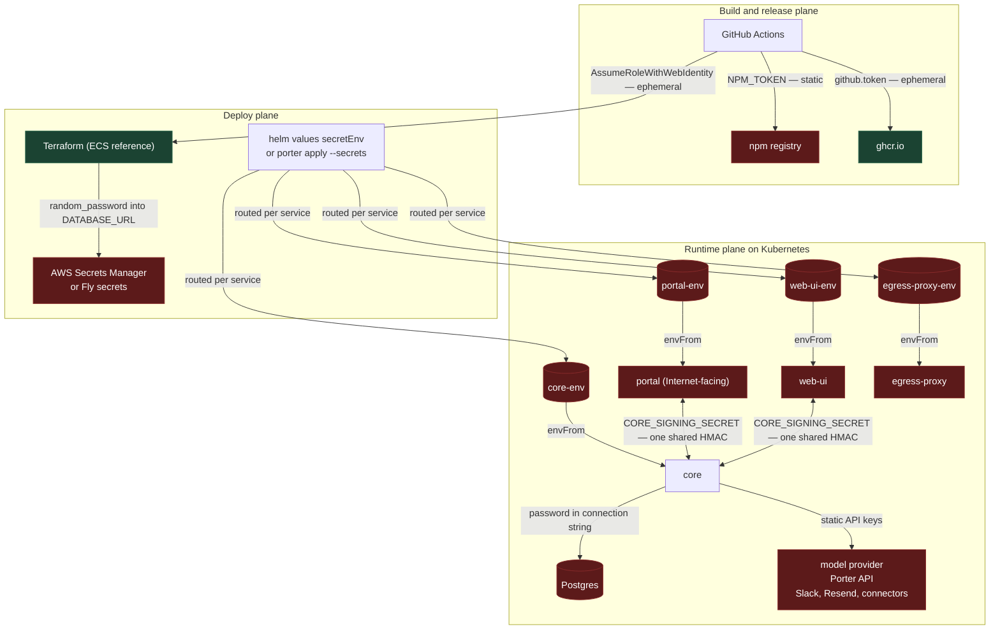
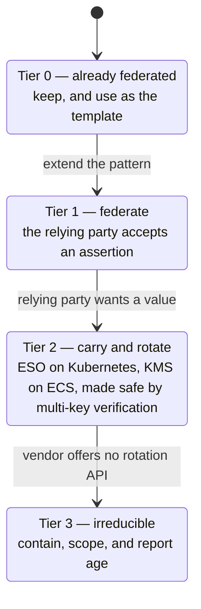
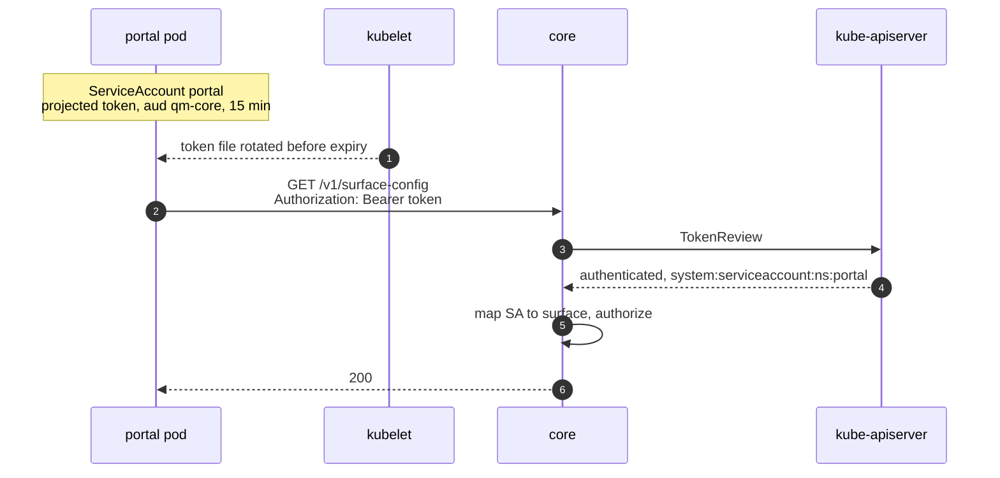
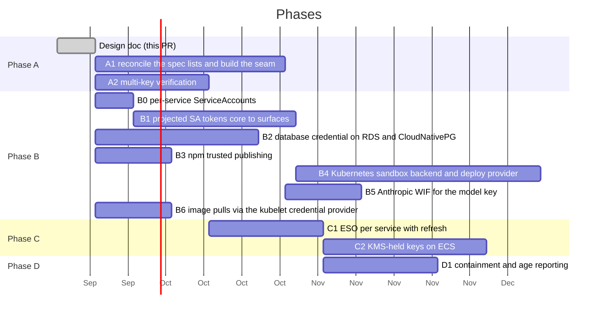

# Secretless QM

Replacing long-lived static secrets with federated, short-lived credentials.

This is the implementation plan: the full inventory, the mechanism analysis, and
the phasing. File and line citations are against the tree at upstream
`bfb1ed1`, synced on 2026-09-14. The proposal for upstream is
[`adrs/secretless-credentials.md`](../adrs/secretless-credentials.md), the same
argument at proposal length. Keep the two in step when findings change.

This plan stacks on
[`helm-per-service-secrets.md`](./helm-per-service-secrets.md), which splits
the chart's one shared `Secret` into one per workload with a routing list per
service. Everything below assumes that has landed.

## Context

QM deploys into an operator's own account and runs as a small fleet of services
that talk to each other, to Postgres, to a model provider, and to a set of
third-party APIs. Almost all of that trust is carried by static secrets: values
minted once by a human and injected as process environment for the life of the
deployment.

The deployment this plan is for is **Kubernetes**, through the Helm chart at
`deploy/helm/` or the Porter manifests at `porter/apps/`. The bar is: workload
identity federation wherever a relying party accepts an assertion, External
Secrets Operator (ESO) everywhere else, and in every case rotation that runs
without a human. The `qm` CLI knows nothing about Kubernetes — its targets are
`docker`, `fly`, and `aws`[^clibackends] — so on this path there is no
`qm secrets push`, no `.env.example` consumer, no `check --live`, and no
per-service secret routing at all. That gap shapes Phase A.

The CLI declares 41 first-party secret names[^specs]. Nine of those are not
secret material — `PUBLIC_API_URL`, both CA certificates, `OIDC_CLIENT_ID`,
`PORTAL_EXPECTED_TEAM_ID`, `AUTH_ALLOWED_EMAILS`, `AUTH_EMAIL_FROM`, `SMTP_HOST`,
`SMTP_USERNAME` — leaving 32 real secrets. Twelve more live outside that list:
`FLY_SANDBOX_API_TOKEN`, `SECURITY_SCREEN_PROXY_TOKEN`, `NPM_TOKEN` in the
release workflow, two that core requires but the CLI never declares
(`MODEL_GATEWAY_API_KEY`[^gateway] and `DEPLOY_APPS_SESSION_SECRET`[^deployapps]),
and two that only exist on Kubernetes: `imagePullSecrets` and the ingress TLS
key, four more connector client secrets the OAuth layer reads but the CLI never
declares[^undeclaredoauth], and the trusted-entry client secret the portal
reads[^trustedentry]. Of these, only the TLS key expires on its own,
because cert-manager rotates it; the rest do not.

The deploy plane is already in better shape than the runtime plane. Deploying to
AWS from GitHub Actions uses `sts:AssumeRoleWithWebIdentity` against an
account-level GitHub OIDC provider, with audience and subject pinned and
wildcards rejected[^oidctrust]. Image pushes use the per-job `github.token`, and
images are signed keylessly with Fulcio and the same OIDC identity. That is the
pattern this document extends.

A note on vocabulary. "OIDC" already appears throughout this codebase meaning
_human_ sign-in: the portal's relying-party configuration, the built-in `auth`
broker, `OIDC_CLIENT_ID`, `OIDC_CLIENT_SECRET`. This document uses **WIF**
(workload identity federation) for the machine-to-machine case to keep the two
apart. They share a protocol and share nothing else.

## Goals

- Eliminate every static secret that a supported identity provider can replace
  with a short-lived, audience-scoped, automatically-rotated credential.
- Where federation is not available, carry the secret through ESO with a
  refresh interval, and make the application safe to rotate under: no
  signature-mismatch outage, no invalidated sessions, no undecryptable rows.
- Make the residual set explicit, small, and contained, and say plainly which
  entries can never meet the rotation bar.
- Build one credential seam that every path flows through, so later work has a
  single place to change.

## Non-goals

- Rewriting how _user_ sign-in works. The portal, the `auth` broker, and
  connector OAuth stay as they are.
- Changing how credentials are materialized into agent sandboxes. That surface
  has its own acknowledged limitations[^security] and its own broker-delivery
  path, which this design reuses but does not redesign.
- Adding a new secrets product on ECS or Fly, where the platform's own STS and
  KMS cover what is needed. On Kubernetes, ESO is not a new product; it is the
  standard carrier, and this design depends on it.
- Inventing federation where no vendor offers it. Slack does not federate and
  neither does OpenRouter; those are contained, not removed. Anthropic and OpenAI
  both do, which is Phase B5.

## Where the secrets are today



The two green nodes are reached with ephemeral, federated credentials. Every
other path rests on a value a human minted that does not expire.

### The Helm chart, after the per-workload split

The worst finding in the first draft of this plan was that the chart rendered
`secretEnv` into one `Secret` and attached it to every Deployment, so the
Internet-facing portal pod held the database, model, and Porter credentials.
That is fixed by the per-workload split[^split], which lands before this plan
and which this plan does not repeat. What the split leaves for the phases
below:

- The values are still static and still typed into `secretEnv` by hand. The
  split decides which pod gets a value, not where the value comes from.
- The routing lists in `services.<name>.secrets` are maintained by hand. The
  CLI's spec list knows the same routing for every service it declares, and
  the CLI has no Kubernetes target to render it with[^clibackends]. A1 closes
  that.
- Two reads the split's routing table surfaced stay in the inventory:
  egress-proxy reads `CAPABILITY_SECRET` and `CORE_SIGNING_SECRET` (and
  `DATABASE_URL` only as a fallback audit sink the chart never leaves it
  with) while the CLI does not know the service exists, and core reads
  `PORTAL_SESSION_SECRET` as the fallback for an undeclared
  `DEPLOY_APPS_SESSION_SECRET`.
- Per-surface identity in Phase B1 would have bought nothing while every
  surface held every secret. That is why the split lands first.

### The service-to-service case

`CORE_SIGNING_SECRET` is a single symmetric HMAC key shared by core and _every_
surface plugin — `portal`, `web-ui`, `admin`, `auth`, `slack`, and any plugin the
deployment adds, since `computedSecrets` grants it to each plugin with
`coreAccess` left on[^computed]. The chassis reads it from process environment
and signs every core call with it[^chassis].

The consequences are structural, not hypothetical:

- Verification is symmetric, so any holder can forge any other holder's
  requests. A compromised `admin` container can sign as `portal`.
- The signature carries no caller identity[^sourceauth]. Core cannot tell which
  surface called it, only that _a_ holder did.
- Rotation is a fleet-wide atomic event. There is no overlap window, because
  there is one key and one value.

`PORTAL_IDENTITY_SECRET` has the same shape in the same direction: the portal
mints a signed user identity and core and admin verify it[^portalmint]. It is a
genuinely distinct key — core refuses to start in production if it is unset or
equal to `CORE_SIGNING_SECRET` or `CAPABILITY_SECRET`[^portalguard] — but it is
still symmetric, still shared across four services, and still rotated
atomically. Upstream's trusted-entry PoC adds a third use of it: after a
verified trusted OIDC sign-in the portal signs a purpose-bound, 60-second,
single-use HS256 assertion with `PORTAL_IDENTITY_SECRET` and core verifies it
before granting organization admin, refusing unless the secret is at least 32
characters, distinct from `CORE_SIGNING_SECRET`, and backed by a durable replay
store[^trustedadmin]. Same key, same direction. That assertion — `purpose`,
`exp` within a minute, `jti` claimed once in a durable store — is the exact
shape B1's per-call tokens and B5's per-exchange tokens need, and it now exists
in the tree.

### The rotation trap

Ten secrets are symmetric keys verified against exactly one value. Call them
the **single-value set**: `CORE_SIGNING_SECRET`, `CAPABILITY_SECRET`,
`PORTAL_IDENTITY_SECRET`, `SKILL_SIGNING_SECRET`, `AUTH_TOKEN_SECRET`,
`AUTH_CLIENT_SECRET`, `PORTAL_SESSION_SECRET`, `DEPLOY_APPS_SESSION_SECRET`,
`AWS_DEPLOY_GATE_SECRET`, and `CONNECTOR_SECRET_KEY`. Later phases refer to this
set by name; it shrinks as B1 deletes the first three.

ESO rotating the Kubernetes Secret and a reloader rolling the pods gives a
window in which core verifies with the new key while portal still signs with
the old one, or the reverse. For the HMACs that is a signature-mismatch outage.
For the cookie keys it invalidates every session. For `CONNECTOR_SECRET_KEY` it
makes every stored connector credential undecryptable. So ESO alone cannot meet
the rotation bar for this family; the application has to change first.

Two mechanics compound it. `loadConfig` snapshots `process.env` at
boot[^loadconfig], so a rotated value is invisible to a running pod until it
restarts. And the chart's `checksum/secret-env` annotation covers only its own
rendered Secret[^helmchecksum], not one ESO manages, so a rotation does not roll
the pods on its own.

### Full inventory

Tiers are defined in the next section.

| Secret                                                                                                           | Where it lives                                                                                                                     | Today                                                                                                                    | Tier  |
| ---------------------------------------------------------------------------------------------------------------- | ---------------------------------------------------------------------------------------------------------------------------------- | ------------------------------------------------------------------------------------------------------------------------ | ----- |
| AWS deploy role                                                                                                  | `main.tf:311`                                                                                                                      | GitHub OIDC, subject + audience pinned                                                                                   | 0     |
| GHCR push                                                                                                        | `release-package.yml`                                                                                                              | `github.token`, per-job                                                                                                  | 0     |
| Cosign signing key                                                                                               | `release-package.yml`                                                                                                              | keyless, Fulcio + OIDC                                                                                                   | 0     |
| Ingress TLS key                                                                                                  | `values.yaml` `clusterIssuer`                                                                                                      | cert-manager issues and rotates                                                                                          | 0     |
| `CORE_SIGNING_SECRET`                                                                                            | core, portal, web-ui, egress-proxy                                                                                                 | shared static HMAC                                                                                                       | 1     |
| `PORTAL_IDENTITY_SECRET`                                                                                         | core, portal, web-ui                                                                                                               | shared static HMAC, portal mints                                                                                         | 1     |
| `DATABASE_URL`                                                                                                   | core                                                                                                                               | static password, no rotation path                                                                                        | 1     |
| `PORTER_DEPLOY_API_TOKEN`                                                                                        | core                                                                                                                               | Admin-role token; used for sandboxes and for app publishing[^porterboth]                                                 | 1     |
| `NPM_TOKEN`                                                                                                      | `publish-cli.yml:89`                                                                                                               | static automation token                                                                                                  | 1     |
| `imagePullSecrets`                                                                                               | `values.yaml`                                                                                                                      | PAT in a `dockerconfigjson` Secret on private forks; kubelet credential provider removes it                              | 1     |
| `CONNECTOR_SECRET_KEY`                                                                                           | core                                                                                                                               | static encryption key, one value                                                                                         | 2     |
| `AUTH_SIGNING_JWK`                                                                                               | portal                                                                                                                             | static P-256 private key                                                                                                 | 2     |
| `CAPABILITY_SECRET`                                                                                              | core, egress-proxy                                                                                                                 | static HMAC, one value                                                                                                   | 2     |
| `SKILL_SIGNING_SECRET`                                                                                           | core                                                                                                                               | static HMAC, one value                                                                                                   | 2     |
| `AUTH_TOKEN_SECRET`                                                                                              | portal                                                                                                                             | static HMAC, one value                                                                                                   | 2     |
| `PORTAL_SESSION_SECRET`                                                                                          | portal; core as a fallback                                                                                                         | static cookie key, one value                                                                                             | 2     |
| `DEPLOY_APPS_SESSION_SECRET`                                                                                     | core                                                                                                                               | static cookie key, undeclared by the CLI                                                                                 | 2     |
| `AWS_DEPLOY_GATE_SECRET`                                                                                         | core                                                                                                                               | static HMAC, one value                                                                                                   | 2     |
| `AUTH_CLIENT_SECRET`                                                                                             | portal                                                                                                                             | CLI-generated; becomes in-process after B1, never deployed                                                               | 1     |
| `DATABASE_POOL_URL`                                                                                              | core                                                                                                                               | must carry the same credentials as `DATABASE_URL`                                                                        | 2     |
| `FLY_DEPLOY_API_TOKEN`, `FLY_SANDBOX_API_TOKEN`                                                                  | core for the deploy token; the sandbox token is used by the CLI preflight only, so neither reaches a workload Secret on Kubernetes | minted at `-x 8760h`[^flytokens]                                                                                         | 2     |
| `ANTHROPIC_API_KEY`                                                                                              | core                                                                                                                               | static vendor key; Anthropic WIF is GA                                                                                   | 1     |
| `OPENAI_API_KEY`                                                                                                 | core                                                                                                                               | static vendor key; OpenAI WIF is GA                                                                                      | 1     |
| `OPENROUTER_API_KEY`                                                                                             | core                                                                                                                               | rotatable through its management-keys API; root in the rotation Job                                                      | 2     |
| `MODEL_GATEWAY_API_KEY`                                                                                          | core                                                                                                                               | static bearer, undeclared by the CLI                                                                                     | 3     |
| `SLACK_BOT_TOKEN`                                                                                                | durable store                                                                                                                      | Slack token rotation, opt-in; needs refresh handling in the installation store                                           | 2     |
| `SLACK_APP_TOKEN`                                                                                                | durable store                                                                                                                      | encrypted at rest, no vendor rotation API                                                                                | 3     |
| `SLACK_SIGNING_SECRET`                                                                                           | core, env only                                                                                                                     | no stored path, no vendor rotation API                                                                                   | 3     |
| `SPRITES_TOKEN`, `E2B_API_KEY`, `MODAL_TOKEN_*`, `SMOLMACHINES_TOKEN`, `AGENT37_API_KEY`                         | core                                                                                                                               | dashboard-minted; moot on this path once B4 lands                                                                        | 3     |
| `SECURITY_SCREEN_PROXY_TOKEN`                                                                                    | core                                                                                                                               | static bearer to a third-party screen                                                                                    | 3     |
| `RESEND_API_KEY`                                                                                                 | core, portal                                                                                                                       | rotatable through Resend's API; root in the rotation Job                                                                 | 2     |
| `SMTP_PASSWORD`                                                                                                  | portal                                                                                                                             | on SES, derived from an IAM access key with a published rotation (Tier 2); on any other relay, dashboard-minted (Tier 3) | 2 / 3 |
| `GOOGLE_/DROPBOX_/LINEAR_OAUTH_CLIENT_SECRET`                                                                    | core                                                                                                                               | ESO-carried; human-rotated at the IdP, propagates restart-free; PKCE public client removes it where the IdP permits      | 2     |
| `SLACK_OAUTH_CLIENT_SECRET`, `NOTION_OAUTH_CLIENT_SECRET`, `GITHUB_OAUTH_CLIENT_SECRET`, `X_OAUTH_CLIENT_SECRET` | core                                                                                                                               | same as above, and undeclared by the CLI                                                                                 | 2     |
| `OIDC_CLIENT_SECRET` (external IdP)                                                                              | portal                                                                                                                             | ESO-carried; `private_key_jwt` removes it where the IdP supports it                                                      | 2     |

The "where it lives" column is the Helm chart after the per-workload
split[^split]. Under Porter the operator passes each value by hand with
`--secrets`, which lets them scope it the same way, but nothing enforces the
scoping.

## The tiering



**Tier 1 — federate.** The relying party accepts a signed assertion in place of a
secret. The secret is deleted outright: no value exists to store, leak, or
rotate.

**Tier 2 — carry and rotate.** The relying party wants a value, but the value
can be minted or held somewhere with an audit trail and delivered short-lived.
On Kubernetes the carrier is an `ExternalSecret` per service with a
`refreshInterval`, whose `SecretStore` authenticates to the cloud secret manager
through IRSA, EKS Pod Identity, GKE Workload Identity, or Azure Workload
Identity — no static credential for the store itself. On ECS the equivalent is
a KMS-held key the task role calls. Either way, automatable rotation requires
the multi-key verification in Phase A first.

**Tier 3 — irreducible.** The vendor mints the credential in a dashboard and
offers no API to rotate it. Keep it out of process environment, deliver it
through the egress-proxy broker path where the consumer is an agent, scope it
as narrowly as the vendor allows, and have `qm doctor` report its age. That
report is the ceiling for this tier and the doc should say so rather than
imply more.

The success metric is the size of Tier 3 after the work, not the number of
mechanisms introduced.

## Proposed design

### Phase A: the seam, and safe rotation

Two pieces of groundwork, both prerequisites for everything after them.

**A1: build the seam that does not exist yet.** There are three candidate
chokepoints and none is universal:

| Candidate                                                  | Actual reach                                                                                                                                                                                                                           |
| ---------------------------------------------------------- | -------------------------------------------------------------------------------------------------------------------------------------------------------------------------------------------------------------------------------------- |
| `FIRST_PARTY_SECRET_SPECS` (`cli/src/secrets.ts:43`)       | Deploy-side only: renders `.env.example`, Terraform `secret_names`, and ECS task secret routing. Nothing in `src/` imports it. Reaches nothing on Kubernetes.                                                                          |
| `CORE_SECRET_SPECS` (`src/deployment/secret-schema.ts:29`) | Boot-time validation only, and it is a _separate list with a separate type_. Nothing in `cli/` imports it.                                                                                                                             |
| `SecretSource` (`src/credentials/secret-source.ts`)        | Connector OAuth clients only[^secretsource]. Core's own secrets never pass through it — `CORE_SIGNING_SECRET`, `CONNECTOR_SECRET_KEY`, `SKILL_SIGNING_SECRET`, `DATABASE_URL` and the model keys are read straight from `process.env`. |

So A1 reconciles the two declaration lists into one, widens `SecretSource` until
core reads its own secrets through it, and — this is the part the ECS-shaped
first draft missed — gives that list a Kubernetes emitter. The per-workload
split gave the chart a hand-maintained routing list per service, and the spec
already knows the same routing for every service the CLI declares. A1 renders
those lists, and later the per-service `ExternalSecret`s, from the spec
instead of maintaining them by hand. Until the seam emits something the chart
consumes, marking a spec federated reaches nothing on this path.


The runtime interface gains expiry:

```ts
export interface CredentialSource {
  get(name: string): Promise<{ value: string; expiresAt: number } | undefined>;
}
```

`createEnvSecretSource` and `createAwsSecretsManagerSource` become
implementations of it. The Secrets Manager source already caches with a
60-second TTL and tolerates staleness for 15 minutes, so the shape federated
credentials need is already written. On EKS, `SECRETS_BACKEND=aws` under IRSA
already reads Secrets Manager from core with no credential[^secretsbackend];
extending that to core's own secrets means a rotated value reaches a running pod
within the cache TTL, with no restart and no reloader. `SECRETS_BACKEND` knows
only `env` and `aws`, so GCP and Azure clusters go through ESO regardless — and
there the seam reads from a **file-mounted Secret** rather than `envFrom`. The
kubelet updates a mounted Secret file in place; environment variables never
change after the process starts. That is the Kubernetes rotation-without-restart
primitive, it generalizes to every value core reads through the seam, and it
removes the reloader from the risk table for those entries.

The seam selects its source at boot: a projected token file present means
federation, otherwise the environment. The `dev-instance` launcher reads shell
environment, `dev.env`, and `.env` only, so local development degrades to the
static path with no cluster and no cloud identity, which is what the dual-read
rule requires anyway.

**A2: key rollover with prepare, activate, retire.** The application change
that makes rotation safe on every substrate. The naive form — each verifier
accepts current plus previous and signs with the first — is not enough. It
handles an old signature reaching an updated verifier; it does not handle a new
signature reaching a verifier that has not updated yet. A portal that has
refreshed to `[K1, K0]` signs with `K1`; a core replica still on `[K0, K−1]`
cannot verify it. The same ordering breaks cookie verification between
replicas and leaves a row encrypted by an updated writer unreadable by an older
reader. File-mounted delivery changes how instances receive keys, not the order
in which they do.

So the active producing key is distinct from the accepted set, and rollover is
three steps. **Prepare**: distribute the new key into every instance's accepted
set while every producer keeps using the old one — safe in any order, because
nothing signs with the new key yet. **Activate**: switch producers to the new
key only after every consumer holds it, on a generation counter each instance
reports and the rotation Job waits for, or on an explicitly justified rollout
barrier such as a full rolling restart with the accepted set already updated.
**Retire**: drop the old key from accepted sets only after everything it
produced has expired or been migrated — for HMAC tokens their TTL, for cookies
the session lifetime, and for `CONNECTOR_SECRET_KEY` every stored row
re-encrypted under the new key id, including rows in retained backups, which
outlive the live table. The auth broker's JWKS serves the retiring `kid`
through the same window.

Acceptance test: refresh a producer before a verifier, in both directions, then
roll back mid-rotation. The scheme passes only if every ordering verifies.

The fallback read path — federated attempted, static accepted — is instrumented
in A1 to report when it fires. Removing a fallback needs evidence nothing uses
it, and `check --live` does not provide that even on the targets where it
exists[^checklive].

### Phase B1: per-workload identity

Replace the shared HMAC with a per-workload assertion that core verifies without
a shared key. The mechanism depends on the substrate, and the substrate this
plan is for has the best one.

| Substrate      | Mechanism                                                                                                                                                                                                                                                                                | Secret material |
| -------------- | ---------------------------------------------------------------------------------------------------------------------------------------------------------------------------------------------------------------------------------------------------------------------------------------- | --------------- |
| **Kubernetes** | Each surface gets its own ServiceAccount and a projected token volume with `audience: qm-core` and a short `expirationSeconds`. The kubelet rotates it. The surface sends it as a bearer; core verifies through the `TokenReview` API or the cluster issuer's JWKS, cached.              | none            |
| ECS            | Each surface runs under its own task role and calls `sts:GetWebIdentityToken` with `aud: qm-core`; core verifies against the account's STS issuer JWKS. Outbound web identity federation must be enabled on the account. KMS signing is the fallback where it is not.                    | none            |
| Fly            | Fly Machines mint OIDC tokens with a caller-chosen audience, issuer `https://oidc.fly.io/<org>`, subject `org:app:machine`, and `app_name` and `image_digest` claims, with public discovery. Verified through the JWKS verifier rather than `TokenReview`. Upstream-only for this layer. | none            |
| Docker         | HMAC path kept, selected by the same `federation` field. Local development stays here.                                                                                                                                                                                                   | shared key      |

**Bearer mode has a transport prerequisite that HMAC mode does not.** The
chart wires every inter-service URL as plain `http://`[^plainhttp], and the
current source-auth signs the request rather than transmitting its key:
capturing an HMAC-signed request yields nothing reusable, and the timestamp
window plus `eventId` dedupe defeat replay[^replay]. A captured bearer is
reusable for every request until it expires. Per-ServiceAccount authorization
bounds what a stolen token can do; it does not stop the theft. So bearer mode
is enabled only behind encrypted, server-authenticated transport between
surfaces and core — TLS with certificate validation on the client, or an
enforced encrypted cluster network such as a mesh or CNI-level encryption,
declared as a precondition the chart checks — and mTLS is not required for
this particular property. Bearer tokens are redacted from logs and error
bodies. The replay protection the HMAC scheme carries is restated on its own
terms: a bearer authenticates the caller and does not make a request
idempotent, so the `eventId` dedupe stays on the endpoints that need it,
independent of the authentication mode.

**Verification has a revocation trade-off to decide, not assume.** Offline
verification against the issuer's JWKS cannot see that a pod or ServiceAccount
has been deleted; a token bound to a deleted object stays valid until it
expires. `TokenReview` checks the binding and rejects it[^offlinejwt]. So B1
sets a revocation-latency budget, caches a successful `TokenReview` no longer
than that budget, serves from cache only within it when the API server is
unreachable, fails closed past it, and never reinterprets an explicit rejection
as success through the weaker offline path. API unavailability and a known
rejection are different outcomes and are handled differently.

The Kubernetes row is the primary design. It is the feature ECS lacks — an
issuer that mints a verifiable, audience-scoped assertion for a workload — and
it is GA on every cluster Porter can create.



Concretely for the chart: `serviceAccount` in `values.yaml` is one SA for every
workload[^helmsa], so the Kubernetes equivalent of "split per-surface task
roles" is per-service ServiceAccounts in `templates/serviceaccount.yaml`. The
chassis needs one more auth mode next to HMAC that reads the token from the
projected file, and core needs a `TokenReview` verifier next to
`verifySignature`. Core's own SA needs one RBAC grant to create `TokenReview`s.

What this buys, beyond deleting a secret:

- Core learns _which_ surface is calling and can authorize per-surface. The
  `admin` container can no longer sign as `portal`.
- Tokens expire on their own and the kubelet rotates them. Nothing is minted,
  stored, or rotated by anyone.
- The mechanism exists today with zero new infrastructure.

**ECS has an issuer after all.** The first drafts said STS consumes a web
identity token and cannot mint one. That is outdated. `sts:GetWebIdentityToken`
returns a short-lived JWT signed by AWS that asserts the caller's IAM identity,
with a caller-chosen audience and duration, verifiable through a per-account
issuer at `https://<uuid>.tokens.sts.global.api.aws` that serves a public
JWKS[^stswebid]. The `sub` is the calling role's ARN, and an
`https://sts.amazonaws.com/` claim carries `aws_account`, `org_id`, and
`principal_id`. It needs the account-level outbound-federation flag, off by
default; the `sts:GetWebIdentityToken` permission on the task role; and a
regional STS endpoint. With that, an ECS surface mints `aud: qm-core` from its
own task role and core verifies it against the account issuer's JWKS exactly as
it verifies a Kubernetes token against the cluster issuer's — one verifier, two
issuers. Per-surface task roles remain a prerequisite, because the `sub` is the
role and the reference module shares one `task` role across every non-core
service[^taskroles]. KMS signing stays as the fallback where outbound
federation is unavailable or deliberately disabled, and the SigV4
`GetCallerIdentity` replay is no longer worth its STS call on the request path.

**`PORTAL_IDENTITY_SECRET` collapses into this.** Today the portal mints a
signed user identity and core verifies it. Once core knows which ServiceAccount
is calling, the user claims are a payload that SA asserts, and the authorization
question becomes "may this SA assert user identities?" — a per-surface
permission, not a second key. On ECS the same holds under KMS: the portal holds
`kms:Sign` on its key, core holds the public half. Under no scheme does core
need a signing key for this. The trusted-entry admin assertion collapses the
same way: once core knows the calling ServiceAccount is the portal, the claim
that a trusted sign-in just succeeded is a payload that account asserts, and
its single-use `jti` moves from the durable replay store to the same TokenReview
budget. The portal already verifies OIDC id_tokens against a JWKS for both of
its sign-in routes[^portaljwks]; core's B1 verifier for the cluster, STS, and
Fly issuers is that operation with a different issuer, and the chassis is the
sanctioned place to share it.

**`AUTH_CLIENT_SECRET` stops being a deployed secret.** In the embedded topology
both halves of the loopback run in the portal pod, so the portal mints it at
process start and hands it to the broker in memory; the 32-character validator
is satisfied by 32 random bytes[^authclientlen], and the `OIDC_CLIENT_SECRET`
alias the chart renders for it[^helmalias] goes with it. In the split topology
the token endpoint accepts the portal's SA token as an RFC 7523 client
assertion, verified the same way as any other B1 call.

### Phase B2: the database

`random_password.database` produces a 32-character password that Terraform
writes into state and into the `DATABASE_URL` secret[^dbpw]. Nothing in the
repository rotates it and no rotation procedure is documented.

Both RDS and CloudNativePG are requirements, so this phase carries both designs
at full depth. They share two mechanics and differ in everything else.

**Shared.** `pg` 8.13 accepts `password` as a function returning a
promise[^pgversion], so the per-connection callback is a config change in
`retainPool`, not a driver change. And `pooledDatabaseUrl` hard-rejects a pooled
URL whose username, password, or database differ from the direct
one[^poolinvariant]; a callback-authenticated URL carries no password to
compare, so that check changes under both designs.

**RDS.** The previous revision mixed two authentication modes on one role:
direct IAM with `rds_iam` granted to the application role, and RDS Proxy
holding a password for that same username. Once `rds_iam` is granted the role
authenticates only with IAM tokens — AWS states one authentication method per
PostgreSQL user, with IAM taking precedence[^rdsiamexcl] — so the proxy's
password login for it stops working. The clean topology is end-to-end IAM,
which RDS Proxy supports as of September 2025: `DefaultAuthScheme=IAM_AUTH`
makes the proxy use IAM both for client connections and for its own
connection to the database, with no Secrets Manager entry for the application
role[^rdsproxye2e]. So: the proxy's role holds `rds-db:connect` for the
application role; core authenticates to the proxy with an IAM token from its
ServiceAccount via IRSA or Pod Identity; `rds_iam` is granted to the
application role; and no password exists for that role anywhere. The master
password remains, relocated by `manage_master_user_password` into an
auto-rotating secret, and the `GRANT rds_iam` bootstrap needs a
password-authenticated session as the master user, so the migration creates
the application role first. The migration cannot keep a password fallback on a
role switched to IAM; if a fallback is wanted during cutover it is a second,
separately named role, never a second credential on the same one.
`sslmode=no-verify` is a separate fix through `DATABASE_CA_CERT`.

**CloudNativePG.** No IAM auth exists in-cluster, and A2 does not help: the
password is not a verifier key. The previous revision claimed the operator
changes the server password only after the pod holds the new value. There is
no such barrier. CloudNativePG applies a `passwordSecret` change to the role
when the Secret changes — immediately if the Secret carries
`cnpg.io/reload: "true"`, otherwise at the next reconciliation — and the
kubelet delivers Secret-volume updates to pods eventually, on its own sync
interval[^cnpgreload]. Those are two unrelated reconciliation loops with no
acknowledgment between them. So the server can change while core still reads
the old password, and a new connection fails until the file catches up; the
reverse order fails the other way. Existing pooled connections surviving does
not protect connections opened during scaling, reconnection, or failover.
Mounted files give no process restart; they do not give no authentication
outage.

Two honest designs. **Alternating roles**: two login roles `app_a` and `app_b`
with identical grants. The rotation Job rotates the inactive one's password (a
Secret change the operator applies), waits until the file has landed in every
core pod, switches core's pool to the newly rotated role by writing the
active-role name into the same mounted Secret, and rotates the other on the
next cycle. No role's password changes while a pool is using it, so the window
is zero. The Job is what generates and schedules credentials; nothing in
CloudNativePG does. **Bounded window**: keep one role, accept that new
connections fail between the operator's apply and the kubelet's delivery, and
specify it — the `pg` callback re-reads the file on every attempt, connection
acquisition retries with backoff for at least the kubelet sync interval, and
the health check does not flip on a single auth failure. Alternating roles is
the recommendation for an outage-free requirement. The `Pooler` runs PgBouncer
with an operator-managed auth role either way, which keeps `pooledDatabaseUrl`
off the same-credential invariant.

### Phase B3: npm trusted publishing

`publish-cli.yml` already passes `--provenance`, which uses the job's OIDC
identity to attest the build. It still authenticates with a static
`NODE_AUTH_TOKEN`. npm's trusted publishing accepts an OIDC identity for
_authentication_, which drops the token.

Reusable workflows are supported and nothing needs inlining. npm validates the
calling workflow's filename — the `workflow_ref` claim — not the file that runs
`npm publish`, so the trusted publisher names `release.yml` and
`publish-cli.yml` stays a `workflow_call`. Three things follow for this
repository:

- **Two entry points.** `publish-cli.yml` also carries its own
  `workflow_dispatch` trigger[^publishdispatch], which npm sees as a different
  caller. A package can hold several trusted-publisher configurations, so add
  one per entry point, or drop that trigger.
- **The credential is publish-only.** The Publish step ends with an
  `npm deprecate` for the 0.1.5 mispublish[^npmdeprecate]; that call fails
  without a token. It is historical and should go. `npm view` and `npm pack` on
  a public package need no auth.
- **Mechanics.** Remove `NODE_AUTH_TOKEN` and the `NPM_TOKEN` secret;
  `id-token: write` is already set[^idtoken]. `registry-url` can stay: an unset
  variable in the `.npmrc` that setup-node writes does not break npm 10 or 11.
  Trusted publishing needs npm 11.5.1 or later. `cli/package.json` pins
  `node >=24.0.0` and no npm version[^engines], and `.node-version` is
  24.18.0, so confirm the npm bundled with that Node clears the floor
  before relying on it. `--provenance` becomes automatic and is harmless to
  keep.

For the fork this is upstream-only, since only the `yc-software` organization
can configure the publisher for `@yc-software/qm`. It belongs in the ADR's
split-off list.

### Phase B4: a Kubernetes sandbox backend and deploy provider

`PORTER_DEPLOY_API_TOKEN` is the largest static credential in the table on this
path: an Admin-role token that can do anything in the Porter project, handed to the
core pod alone since the per-workload split. It has two consumers in core, not one: `porterSandboxEnv`
reads it for the sandbox backend and `porterDeployEnv` reads it again for
`DEPLOY_PROVIDER=porter`, which publishes apps[^porterboth]. A plan that
replaces only the sandbox half leaves the Admin token in place for publishing.

When qm runs on the same cluster its sandboxes run on, both halves can talk to
the Kubernetes API with core's own ServiceAccount, RBAC-scoped to a sandbox
namespace, instead of Porter's admin API. That is workload identity through the
auto-mounted SA token, with no secret at all. It is a new `kubernetes` sandbox
backend next to the five that exist and a new `kubernetes` deploy provider next
to the four under `src/deploy/`[^deployproviders], so it is real work — but it
is the only route that removes the token rather than storing it somewhere
nicer. Until both land, the token should at minimum be scoped to core's
`ExternalSecret` alone.

### Phase B5: federate the model keys

Anthropic's Workload Identity Federation is GA on the Claude API, which moves
`ANTHROPIC_API_KEY` from irreducible to deleted and does so on every cloud and
on-prem alike, with no new model provider implementation.

A federation issuer registers the cluster's OIDC issuer — EKS, GKE, and AKS all
serve public discovery, and a private cluster uploads its JWKS inline. A
federation rule pins `subject_prefix` to `system:serviceaccount:<ns>:<core-sa>`
and the audience to the Claude API, targets a service account, grants
`workspace:inference`, and sets `token_lifetime_seconds`. Core presents a
projected SA token at `POST /v1/oauth/token` under the RFC 7523 `jwt-bearer`
grant and receives a bearer that lives at most the rule's lifetime or twice the
remaining life of the JWT, whichever is shorter. The SDK does this exchange
itself when the federation environment variables are set, but that is not the
path qm takes, for four reasons the design has to state:

1. **The exchange belongs in core, and the bearer has to reach the live
   consumer.** The Pi harness sends the key as a raw `x-api-key` header and
   pushes it into the Pi runtime once, at creation[^piharness]; the Claude Code
   harness snapshots `ANTHROPIC_AUTH_TOKEN` into the child's environment at
   spawn[^claudeharness]. Neither consults core again. That matters because
   the minted bearer lives for the lesser of the rule's lifetime and twice the
   remaining life of the identity token[^wiflifetime] — with a ten-minute
   projected token, twenty minutes at most — and a turn that runs longer than
   that makes its next model request with an expired credential while core
   holds a fresh one. Returning `expiresAt` from `CredentialSource` fixes
   nothing by itself. Three mechanisms reach the live consumer: core runs an
   authenticated proxy at `ANTHROPIC_BASE_URL` that attaches the current bearer
   to each outbound request, so neither harness ever holds it; the Pi runtime's
   credential store is replaced with a provider that resolves the bearer per
   request rather than at creation; or the Claude child uses a credential
   helper the harness supplies. The proxy is the recommendation: one mechanism
   covers both harnesses and keeps the bearer out of the sandbox entirely.
   Acceptance test: a deliberately short token lifetime and several inference
   and tool cycles across expiry within one Claude child, and the same on the
   Pi path independently, since its header replacement does not imply refresh.
2. **Mint a fresh token per exchange.** ServiceAccount tokens carry a `jti`
   since Kubernetes 1.32, Anthropic rejects a re-presented one by default, and
   the kubelet only rotates a projected file at 80% of its lifetime, so a
   refresh that re-reads an unrotated file fails. Use the TokenRequest API for
   core's own SA with the Anthropic audience and a 10-minute lifetime; B1
   already needs the same API access for `TokenReview`. The grant to name is
   `create` on `serviceaccounts/token` for core's own ServiceAccount; the node
   audience restriction does not apply, since it constrains kubelets rather
   than a pod requesting a token for its own account. Disabling the `jti`
   check on the issuer is the documented last resort and removes replay
   protection for every rule on it.
3. **Boot validation changes.** The `model-anthropic` gate requires the key at
   boot[^modelgate]; it has to accept the federation configuration instead.
4. **Drop the key from `secretEnv`.** `ANTHROPIC_API_KEY` and
   `ANTHROPIC_AUTH_TOKEN` outrank federation in the SDK's credential precedence
   — even an empty value — so a leftover value silently shadows it. In local
   development a shell `ANTHROPIC_API_KEY` keeps winning for the same reason,
   which is the intended behavior.

**OpenAI federates the same way.** The previous revision recorded this as an
unverified report. It is verified now from OpenAI's SDKs and documentation:
the Python and Node clients take a `workload_identity` option, mutually
exclusive with the API key, that performs an RFC 8693 token exchange against a
Workload Identity Provider registered in the OpenAI Platform and returns a
short-lived access token bound to a Platform service account[^openaiwif]. The
Python SDK ships providers for a Kubernetes projected token, the Google
metadata server, and Azure managed identity, plus a custom JWT subject-token
provider, and refreshes 1200 seconds before expiry by default. OpenAI verifies
the subject token through OIDC discovery on the provider and caches JWKS for
600 seconds; the principal is a service account that an administrator creates
beforehand, since the exchange never creates one. Legacy Secret-stored
ServiceAccount tokens are rejected; the token must be projected. So the shape
is Anthropic's exactly: a second projected token with OpenAI's audience
(`https://api.openai.com/v1`) on core's ServiceAccount, an Identity Provider
for the cluster issuer, a service-account mapping on the subject, and the
exchange in core through the same `CredentialSource`. The four consequences
above carry over unchanged, and so does the proxy: core already passes
`OPENAI_BASE_URL` to the Pi runtime and to the Codex child[^openaibase], so the
authenticated proxy that fronts the Claude API fronts the OpenAI API as well.
One wrinkle is Codex-specific: the harness writes the key into the child's
`auth.json` as `auth_mode: "apikey"`[^codexauth], and whether the Codex CLI
accepts a federated access token under that mode, or needs the proxy to strip
and re-add authentication, has to be tested rather than assumed.

OpenRouter offers no federation and stays in Phase D.

### Phase B6: image pulls without a pull secret

The kubelet image credential provider can pull with workload identity instead
of a stored secret. With `KubeletServiceAccountTokenForCredentialProviders`
(alpha and off in Kubernetes 1.33, beta and on by default from 1.34) the kubelet mints a projected token for
the pulling pod's own ServiceAccount, with the audience configured in the
provider's `tokenAttributes`, and hands it to the plugin, which exchanges it at
the registry. Zot supports that flow natively: its bearer auth takes an OIDC
issuer with audiences and claim mapping, it exposes the token exchange endpoint
the registry token-service login uses, and its unauthorized response carries the
full `WWW-Authenticate: Bearer` challenge so the kubelet discovers the endpoint.
With Zot fronting the images — as the fork's registry, or mirroring ghcr — there
is no `imagePullSecrets` at all, and pulls carry pod identity rather than node
identity.

Getting the provider onto the nodes is one file and one binary, and no
self-managed node pool is needed. The gate is on by default from 1.34, so the
prerequisite is the Porter cluster on EKS 1.34 or later. The API-server side is
RBAC only: with `ServiceAccountNodeAudienceRestriction`, on by default since
1.32, the kubelet's TokenRequest for the registry audience passes an
authorization check with verb `request-serviceaccounts-token-audience`,
resource `<audience>`, and `resourceNames` the pulling ServiceAccounts, bound
to `system:nodes` — no control-plane flags, so the managed control plane is
fine. EKS nodes already start the kubelet with
`--image-credential-provider-config /etc/eks/image-credential-provider/config.json`
for `ecr-credential-provider`, and AWS documents appending further providers to
that file. On a node, B6 is therefore: drop the Zot plugin binary beside it,
append a provider with `matchImages` for the Zot host and `tokenAttributes`
(`serviceAccountTokenAudience`, `requireServiceAccount: true`, `cacheType`),
and restart the kubelet.

Two ways to reach Porter-managed nodes. A **DaemonSet installer** — privileged,
`hostPath` on that directory, `nsenter` into the host to restart the kubelet —
works on Porter's node groups unchanged and self-heals on node replacement, at
the cost of one kubelet restart per node and a bootstrap rule that the
installer image must be pullable without the provider, so from ECR or public
ghcr. An operator-owned EKS managed node group with a custom launch template
and `nodeadm` user data is cleaner (`nodeadm` has no credential-provider field,
so the provider file is a shell part) but sits outside Porter, which will not
upgrade or resize it. The DaemonSet is the default; the node group only if
kubelet restarts are unacceptable. Porter's Node Groups settings cover machine
types, counts, disk, autoscaling, and GPU groups and nothing about launch
templates or kubelet flags, so nothing there conflicts — confirm in the
dashboard.

**The plugin is a deliverable.** Zot's OIDC login takes the identity token as
the password of a basic-auth pair with any username and completes the OCI token
flow at its exchange endpoint; its documented client is an `imagePullSecret`,
which cannot hold a rotating token. The credential provider is what makes it
per-pull: a small plugin that returns the SA token it was handed as the
password. Nothing ships one, so it is B6's code.

`imagePullSecrets` stays in `values.yaml` as the escape hatch for clusters
below 1.34. On that fallback, the ESO `ECRAuthorizationToken`,
`GCRAccessToken`, and `ACRAccessToken` generators only help once images are
mirrored off ghcr into the cloud registry; for ghcr itself the option is the
`GithubAccessToken` generator, which still holds a GitHub App private key.

### Phase C: the keys core and auth sign with

The keys this phase covers are the single-value set from the rotation trap,
less the three B1 deletes (`CORE_SIGNING_SECRET`, `PORTAL_IDENTITY_SECRET`,
`AUTH_CLIENT_SECRET`), plus `AUTH_SIGNING_JWK`, which is asymmetric and so not
in that set but rotates under the same two-`kid` rule: eight keys that core or
auth uses to sign, seal, or encrypt, where nothing outside the deployment ever
needs the key itself. After A2 they can be rotated safely; this phase is about
where they live.

On **ECS** the key moves into KMS and the task role calls it: `CONNECTOR_SECRET_KEY`
as envelope encryption with a KMS key encryption key, `AUTH_SIGNING_JWK` as a
KMS asymmetric key behind the existing JWKS endpoint, and the HMACs as
`GenerateMac` / `VerifyMac`.

On **Kubernetes** they are carried by ESO from the cloud secret manager, one
`ExternalSecret` per service so each pod holds only its own, with a
`refreshInterval` and the multi-key overlap from A2 making the refresh safe.
Whether they are also KMS-backed is a per-cloud choice — on EKS the seam can
read them through `SECRETS_BACKEND=aws` under IRSA and skip ESO for core's own
keys entirely.

For the Fly tokens, which are Tier 2 because the CLI itself sets the one-year
expiry, the fix is minting per-deploy with a short `-x`. The `AwsRoleBroker`
already in the tree is the right shape for any vendor that supports scoped
minting: it caches per-actor credentials, refreshes on a margin, and constrains
the session with an inline policy[^broker].

### Phase D: contain what remains

What remains after the federation phases splits into three groups, and only
the last is Tier 3. The tier definition is the test: Tier 3 is a vendor that
mints in a dashboard and offers no API to rotate. Anything with a rotation
path — even one that needs code in qm — is Tier 2, with the root credential
living only in the rotation Job and ESO carrying the child.

**OAuth client secrets: ESO-carried, human-rotated at the IdP.** This group is
the connector client secrets — Google, Dropbox, Linear, and the four the CLI never declares (`SLACK_OAUTH_CLIENT_SECRET`, `NOTION_OAUTH_CLIENT_SECRET`, `GITHUB_OAUTH_CLIENT_SECRET`, `X_OAUTH_CLIENT_SECRET`) — and the
portal's `OIDC_CLIENT_SECRET` when an external identity provider is in use,
and `PORTAL_TRUSTED_OIDC_CLIENT_SECRET` for the trusted-entry PoC, which is the
same kind of credential for a second provider and already does PKCE S256 on its
authorization-code flow. The
previous revision put these under "can never meet the rotation bar," which
conflated two things. Rotation cannot be _automated_, because each IdP mints
the secret in a dashboard with no API to mint another. But the secret can be
_carried_ by ESO with no code change and rotated by a human without a restart,
and for some providers it can be removed outright. Its own subsection follows.

**Rotatable, so Tier 2.** Two vendors are verified rotatable through an
admin API: OpenRouter, through its management keys endpoint, and Resend,
through its create-API-key endpoint. OpenAI is federated in B5 and no longer
belongs here. An ESO `Webhook` generator or a scheduled Job closes
the loop. Two more join them with a mechanism rather than an API:

- **`SLACK_BOT_TOKEN`.** Slack's token rotation is an opt-in, per-app, one-way
  setting: bot and user tokens get a 12-hour lifetime with a refresh token, an
  existing long-lived token converts once through `oauth.v2.exchange`, and
  `oauth.v2.access` with `grant_type=refresh_token` renews it; the official SDK
  refreshes 120 minutes before expiry. qm has no refresh handling
  today[^slackrefresh], so this is a code change — a refresh token and expiry
  beside `botTokenEnc` in the installation store, a refresh loop, and the
  one-time exchange. After that the bot token meets the bar.
- **`SMTP_PASSWORD` on SES.** The SES SMTP password is derived from an IAM
  user's secret access key, so rotation is: create a new access key, derive,
  store in Secrets Manager, verify, delete the old key. AWS publishes a
  Lambda-based Secrets Manager rotation for exactly this, and ESO syncs the
  result. The auth transport is generic SMTP, so nothing in qm changes.

**Can never meet the rotation bar.** `SLACK_APP_TOKEN`, `SLACK_SIGNING_SECRET`,
and `SMTP_PASSWORD` on any relay other than SES. Each is minted in a vendor
dashboard with no API to rotate it and no client-side mechanism that removes
it. For these the `qm doctor` age report is the ceiling. `SLACK_SIGNING_SECRET`
has no stored path and is read only from environment, so giving it one is a
small piece of real work; the Slack app token already lives in the durable
store encrypted at rest[^slackstore]. `MODEL_GATEWAY_API_KEY` and
`SECURITY_SCREEN_PROXY_TOKEN` sit here until the gateway and screen vendors are
checked, and the sandbox vendor keys are moot on this path once B4 lands, since
Porter is the backend they would replace. On Kubernetes, anything a pod needs
at boot is an `ExternalSecret` per service, not a hand-maintained `secretEnv`
map.

For all of it: declare `MODEL_GATEWAY_API_KEY`, `DEPLOY_APPS_SESSION_SECRET`,
`SLACK_OAUTH_CLIENT_SECRET`, `NOTION_OAUTH_CLIENT_SECRET`,
`GITHUB_OAUTH_CLIENT_SECRET`, `X_OAUTH_CLIENT_SECRET`, and
`PORTAL_TRUSTED_OIDC_CLIENT_SECRET` in the CLI spec list. A
secret core requires but the deployment tooling has never heard of cannot be
validated, routed, or rotated.

### OAuth client secrets under ESO

Core resolves a connector's client credentials in two steps: the durable
connector store first, then `SecretSource`[^clientresolver]. The store is the
admin-UI path — per-org, encrypted with `CONNECTOR_SECRET_KEY`. The fallback is
the one place `SecretSource` is wired today, which means the ESO path already
exists: on EKS, `SECRETS_BACKEND=aws` under IRSA reads the client secret from
Secrets Manager with no ESO at all; on GKE, AKS, or on-prem, an
`ExternalSecret` syncs it from the cloud secret manager into core's own
`Secret`, mounted as a file, and the Phase A seam reads it there. Either way a
human still mints the secret in the IdP's dashboard and writes it to the secret
manager; from that point on, propagation is automatic and restart-free.

Three things follow.

**The store must not shadow ESO.** A durable-store record wins over the ESO
value, so an operator who enters a client secret in the admin UI silently
disables the managed path for that provider. When ESO manages a provider, the
store must hold no record for it. Add a `qm doctor` finding and an admin
Connectors-tab warning when both are present; the cleaner fix is a
deployment-level switch that makes the store path read-only for client
credentials, so the UI shows the ESO-managed client id and never accepts a
secret.

**Rotation is safe on the qm side and conditional on the IdP side.** These
secrets are not in the single-value set: core presents the secret to the IdP
and never verifies with it, so there is no overlap-window outage in qm and no
A2 dependency. User grants survive rotation, since refresh tokens are bound to
the client id, not the secret; nobody re-consents. The one window is at the
IdP: if it allows only one active secret, token exchanges and refreshes fail
between the IdP taking the new value and ESO delivering it. Google allows
multiple active secrets per client, which closes that window; confirm for each
other provider before rotating one in production.

**Some can be removed.** The OAuth layer already implements PKCE with S256 and
uses it for X[^pkce], but the token exchange always sends the client secret and
the resolver throws without one — there is no public-client branch. Making
`secret` optional in `ResolvedClient` and omitting `client_secret` when it is
absent is a small change, and for any provider whose IdP accepts a
public-client authorization-code flow with PKCE, the secret then disappears.
Dropbox documents PKCE for exactly that case. Google's Web application client
type still requires a secret even with PKCE. Verify Linear, Notion, and GitHub
before assuming either way. A public client gives up client authentication at
the token endpoint, which is a real if small regression for a server-side app;
the redirect-URI binding and the PKCE verifier are what remain, and they are
enough for the trade.

Two further mechanisms, for completeness. `private_key_jwt` (RFC 7523 §2.2) is
the confidential-client method that replaces a shared secret with a signed
assertion, and the Phase C KMS key would sign it; none of the seven connector
IdPs support it, but the portal's external identity provider might, since
Entra, Okta, and Auth0 do. And for a Google Workspace organization, a service
account with domain-wide delegation bound through GKE Workload Identity acts as
any user with no secret anywhere — but it replaces user consent with
admin-granted impersonation, which contradicts the security model in
`SECURITY.md` where the agent acts as the person with their credentials. It is
listed so nobody rediscovers it as a shortcut; it is not recommended.

### What about Bedrock and SES?

Bedrock is superseded for the model key. Federation removes `ANTHROPIC_API_KEY`
on EKS, GKE, AKS, and on-prem alike with no Bedrock provider, and
`MODEL_PROVIDERS` has no Bedrock entry to begin with[^providers]. It is no
longer the route to a keyless model call.

SES is Tier 2, as Phase D says. The existing route is the SMTP interface,
which the CLI tells operators to configure with "the SMTP credential, not an AWS
access key"[^ses]; that credential is derived from an IAM access key and rotates
through the published Lambda rotation, which is what puts `SMTP_PASSWORD` at
Tier 2 on SES and Tier 3 on any other relay. An
IAM-authenticated SES transport would remove it entirely; that is a new
transport implementation and a deliberate deferral.

## Rollout

Each phase is independently shippable and independently revertable.



The Helm Secret split is its own plan and precedes this one; Phase B1 is
pointless until it has landed, and nothing here reschedules it. A2 starts from the design doc in parallel with everything: it depends on
nothing and, per the risk table, gates every ESO `refreshInterval`. B5 depends
only on the seam. B3 and B6 are independent of the rest and carry their own
caveats.

Every phase that removes a secret ships with a dual-read window: the federated
path is attempted and the static value is accepted as a fallback. Removing the
fallback needs the instrumentation from A1, because no existing command reports
whether a value was read.

## Alternatives considered

**Leave it alone; rotate more often.** Rotation does not fix the symmetric-key
impersonation problem, and without A2 rotation of the ten shared keys is an
outage. The failure mode is that rotation quietly never happens, which is the
current state.

**HashiCorp Vault as the carrier instead of ESO.** It would work, and its
`aws-iam` auth method is the source of the SigV4 alternative in Phase B1. On
Kubernetes it is a second control plane where ESO is a controller that reads
from the cloud secret manager the cluster already has an identity for. Vault
remains a reasonable operator choice behind the `CredentialSource` seam.

**KMS signing as the primary service-to-service mechanism.** The first draft
proposed it. It is the right ECS answer and the wrong Kubernetes one: it
introduces a KMS call per token and a key per surface to do what a projected
ServiceAccount token does with neither.

**SPIFFE/SPIRE for workload identity.** The right answer for a large
multi-cluster fleet, and heavy for a handful of services on one cluster that
already issues projected tokens. Revisit if QM ever spans heterogeneous
substrates in one deployment.

**mTLS between core and surfaces.** Solves per-service identity, and trades the
key-rotation problem for a certificate-rotation problem. On Kubernetes the
projected token is simpler and the cluster already runs the issuer.

## Risks

| Risk                                                                           | Mitigation                                                                                                                                                                                                                 |
| ------------------------------------------------------------------------------ | -------------------------------------------------------------------------------------------------------------------------------------------------------------------------------------------------------------------------- |
| The split's hand-maintained routing lists drift from the spec list             | A1 renders them from the spec; until then the split accepts that drift, and its render check pins the lists only against the chart's own table                                                                             |
| Phase A lands and the later phases do not, leaving refactor without benefit    | The Secret split already landed on its own; schedule `NPM_TOKEN` and the database credential the same way so value lands either way                                                                                        |
| An ESO refresh rotates a shared key and takes the fleet down                   | A2 lands before any `refreshInterval` is set on a single-value key, and its activate step waits for every verifier to report the new generation                                                                            |
| A producer refreshes to the new key before a verifier holds it                 | Prepare precedes activate in A2; current-plus-previous alone does not cover this ordering and is not the design                                                                                                            |
| Bearer tokens transit the chart's plain-HTTP service URLs                      | B1 refuses bearer mode unless TLS or an enforced encrypted network is configured; the chart wires TLS to core when bearer mode is on                                                                                       |
| The database password changes on the server before core's mounted file updates | Alternating login roles in B2; the active role switches only after the file has landed in every pod, and no role's password changes while a pool uses it                                                                   |
| A rotated value is invisible to a running pod                                  | Core reads through the seam from a file-mounted Secret the kubelet updates in place, or under `SECRETS_BACKEND=aws` with a cache TTL; a reloader is the fallback only for values that must stay in `envFrom`               |
| `TokenReview` becomes a hard dependency on core's request path                 | A revocation-latency budget bounds the cache; serve from cache only within it when the API server is unreachable, fail closed past it, and never turn an explicit rejection into success through offline JWKS verification |
| The pooled-path invariant blocks partial migration                             | `pooledDatabaseUrl` changes in B2 under both designs; RDS Proxy on RDS and the CloudNativePG `Pooler` in-cluster each make the pooled path token- or operator-authenticated                                                |
| The Porter token stays because B4 is large                                     | The per-workload split already keeps it out of every pod but core; B4 covers both the sandbox and the publishing consumer                                                                                                  |
| Targets without a workload issuer diverge from Kubernetes                      | Keep the HMAC and KMS paths as explicit `federation` variants, exercised by the same tests                                                                                                                                 |
| The work stalls halfway and the system carries both mechanisms forever         | Each phase deletes its secret from the spec list as its last step; a half-finished phase is visible in that list                                                                                                           |
| A rolling upgrade kills an in-flight turn                                      | Core has ECS task protection and no Kubernetes equivalent[^ecstaskprot]; add a PodDisruptionBudget and size `terminationGracePeriodSeconds` to a turn before B1 rolls pods                                                 |
| An exchanged Anthropic bearer is refreshed from an unrotated projected file    | B5 mints a fresh token per exchange through the TokenRequest API; never re-read the projected file for a refresh                                                                                                           |

## Decisions taken

These were open questions in the previous revision and are now settled with the
author. Each is folded into the phase it affects; this list is the record.

1. **Which database.** Both. RDS and CloudNativePG are requirements, and B2
   carries both designs at full depth.
2. **Fly workload identity.** Verifiable per app. Fly Machines mint OIDC tokens
   with public discovery, and B1 extends to Fly through the JWKS verifier. The
   same tokens federate to Anthropic. Upstream-only for this layer.
3. **`AUTH_CLIENT_SECRET`.** Not a deployed secret. Minted in-process in the
   embedded topology; an RFC 7523 client assertion in the split one. Folded
   into B1.
4. **Vendor rotation APIs.** Anthropic is deleted by federation, not rotated.
   OpenAI, OpenRouter, and Resend are verified rotatable through admin APIs.
   The sandbox vendor keys are moot once B4 lands. Folded into Phase D.
5. **Local development.** Degrades to the environment source. The seam selects
   federation on the presence of the projected token file and falls back to
   HMAC and the static key otherwise. Folded into A1.
6. **Existing deployments.** Every step is additive with a dual-accept window
   if ordered: the Secret split first on its own, then A2 and per-service ServiceAccounts in parallel, then B1 with HMAC still accepted, then the database with the password path kept until IAM or
   CloudNativePG is proven. The one gap is in-flight turns during a roll, which
   the risk table covers.
7. **Connector OAuth client secrets.** ESO-managed. Carried from the cloud
   secret manager into core's own `Secret` and read through the seam; the
   durable-store path yields to ESO and must not hold a record for a managed
   provider. Removed outright via PKCE public client where the IdP permits it.
   Folded into Phase D.
8. **Porter node groups.** No self-managed pool. The gate is on by default
   from 1.34, the API-server side is RBAC, EKS nodes already run a credential
   provider, and a DaemonSet installer reaches Porter's node groups unchanged.
   The Zot plugin is B6's deliverable. Folded into B6.
9. **npm reusable workflows.** Supported; the trusted publisher names the
   calling workflow. Two entry points to register or one to drop, the
   historical `npm deprecate` to remove, and the npm floor to confirm. Folded
   into B3.
10. **OpenAI workload identity federation.** Verified from the SDKs and
    documentation: RFC 8693 exchange of a projected ServiceAccount token for
    a short-lived access token bound to a Platform service account.
    `OPENAI_API_KEY` is Tier 1; folded into B5. The Codex `auth.json` mode is
    the one thing left to test.
11. **RDS Proxy end-to-end IAM.** Verified from the RDS API model:
    `DefaultAuthScheme=IAM_AUTH` makes the proxy authenticate to the database
    with IAM, so the application role carries no password and no Secrets
    Manager entry. Folded into B2.

## Open questions

None at this revision. Every question raised since the first draft is either
folded into a phase or recorded above as a decision.

## References

[^split]: [`helm-per-service-secrets.md`](./helm-per-service-secrets.md) — one `Secret` per Deployment, routed by `services.<name>.secrets`, with the render check that pins the routing.

[^clibackends]: `cli/src/backends/registry.ts:96`, `:149`, `:230` — the three hosting providers are `docker`, `fly`, and `aws`. No Kubernetes or Porter target exists; `docs/porter.md` notes that `cli/src/services.ts` has no Porter wiring either.

[^specs]: `cli/src/secrets.ts:43` — `FIRST_PARTY_SECRET_SPECS`, the typed schema from which `.env.example`, Terraform `secret_names`, and per-task ECS secret routing are derived. Deploy-side only; nothing under `src/` imports it.

[^gateway]: `src/config.ts:940` — `${name} is required when model gateway routing is configured`, used as `apiKey` at `:957`. Not declared in `cli/src/secrets.ts`.

[^deployapps]: `src/config.ts:615` — a cookie-signing secret that falls back to `PORTAL_SESSION_SECRET`. Not declared in `cli/src/secrets.ts`.

[^oidctrust]: `cli/src/backends/aws.ts:2973` — `assertGithubDeployTrust` requires exactly one trust statement, `sts:AssumeRoleWithWebIdentity` only, a pinned `sts.amazonaws.com` audience, and subjects without wildcards. The role itself is `cli/templates/aws/main.tf:311`.

[^security]: [`SECURITY.md`](../../../../SECURITY.md) — "Sandbox credentials are plaintext while in use", and the operator assumptions around credential materialization.

[^computed]: `cli/src/secrets.ts:559` — every plugin with `coreAccess !== false` is added to `CORE_SIGNING_SECRET`'s service list.

[^chassis]: `plugins/chassis/src/env.ts:5` reads the value; the signing itself is `plugins/chassis/src/source-auth-sign.ts` and `plugins/chassis/src/core-client.ts`.

[^sourceauth]: `src/auth/source-auth.ts:36` — `verifySignature` checks signature, timestamp freshness, and replay only. No caller identity is carried or checked.

[^portalmint]: `mintPortalIdentity` is called in the portal at `plugins/portal/src/index.ts:250`, `:761`, `:936` and `plugins/portal/src/proxy.ts:120`, `:191`; `verifyPortalIdentity` runs in core at `src/api/server.ts:293` and `src/api/routes/deployments.ts:66`, and in admin at `plugins/admin/src/index.ts:86`.

[^portalguard]: `src/api/server.ts:536` — under `production`, core throws if `PORTAL_IDENTITY_SECRET` or `CAPABILITY_SECRET` is unset, equals `CORE_SIGNING_SECRET`, or equals the other.

[^loadconfig]: `src/config.ts:993` — `loadConfig(env = process.env)` reads every secret once at boot.

[^helmchecksum]: `deploy/helm/templates/deployment.yaml:26` — the annotation hashes the chart's own `secret.yaml` render (per workload after the split), so a change to an ESO-managed Secret does not alter it.

[^flytokens]: `cli/src/secrets.ts:119` (`fly tokens create org -o <fly-org> -x 8760h`) and `cli/src/preflight.ts:96` (`fly tokens create deploy -a <app> -x 8760h`).

[^secretsource]: `src/wiring.ts:1009` builds the source and passes it only to `createConnectorClientResolver`. Other importers are `src/connectors/oauth.ts:457`, `src/connectors/connector-client-store.ts:127`, `src/credentials/connector-token.ts:16`, `src/api/routes/connectors.ts:48`. Core's own secrets are read from `process.env` in `src/config.ts` — `:1222` `DATABASE_URL`, `:1335` `CORE_SIGNING_SECRET`, `:1343` `CONNECTOR_SECRET_KEY`, `:1354` `SKILL_SIGNING_SECRET`.

[^secretsbackend]: `src/config.ts:896` — `SECRETS_BACKEND` accepts `env` or `aws` only.

[^checklive]: `cli/src/cli.ts:137` describes `--live` as "verify running identity, rendered config, and health"; the implementation emits `fly.live-readiness` / `<target>.live-drift` clauses and throws for unsupported targets at `:334`.

[^helmsa]: `deploy/helm/values.yaml:9` declares one `serviceAccount` block; `deploy/helm/templates/deployment.yaml:35` sets the same `serviceAccountName` on every Deployment.

[^taskroles]: `cli/templates/aws/main.tf:193` is the shared default task role and `:199` is core's; `:224` defines per-service `assume_role_task` roles, and `:26` (`effective_task_role_arns`) is the coalesce that falls back to the shared role. `manage_task_role` defaults to false (`cli/templates/aws/variables.tf:139`) and is set only for a non-core service with `assumeRoleArns` (`cli/src/terraform.ts:180`).

[^dbpw]: `cli/templates/aws/main.tf:580` generates the password; `:617` sets it on the instance; `:778` writes it into the `DATABASE_URL` secret with `sslmode=no-verify`.

[^pgversion]: `package.json:82` — `"pg": "^8.13.1"`; the pool is built at `src/persistence/pg-pool.ts:55`.

[^poolinvariant]: `src/persistence/pg-pool.ts:85` — `DATABASE_POOL_URL must preserve the DATABASE_URL database and credentials`.

[^broker]: `src/auth/aws-role-broker.ts:46` — per-actor `AssumeRole` with an inline session policy, a 5-minute refresh margin, and a cache keyed by session name.

[^slackstore]: `src/surfaces/slack-installation.ts:2` imports `encryptSecret`/`deriveConnectorKey`; `createSlackInstallationStore` (`:59`) stores `botTokenEnc` and `appTokenEnc`. `SLACK_SIGNING_SECRET` is read only from environment (`src/slack/config.ts:48`).

[^providers]: `cli/src/config.ts:116` — `MODEL_PROVIDERS = ["anthropic", "openai", "openrouter"]`.

[^porterboth]: `src/config.ts:519` (`porterDeployEnv`) and `:536` (`porterSandboxEnv`) both read `PORTER_DEPLOY_API_TOKEN`; the first serves `DEPLOY_PROVIDER=porter`, the second `SANDBOX_BACKEND=porter`.

[^deployproviders]: `src/deploy/` holds `aws-`, `docker-`, `fly-`, and `porter-deploy-provider.ts`; there is no Kubernetes provider.

[^authclientlen]: `plugins/auth/src/config.ts:169` — `AUTH_CLIENT_SECRET must be at least 32 characters`.

[^helmalias]: `deploy/helm/templates/secret.yaml:18` renders `OIDC_CLIENT_SECRET` from `AUTH_CLIENT_SECRET` when the former is unset.

[^piharness]: `src/harness/pi-harness.ts:399` sends the key as `x-api-key`; `:1181` pushes per-provider keys into the Pi runtime.

[^claudeharness]: `src/harness/claude-harness.ts:98` lists `ANTHROPIC_AUTH_TOKEN` among the variables passed through to the child process.

[^modelgate]: `src/deployment/secret-schema.ts:37` — `ANTHROPIC_API_KEY` is required when the `model-anthropic` gate is on.

[^clientresolver]: `src/connectors/connector-client-store.ts:124` — `createConnectorClientResolver` returns the durable-store record when one exists and otherwise delegates to `createSecretClientResolver(secretSource)`; `src/wiring.ts:1016` wires it with the layered `secretSource`.

[^pkce]: `src/connectors/oauth.ts:428` sets `pkce: true` for X; `:560` sends `code_challenge` with `S256`; `:112` always includes `client_secret` in the token-exchange body; `:466` throws when no secret resolves.

[^undeclaredoauth]: `src/connectors/oauth.ts` declares `clientSecretEnv` for seven providers; `SLACK_OAUTH_CLIENT_SECRET`, `NOTION_OAUTH_CLIENT_SECRET`, `GITHUB_OAUTH_CLIENT_SECRET`, `X_OAUTH_CLIENT_SECRET` appear in neither `cli/src/secrets.ts` nor `src/deployment/secret-schema.ts`.

[^publishdispatch]: `.github/workflows/publish-cli.yml:18` — the workflow declares `workflow_dispatch` alongside `workflow_call`.

[^npmdeprecate]: `.github/workflows/publish-cli.yml:109` — `npm deprecate @yc-software/qm@1.0.5` runs when the published version is 0.1.5.

[^idtoken]: `.github/workflows/publish-cli.yml:29` — `id-token: write` at the workflow level.

[^engines]: `cli/package.json:27` — `engines` declares `node >=24.0.0` and nothing for npm.

[^slackrefresh]: `src/surfaces/slack-installation.ts` stores `botTokenEnc` and `appTokenEnc` and nothing else; no refresh token, expiry, or `oauth.v2.exchange` call exists under `src/slack/` or `src/surfaces/`.

[^plainhttp]: `deploy/helm/templates/deployment.yaml:50` — `CORE_API_URL` is rendered as `http://…`; `:57` and `:58` do the same for `WEB_UI_UPSTREAM` and `ADMIN_UPSTREAM`.

[^replay]: `src/auth/source-auth.ts:57` — `createSourceAuth` verifies the signature within a replay window and then claims `eventId` in a dedupe store; a duplicate is rejected as already processed.

[^stswebid]: Anthropic, _Use WIF with AWS_, <https://platform.claude.com/docs/en/manage-claude/wif-providers/aws> — documents `aws sts get-web-identity-token --audience … --signing-algorithm RS256 --duration-seconds …`, the account-level outbound-federation flag, the `sts:GetWebIdentityToken` permission, the per-account issuer URL with discovery JWKS, and the `sub` and `https://sts.amazonaws.com/` claim shapes. Fetched from this session; the AWS STS reference itself was not reachable.

[^offlinejwt]: Kubernetes, _Managing Service Accounts_ — services that verify JWTs offline "do not verify the claims embedded in the JWT token to be current and still valid"; a token bound to a deleted object "will still be considered valid (until the configured token expires)"; clients needing that assurance "MUST use the TokenReview API." Fetched from the kubernetes/website source.

[^cnpgreload]: CloudNativePG, _PostgreSQL Role management_ — "A `DatabaseRole` is applied when its specification or its password Secret changes"; "Password changes in labeled Secrets are applied immediately, while changes in unlabeled Secrets are only applied at a subsequent reconciliation." No coordination with consuming pods is described. Fetched from the cloudnative-pg source.

[^wiflifetime]: Anthropic, _Workload Identity Federation_ — "the lesser of (a) the rule's `token_lifetime_seconds` (default 3,600 seconds) and (b) twice the remaining lifetime of the IdP JWT you presented"; the SDK refreshes at expiry minus 120 s (advisory) and minus 30 s (mandatory) and re-reads the token file on every exchange.

[^openaiwif]: OpenAI Python SDK, `README.md` on `main` — section "Workload Identity Authentication": `k8s_service_account_token_provider`, `gcp_id_token_provider(audience="https://api.openai.com/v1")`, `azure_managed_identity_token_provider`, a custom `token_type: "jwt"` provider, `refresh_buffer_seconds` default 1200; `_client.py` takes `workload_identity`; the Node client's `workloadIdentity` is "OAuth2 token exchange authentication. Mutually exclusive with `apiKey`." Changelog: short-lived token support in 2.31.0 (2026-04-08). OpenAI docs: <https://developers.openai.com/api/docs/guides/workload-identity-federation> and the Kubernetes guide beneath it, which state RFC 8693 exchange, OIDC discovery with a 600-second JWKS cache, a Platform service account as the principal, and that legacy Secret-stored tokens are unsupported. The SDK sources were fetched from this session; the docs were read through search excerpts.

[^openaibase]: `src/model/provider-endpoints.ts:18` maps the OpenAI provider to `OPENAI_BASE_URL`; `src/config.ts:1194` sets it on the Codex child environment; `src/harness/codex-harness.ts:233` passes it through.

[^codexauth]: `src/harness/codex-harness.ts:272` — when `OPENAI_API_KEY` is set, the harness writes `{ auth_mode: "apikey", OPENAI_API_KEY }` into the child's `auth.json`.

[^rdsiamexcl]: AWS re:Post, _Connect to an RDS PostgreSQL instance using IAM authentication_ — if `rds_iam` is added to a user, "IAM authentication takes precedence over password authentication, so the user must log in as an IAM user"; "you can only use one authentication method per user." Read through search excerpts; the AWS docs host was unreachable.

[^rdsproxye2e]: AWS SDK for Go v2, `service/rds/api_op_CreateDBProxy.go` on `main`, doc comment on `DefaultAuthScheme`: "The default authentication scheme that the proxy uses for client connections to the proxy and connections from the proxy to the underlying database. Valid values are NONE and IAM_AUTH. When set to IAM_AUTH, the proxy uses end-to-end IAM authentication to connect to the database." Fetched from this session. Announced in _Amazon RDS Proxy announces support for end-to-end IAM authentication_, AWS What's New, September 2025, for MySQL and PostgreSQL in all RDS Proxy regions.

[^trustedentry]: `plugins/portal/src/trusted-entry.ts:7` reads `PORTAL_TRUSTED_OIDC_CLIENT_SECRET`, requires at least 32 characters, and rejects a value equal to `OIDC_CLIENT_SECRET`, `PORTAL_SESSION_SECRET`, or `CORE_SIGNING_SECRET`; `plugins/portal/src/index.ts:208` loads it. `plugins/portal/README.md` calls the entry a PoC with "Deployment CLI secret wiring ... pending"; the name appears in neither `cli/src/secrets.ts`, `src/deployment/secret-schema.ts`, nor `deploy/helm/values.yaml`.

[^trustedadmin]: `plugins/portal/src/trusted-admin.ts:5` — `provisionTrustedAdmin` signs `{ purpose: "trusted-entry-admin", issuer, subject, org, exp: now + 60_000, jti }` with HS256 under `PORTAL_IDENTITY_SECRET` and posts it under source-auth; `src/api/routes/auth-broker.ts:107` verifies with `deps.portalIdentitySecret`, refusing unless it is 32+ characters, differs from `CORE_SIGNING_SECRET`, and `replayDedupe.durable` is set, then claims the `jti`; the route is registered at `:151` and the portal calls it at `plugins/portal/src/index.ts:1284`.

[^portaljwks]: `plugins/portal/src/oidc.ts:98` — `verifyIdToken` validates signature, issuer, audience, and nonce against the provider's `jwksUri`, and serves both `/auth/callback` and `/auth/trusted/callback`.

[^ecstaskprot]: `src/wiring.ts:2019` — `createEcsTaskProtection(config.ecsAgentUri)` is constructed only when `ecsTaskProtection` and `ecsAgentUri` are set; nothing equivalent exists for Kubernetes.

[^ses]:
    `cli/src/commands/setup.ts:92` — "for SES, the SMTP credential, not an AWS access key".
    | `PORTAL_TRUSTED_OIDC_CLIENT_SECRET` | portal | trusted-entry PoC; static OAuth client secret, 32+ chars, distinct from the other three; undeclared by the CLI | 2 |
