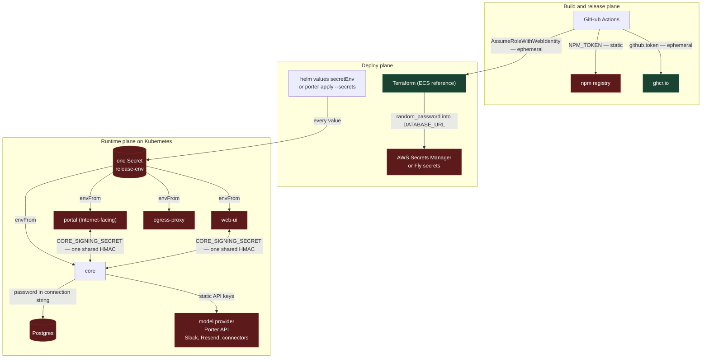
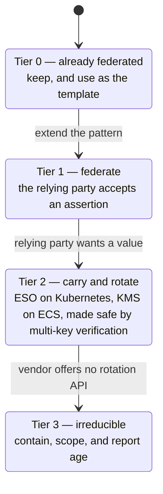
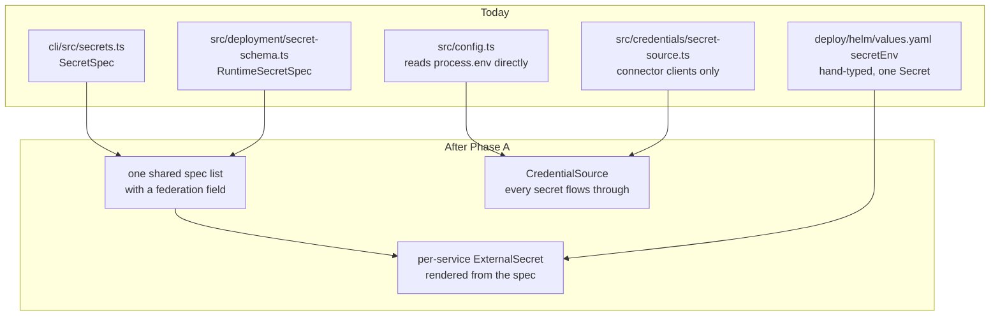
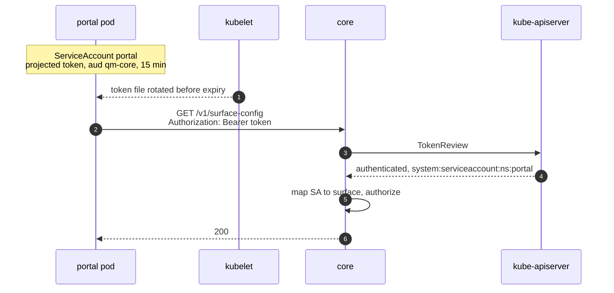
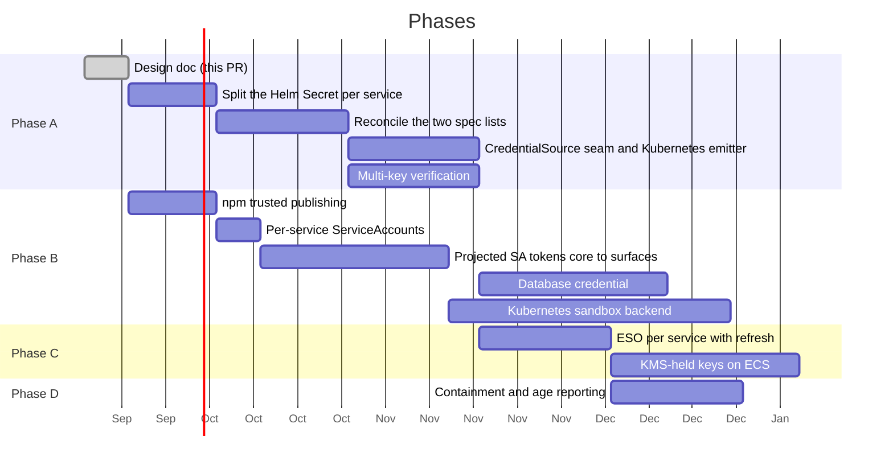

# Secretless QM

Replacing long-lived static secrets with federated, short-lived credentials.

This is the implementation plan: the full inventory, the mechanism analysis, and
the phasing. The proposal for upstream is
[`adrs/secretless-credentials.md`](../adrs/secretless-credentials.md), the same
argument at proposal length. Keep the two in step when findings change.

## Context

QM deploys into an operator's own account and runs as a small fleet of services
that talk to each other, to Postgres, to a model provider, and to a set of
third-party APIs. Almost all of that trust is carried by static secrets: values
minted once by a human and injected as process environment for the life of the
deployment.

The deployment this plan is for is **Kubernetes**, through the Helm chart at
`deploy/helm/` or the Porter manifests at `porter/apps/`. The bar is: workload
identity federation wherever a relying party accepts an assertion, External
Secrets Operator (ESO) everywhere else, and in every case rotation that runs
without a human. The `qm` CLI knows nothing about Kubernetes — its targets are
`docker`, `fly`, and `aws`[^clibackends] — so on this path there is no
`qm secrets push`, no `.env.example` consumer, no `check --live`, and no
per-service secret routing at all. That gap shapes Phase A.

The CLI declares 41 first-party secret names[^specs]. Nine of those are not
secret material — `PUBLIC_API_URL`, both CA certificates, `OIDC_CLIENT_ID`,
`PORTAL_EXPECTED_TEAM_ID`, `AUTH_ALLOWED_EMAILS`, `AUTH_EMAIL_FROM`, `SMTP_HOST`,
`SMTP_USERNAME` — leaving 32 real secrets. Seven more live outside that list:
`FLY_SANDBOX_API_TOKEN`, `SECURITY_SCREEN_PROXY_TOKEN`, `NPM_TOKEN` in the
release workflow, two that core requires but the CLI never declares
(`MODEL_GATEWAY_API_KEY`[^gateway] and `DEPLOY_APPS_SESSION_SECRET`[^deployapps]),
and two that only exist on Kubernetes: `imagePullSecrets` and the ingress TLS
key. None expire on their own.

The deploy plane is already in better shape than the runtime plane. Deploying to
AWS from GitHub Actions uses `sts:AssumeRoleWithWebIdentity` against an
account-level GitHub OIDC provider, with audience and subject pinned and
wildcards rejected[^oidctrust]. Image pushes use the per-job `github.token`, and
images are signed keylessly with Fulcio and the same OIDC identity. That is the
pattern this document extends.

A note on vocabulary. "OIDC" already appears throughout this codebase meaning
_human_ sign-in: the portal's relying-party configuration, the built-in `auth`
broker, `OIDC_CLIENT_ID`, `OIDC_CLIENT_SECRET`. This document uses **WIF**
(workload identity federation) for the machine-to-machine case to keep the two
apart. They share a protocol and share nothing else.

## Goals

- Eliminate every static secret that a supported identity provider can replace
  with a short-lived, audience-scoped, automatically-rotated credential.
- Where federation is not available, carry the secret through ESO with a
  refresh interval, and make the application safe to rotate under: no
  signature-mismatch outage, no invalidated sessions, no undecryptable rows.
- Make the residual set explicit, small, and contained, and say plainly which
  entries can never meet the rotation bar.
- Build one credential seam that every path flows through, so later work has a
  single place to change.

## Non-goals

- Rewriting how _user_ sign-in works. The portal, the `auth` broker, and
  connector OAuth stay as they are.
- Changing how credentials are materialized into agent sandboxes. That surface
  has its own acknowledged limitations[^security] and its own broker-delivery
  path, which this design reuses but does not redesign.
- Adding a new secrets product on ECS or Fly, where the platform's own STS and
  KMS cover what is needed. On Kubernetes, ESO is not a new product; it is the
  standard carrier, and this design depends on it.
- Inventing federation where no vendor offers it. Slack does not federate;
  neither does Anthropic's first-party API. Those are contained, not removed.

## Where the secrets are today



The two green nodes are reached with ephemeral, federated credentials. Every
other path rests on a value a human minted that does not expire.

### The Helm chart hands every secret to every pod

This is the worst finding in the inventory and the one to fix first. The chart
renders `values.yaml` `secretEnv` into a single `Secret` named `<release>-env`
and attaches it with an unconditional `envFrom` to every Deployment it
creates[^helmenvfrom]: core, web-ui, portal, and egress-proxy. So the one
Internet-facing pod, portal, holds `ANTHROPIC_API_KEY`, `DATABASE_URL`,
`CONNECTOR_SECRET_KEY`, `SKILL_SIGNING_SECRET`, `CAPABILITY_SECRET`, and the
Admin-role `PORTER_DEPLOY_API_TOKEN`, none of which it uses. Non-secrets sit in
the same Secret too: `SANDBOX_BACKEND`, the `PORTER_*_ID` values, image names,
domains.

The per-service routing already exists on the ECS side. `SecretSpec.service`,
`computedSecrets`, and `secretsForService` in `cli/src/secrets.ts` decide which
task definition receives which secret, and `docs/porter.md` hand-copies the same
table for operators to apply by hand[^portersecrets]. The chart ignores both.

Per-surface identity in Phase B1 buys nothing while every surface already holds
every secret. Splitting that Secret is step zero.

### The service-to-service case

`CORE_SIGNING_SECRET` is a single symmetric HMAC key shared by core and _every_
surface plugin — `portal`, `web-ui`, `admin`, `auth`, `slack`, and any plugin the
deployment adds, since `computedSecrets` grants it to each plugin with
`coreAccess` left on[^computed]. The chassis reads it from process environment
and signs every core call with it[^chassis].

The consequences are structural, not hypothetical:

- Verification is symmetric, so any holder can forge any other holder's
  requests. A compromised `admin` container can sign as `portal`.
- The signature carries no caller identity[^sourceauth]. Core cannot tell which
  surface called it, only that _a_ holder did.
- Rotation is a fleet-wide atomic event. There is no overlap window, because
  there is one key and one value.

`PORTAL_IDENTITY_SECRET` has the same shape in the same direction: the portal
mints a signed user identity and core and admin verify it[^portalmint]. It is a
genuinely distinct key — core refuses to start in production if it is unset or
equal to `CORE_SIGNING_SECRET` or `CAPABILITY_SECRET`[^portalguard] — but it is
still symmetric, still shared across four services, and still rotated
atomically.

### The rotation trap

Ten secrets are symmetric keys verified against exactly one value:
`CORE_SIGNING_SECRET`, `CAPABILITY_SECRET`, `PORTAL_IDENTITY_SECRET`,
`SKILL_SIGNING_SECRET`, `AUTH_TOKEN_SECRET`, `AUTH_CLIENT_SECRET`,
`PORTAL_SESSION_SECRET`, `DEPLOY_APPS_SESSION_SECRET`, `AWS_DEPLOY_GATE_SECRET`,
and `CONNECTOR_SECRET_KEY`.

ESO rotating the Kubernetes Secret and a reloader rolling the pods gives a
window in which core verifies with the new key while portal still signs with
the old one, or the reverse. For the HMACs that is a signature-mismatch outage.
For the cookie keys it invalidates every session. For `CONNECTOR_SECRET_KEY` it
makes every stored connector credential undecryptable. So ESO alone cannot meet
the rotation bar for this family; the application has to change first.

Two mechanics compound it. `loadConfig` snapshots `process.env` at
boot[^loadconfig], so a rotated value is invisible to a running pod until it
restarts. And the chart's `checksum/secret-env` annotation covers only its own
rendered Secret[^helmchecksum], not one ESO manages, so a rotation does not roll
the pods on its own.

### Full inventory

Tiers are defined in the next section.

| Secret                                                                                   | Where it lives                | Today                                               | Tier |
| ---------------------------------------------------------------------------------------- | ----------------------------- | --------------------------------------------------- | ---- |
| AWS deploy role                                                                          | `main.tf:311`                 | GitHub OIDC, subject + audience pinned              | 0    |
| GHCR push                                                                                | `release-package.yml`         | `github.token`, per-job                             | 0    |
| Cosign signing key                                                                       | `release-package.yml`         | keyless, Fulcio + OIDC                              | 0    |
| Ingress TLS key                                                                          | `values.yaml` `clusterIssuer` | cert-manager issues and rotates                     | 0    |
| `CORE_SIGNING_SECRET`                                                                    | every pod via `envFrom`       | shared static HMAC                                  | 1    |
| `PORTAL_IDENTITY_SECRET`                                                                 | every pod via `envFrom`       | shared static HMAC, portal mints                    | 1    |
| `DATABASE_URL`                                                                           | every pod via `envFrom`       | static password, no rotation path                   | 1    |
| `PORTER_DEPLOY_API_TOKEN`                                                                | every pod via `envFrom`       | Admin-role token, can do anything in the project    | 1    |
| `NPM_TOKEN`                                                                              | `publish-cli.yml:89`          | static automation token                             | 1    |
| `imagePullSecrets`                                                                       | `values.yaml`                 | PAT in a `dockerconfigjson` Secret on private forks | 2    |
| `CONNECTOR_SECRET_KEY`                                                                   | every pod via `envFrom`       | static encryption key, one value                    | 2    |
| `AUTH_SIGNING_JWK`                                                                       | every pod via `envFrom`       | static P-256 private key                            | 2    |
| `CAPABILITY_SECRET`                                                                      | every pod via `envFrom`       | static HMAC, one value                              | 2    |
| `SKILL_SIGNING_SECRET`                                                                   | every pod via `envFrom`       | static HMAC, one value                              | 2    |
| `AUTH_TOKEN_SECRET`                                                                      | every pod via `envFrom`       | static HMAC, one value                              | 2    |
| `PORTAL_SESSION_SECRET`                                                                  | every pod via `envFrom`       | static cookie key, one value                        | 2    |
| `DEPLOY_APPS_SESSION_SECRET`                                                             | core                          | static cookie key, undeclared by the CLI            | 2    |
| `AWS_DEPLOY_GATE_SECRET`                                                                 | core                          | static HMAC, one value                              | 2    |
| `AUTH_CLIENT_SECRET`                                                                     | every pod via `envFrom`       | CLI-generated shared secret                         | 2    |
| `DATABASE_POOL_URL`                                                                      | operator-supplied             | must carry the same credentials as `DATABASE_URL`   | 2    |
| `FLY_DEPLOY_API_TOKEN`, `FLY_SANDBOX_API_TOKEN`                                          | core, Fly targets only        | minted at `-x 8760h`[^flytokens]                    | 2    |
| `ANTHROPIC_API_KEY`                                                                      | every pod via `envFrom`       | static vendor key                                   | 3    |
| `OPENAI_API_KEY`, `OPENROUTER_API_KEY`                                                   | core                          | static vendor keys                                  | 3    |
| `MODEL_GATEWAY_API_KEY`                                                                  | core                          | static bearer, undeclared by the CLI                | 3    |
| `SLACK_BOT_TOKEN`, `SLACK_APP_TOKEN`                                                     | durable store                 | encrypted at rest, no vendor rotation API           | 3    |
| `SLACK_SIGNING_SECRET`                                                                   | core, env only                | no stored path, no vendor rotation API              | 3    |
| `SPRITES_TOKEN`, `E2B_API_KEY`, `MODAL_TOKEN_*`, `SMOLMACHINES_TOKEN`, `AGENT37_API_KEY` | core                          | dashboard-minted; vendor API unverified             | 3    |
| `SECURITY_SCREEN_PROXY_TOKEN`                                                            | core                          | static bearer to a third-party screen               | 3    |
| `RESEND_API_KEY`                                                                         | every pod via `envFrom`       | static vendor key                                   | 3    |
| `SMTP_PASSWORD`                                                                          | auth                          | dashboard-minted, no vendor rotation API            | 3    |
| `GOOGLE_/DROPBOX_/LINEAR_OAUTH_CLIENT_SECRET`                                            | core                          | dashboard-minted, no vendor rotation API            | 3    |
| `OIDC_CLIENT_SECRET` (external IdP)                                                      | portal                        | dashboard-minted, no vendor rotation API            | 3    |

"Every pod via `envFrom`" is the Helm chart today. Under Porter the operator
passes each value by hand with `--secrets`, which at least lets them scope it,
but nothing enforces the scoping.

## The tiering



**Tier 1 — federate.** The relying party accepts a signed assertion in place of a
secret. The secret is deleted outright: no value exists to store, leak, or
rotate.

**Tier 2 — carry and rotate.** The relying party wants a value, but the value
can be minted or held somewhere with an audit trail and delivered short-lived.
On Kubernetes the carrier is an `ExternalSecret` per service with a
`refreshInterval`, whose `SecretStore` authenticates to the cloud secret manager
through IRSA, EKS Pod Identity, GKE Workload Identity, or Azure Workload
Identity — no static credential for the store itself. On ECS the equivalent is
a KMS-held key the task role calls. Either way, automatable rotation requires
the multi-key verification in Phase A first.

**Tier 3 — irreducible.** The vendor mints the credential in a dashboard and
offers no API to rotate it. Keep it out of process environment, deliver it
through the egress-proxy broker path where the consumer is an agent, scope it
as narrowly as the vendor allows, and have `qm doctor` report its age. That
report is the ceiling for this tier and the doc should say so rather than
imply more.

The success metric is the size of Tier 3 after the work, not the number of
mechanisms introduced.

## Proposed design

### Phase A: the seam, and safe rotation

Two pieces of groundwork, both prerequisites for everything after them.

**A1: build the seam that does not exist yet.** There are three candidate
chokepoints and none is universal:

| Candidate                                                  | Actual reach                                                                                                                                                                                                                           |
| ---------------------------------------------------------- | -------------------------------------------------------------------------------------------------------------------------------------------------------------------------------------------------------------------------------------- |
| `FIRST_PARTY_SECRET_SPECS` (`cli/src/secrets.ts:43`)       | Deploy-side only: renders `.env.example`, Terraform `secret_names`, and ECS task secret routing. Nothing in `src/` imports it. Reaches nothing on Kubernetes.                                                                          |
| `CORE_SECRET_SPECS` (`src/deployment/secret-schema.ts:29`) | Boot-time validation only, and it is a _separate list with a separate type_. Nothing in `cli/` imports it.                                                                                                                             |
| `SecretSource` (`src/credentials/secret-source.ts`)        | Connector OAuth clients only[^secretsource]. Core's own secrets never pass through it — `CORE_SIGNING_SECRET`, `CONNECTOR_SECRET_KEY`, `SKILL_SIGNING_SECRET`, `DATABASE_URL` and the model keys are read straight from `process.env`. |

So A1 reconciles the two declaration lists into one, widens `SecretSource` until
core reads its own secrets through it, and — this is the part the ECS-shaped
first draft missed — gives that list a Kubernetes emitter. The spec already
knows which service needs which secret; on Kubernetes that has to become
per-service `Secret`s or per-service `ExternalSecret`s, rendered into Helm
values rather than typed into `secretEnv` by hand. Until the seam emits
something the chart consumes, marking a spec federated reaches nothing on this
path.



The runtime interface gains expiry:

```ts
export interface CredentialSource {
  get(name: string): Promise<{ value: string; expiresAt: number } | undefined>;
}
```

`createEnvSecretSource` and `createAwsSecretsManagerSource` become
implementations of it. The Secrets Manager source already caches with a
60-second TTL and tolerates staleness for 15 minutes, so the shape federated
credentials need is already written. On EKS, `SECRETS_BACKEND=aws` under IRSA
already reads Secrets Manager from core with no credential[^secretsbackend];
extending that to core's own secrets means a rotated value reaches a running pod
within the cache TTL, with no restart and no reloader. That is the preferred
path for anything core reads at runtime. `SECRETS_BACKEND` knows only `env` and
`aws`, so GCP and Azure clusters go through ESO regardless.

**A2: multi-key verification.** The application change that makes rotation safe
on every substrate, including the ones that never get KMS. Each verifier of the
ten single-value keys accepts a list — current plus previous — and signs with
the first. `CONNECTOR_SECRET_KEY` gets a key id per encrypted row, so old rows
decrypt under the old key until they are re-encrypted. The auth broker's JWKS
serves two `kid`s during an `AUTH_SIGNING_JWK` rollover. With this in place, an
ESO refresh followed by a rolling restart has an overlap window in which both
keys verify, and the outage disappears.

The fallback read path — federated attempted, static accepted — is instrumented
in A1 to report when it fires. Removing a fallback needs evidence nothing uses
it, and `check --live` does not provide that even on the targets where it
exists[^checklive].

### Phase B1: per-workload identity

Replace the shared HMAC with a per-workload assertion that core verifies without
a shared key. The mechanism depends on the substrate, and the substrate this
plan is for has the best one.

| Substrate      | Mechanism                                                                                                                                                                                                                                                                   | Secret material |
| -------------- | --------------------------------------------------------------------------------------------------------------------------------------------------------------------------------------------------------------------------------------------------------------------------- | --------------- |
| **Kubernetes** | Each surface gets its own ServiceAccount and a projected token volume with `audience: qm-core` and a short `expirationSeconds`. The kubelet rotates it. The surface sends it as a bearer; core verifies through the `TokenReview` API or the cluster issuer's JWKS, cached. | none            |
| ECS            | Each surface gets a KMS key whose policy permits `kms:Sign` only from its own task role. The surface mints a short-lived token and signs it through KMS; core verifies against a cached public key.                                                                         | none in-process |
| Docker, Fly    | HMAC path kept, selected by the same `federation` field. Local development stays here.                                                                                                                                                                                      | shared key      |

The Kubernetes row is the primary design. It is the feature ECS lacks — an
issuer that mints a verifiable, audience-scoped assertion for a workload — and
it is GA on every cluster Porter can create.



Concretely for the chart: `serviceAccount` in `values.yaml` is one SA for every
workload[^helmsa], so the Kubernetes equivalent of "split per-surface task
roles" is per-service ServiceAccounts in `templates/serviceaccount.yaml`. The
chassis needs one more auth mode next to HMAC that reads the token from the
projected file, and core needs a `TokenReview` verifier next to
`verifySignature`. Core's own SA needs one RBAC grant to create `TokenReview`s.

What this buys, beyond deleting a secret:

- Core learns _which_ surface is calling and can authorize per-surface. The
  `admin` container can no longer sign as `portal`.
- Tokens expire on their own and the kubelet rotates them. Nothing is minted,
  stored, or rotated by anyone.
- The mechanism exists today with zero new infrastructure.

**ECS has no OIDC issuer**, which is why the KMS row exists. AWS STS _consumes_
a web identity token and does not mint one, and AWS publishes no JWKS for ECS
task roles. Two prerequisites on that substrate: every surface needs its own
task role (the reference module shares one `task` role across every non-core
service[^taskroles]), and the alternative to KMS is a SigV4-signed
`sts:GetCallerIdentity` request that core replays — the Vault `aws-iam`
pattern, at the cost of an STS call on core's request path.

**`PORTAL_IDENTITY_SECRET` collapses into this.** Today the portal mints a
signed user identity and core verifies it. Once core knows which ServiceAccount
is calling, the user claims are a payload that SA asserts, and the authorization
question becomes "may this SA assert user identities?" — a per-surface
permission, not a second key. On ECS the same holds under KMS: the portal holds
`kms:Sign` on its key, core holds the public half. Under no scheme does core
need a signing key for this.

### Phase B2: the database

`random_password.database` produces a 32-character password that Terraform
writes into state and into the `DATABASE_URL` secret[^dbpw]. Nothing in the
repository rotates it and no rotation procedure is documented.

The design has to say which database it is for, because the answer differs:

**RDS (EKS or ECS).** With `iam_database_authentication_enabled` and an
`rds-db:connect` grant on core's identity — the task role on ECS, the
ServiceAccount via IRSA or Pod Identity on EKS — core generates a 15-minute auth
token at connect time. `pg` 8.13 accepts `password` as a function returning a
promise[^pgversion], so the per-connection callback is a config change in
`retainPool`, not a driver change. Three things this does **not** do:

- **It does not remove the master password.** RDS requires one at instance
  creation. `manage_master_user_password` relocates it into an AWS-managed,
  auto-rotating Secrets Manager secret rather than deleting it. That is fine —
  it becomes Tier 2, and an ESO `template` can compose `DATABASE_URL` from that
  secret's JSON for any consumer that still needs a string.
- **It needs a bootstrap.** `GRANT rds_iam TO <user>` requires a prior
  password-authenticated session, and the module currently connects as the
  master user. The migration needs a separate application role.
- **It changes the pooled path.** `pooledDatabaseUrl` hard-rejects a pooled URL
  whose username, password, or database differ from the direct
  one[^poolinvariant], and a callback-authenticated URL carries no password to
  compare, so that check changes either way. On AWS, RDS Proxy accepts IAM
  tokens from clients and holds the database credential itself, which makes
  both `DATABASE_URL` and `DATABASE_POOL_URL` token-authenticated under one
  username. Replacing PgBouncer with RDS Proxy is the clean answer to open
  question 1 on that substrate.

**In-cluster Postgres, or a Porter datastore.** No IAM auth exists. The options
are ESO carrying the credential with rotation and a restart (safe once A2
lands, since the database password is not one of the ten shared keys), or an
operator such as CloudNativePG that manages the credential itself and rotates
it without application involvement. `docs/porter.md` treats in-cluster or
Porter datastores as the norm, so this case is not an afterthought; it is
probably the common one.

Separately, the generated URL carries `sslmode=no-verify`. That is worth fixing
on its own merits, and the supported fix already exists in `DATABASE_CA_CERT`.
It is not gated on this phase.

### Phase B3: npm trusted publishing

`publish-cli.yml` already passes `--provenance`, which uses the job's OIDC
identity to attest the build. It still authenticates with a static
`NODE_AUTH_TOKEN`. npm's trusted publishing accepts an OIDC identity for
_authentication_, which would drop the token.

One caveat specific to this repository: `publish-cli.yml` is a `workflow_call`
workflow invoked from `release.yml`. Trusted publishing matches on workflow
identity claims, and reusable-workflow support has been a moving target. Confirm
against current npm documentation before committing to this as the easy first
PR — if reusable workflows are not supported, the publish step has to be inlined
into the calling workflow first.

### Phase B4: a Kubernetes sandbox backend

`PORTER_DEPLOY_API_TOKEN` is the largest static credential in the table on this
path: an Admin-role token that can do anything in the Porter project, handed to
every pod by the chart. Tier 3 with an open question is not a plan for it.

When qm runs on the same cluster its sandboxes run on, the sandbox backend can
talk to the Kubernetes API with core's own ServiceAccount, RBAC-scoped to a
sandbox namespace, instead of Porter's admin API. That is workload identity
through the auto-mounted SA token, with no secret at all. It is a new
`kubernetes` sandbox backend next to the five that exist, so it is real work —
but it is the only route that removes the token rather than storing it
somewhere nicer. Until it lands, the token should at minimum be scoped to
core's `ExternalSecret` alone.

### Phase C: the keys core and auth sign with

Ten secrets are keys that core or auth uses to sign, seal, or encrypt, where
nothing outside the deployment ever needs the key itself. After A2 they can be
rotated safely; this phase is about where they live.

On **ECS** the key moves into KMS and the task role calls it: `CONNECTOR_SECRET_KEY`
as envelope encryption with a KMS key encryption key, `AUTH_SIGNING_JWK` as a
KMS asymmetric key behind the existing JWKS endpoint, and the HMACs as
`GenerateMac` / `VerifyMac`.

On **Kubernetes** they are carried by ESO from the cloud secret manager, one
`ExternalSecret` per service so each pod holds only its own, with a
`refreshInterval` and the multi-key overlap from A2 making the refresh safe.
Whether they are also KMS-backed is a per-cloud choice — on EKS the seam can
read them through `SECRETS_BACKEND=aws` under IRSA and skip ESO for core's own
keys entirely.

For the Fly tokens, which are Tier 2 because the CLI itself sets the one-year
expiry, the fix is minting per-deploy with a short `-x`. The `AwsRoleBroker`
already in the tree is the right shape for any vendor that supports scoped
minting: it caches per-actor credentials, refreshes on a margin, and constrains
the session with an inline policy[^broker].

### Phase D: contain what remains

Tier 3 splits into two groups, and the doc should be honest about which is
which.

**Can never meet the rotation bar.** `SLACK_BOT_TOKEN`, `SLACK_APP_TOKEN`,
`SLACK_SIGNING_SECRET`, the Google, Dropbox, and Linear OAuth client secrets, an
external `OIDC_CLIENT_SECRET`, and `SMTP_PASSWORD`. Each is minted in a vendor
dashboard with no API to rotate it. For these the `qm doctor` age report is the
ceiling. Two mechanics: the Slack bot and app tokens already live in the durable
store encrypted at rest[^slackstore], but `SLACK_SIGNING_SECRET` has no stored
path and is read only from environment, so giving it one is a small piece of
real work. And on Kubernetes, anything a pod needs at boot is an
`ExternalSecret` per service, not a hand-maintained `secretEnv` map.

**Rotatable if the vendor's admin API can mint keys.** The model provider keys,
`MODEL_GATEWAY_API_KEY`, `SECURITY_SCREEN_PROXY_TOKEN`, and the sandbox vendor
keys (`SPRITES_TOKEN`, `E2B_API_KEY`, `MODAL_TOKEN_*`, `SMOLMACHINES_TOKEN`,
`AGENT37_API_KEY`). The repository records only dashboard creation for each, and
nothing establishes that any of them offers sub-token minting. Where a vendor
does, an ESO `Webhook` generator or a scheduled rotation Job closes the loop and
the entry moves to Tier 2. Confirming this per vendor is cheap and should happen
before Phase C plans around any of them.

For all of it: declare `MODEL_GATEWAY_API_KEY` and `DEPLOY_APPS_SESSION_SECRET`
in the CLI spec list. A secret core requires but the deployment tooling has
never heard of cannot be validated, routed, or rotated.

### What about Bedrock and SES?

On AWS, Bedrock serves Anthropic models under IAM and SES sends mail under IAM,
both reachable from a task role or IRSA-bound ServiceAccount with no key
material. That is attractive and it is not close. `MODEL_PROVIDERS` is
`["anthropic", "openai", "openrouter"]`[^providers] with no Bedrock
implementation anywhere in the tree, and the existing SES route is the SMTP
interface, which the CLI explicitly tells operators to configure with "the SMTP
credential, not an AWS access key"[^ses]. Each is a new provider or transport
implementation, not a configuration flag, and neither helps GCP or Azure
clusters. They are listed here as a deliberate deferral rather than a phase.

## Rollout

Each phase is independently shippable and independently revertable.



The Helm Secret split is scheduled first and independently, because it removes
the worst finding with no seam work, and because Phase B1 is pointless until it
lands. `NPM_TOKEN` is independent of everything and carries the caveat in
Phase B3.

Every phase that removes a secret ships with a dual-read window: the federated
path is attempted and the static value is accepted as a fallback. Removing the
fallback needs the instrumentation from A1, because no existing command reports
whether a value was read.

## Alternatives considered

**Leave it alone; rotate more often.** Rotation does not fix the symmetric-key
impersonation problem, and without A2 rotation of the ten shared keys is an
outage. The failure mode is that rotation quietly never happens, which is the
current state.

**HashiCorp Vault as the carrier instead of ESO.** It would work, and its
`aws-iam` auth method is the source of the SigV4 alternative in Phase B1. On
Kubernetes it is a second control plane where ESO is a controller that reads
from the cloud secret manager the cluster already has an identity for. Vault
remains a reasonable operator choice behind the `CredentialSource` seam.

**KMS signing as the primary service-to-service mechanism.** The first draft
proposed it. It is the right ECS answer and the wrong Kubernetes one: it
introduces a KMS call per token and a key per surface to do what a projected
ServiceAccount token does with neither.

**SPIFFE/SPIRE for workload identity.** The right answer for a large
multi-cluster fleet, and heavy for a handful of services on one cluster that
already issues projected tokens. Revisit if QM ever spans heterogeneous
substrates in one deployment.

**mTLS between core and surfaces.** Solves per-service identity, and trades the
key-rotation problem for a certificate-rotation problem. On Kubernetes the
projected token is simpler and the cluster already runs the issuer.

## Risks

| Risk                                                                         | Mitigation                                                                                                           |
| ---------------------------------------------------------------------------- | -------------------------------------------------------------------------------------------------------------------- |
| The Helm Secret split lands but the CLI never emits it, so it drifts by hand | The split is rendered from the spec list in A1, not hand-maintained, and the chart fails if `secretEnv` is still set |
| Phase A lands and the later phases do not, leaving refactor without benefit  | Schedule the Secret split, `NPM_TOKEN`, and the database credential independently so value lands either way          |
| An ESO refresh rotates a shared key and takes the fleet down                 | A2 lands before any `refreshInterval` is set on one of the ten shared keys                                           |
| A rotated value is invisible to a running pod                                | Core reads through the seam with a cache TTL where it can; a reloader watches the `ExternalSecret` where it cannot   |
| `TokenReview` becomes a hard dependency on core's request path               | Cache verified tokens for their remaining lifetime; fall back to issuer JWKS verification, which is local            |
| The pooled-path invariant blocks partial migration                           | Resolve open question 1 before starting B2, not during; RDS Proxy is the AWS answer                                  |
| The Porter token stays because B4 is large                                   | Scope it to core's `ExternalSecret` alone as an interim, so at least the Internet-facing pod stops holding it        |
| Targets without a workload issuer diverge from Kubernetes                    | Keep the HMAC and KMS paths as explicit `federation` variants, exercised by the same tests                           |
| The work stalls halfway and the system carries both mechanisms forever       | Each phase deletes its secret from the spec list as its last step; a half-finished phase is visible in that list     |

## Open questions

1. **Which database.** RDS with IAM auth and RDS Proxy, or in-cluster Postgres
   under an operator? The B2 design differs completely between them, and
   `docs/porter.md` suggests in-cluster is the norm. This has to be decided
   before B2 starts.
2. **Fly workload identity.** Fly Machines expose a per-machine identity token.
   Is it verifiable by core in a way that distinguishes one app from another
   within the same organization? If yes, B1 extends to Fly. If no, Fly stays on
   HMAC and the deployment references should say so.
3. **`AUTH_CLIENT_SECRET`.** The CLI generates it for both sides of a loopback
   between two services we control, and on Kubernetes the auth broker runs
   embedded in the portal pod. Is a client secret needed at all once the
   surface has a verifiable identity?
4. **Vendor rotation APIs.** For each Tier 3 vendor in the "rotatable if" group,
   does the admin API mint keys? Cheap to answer and it decides whether the
   entry stays Tier 3.
5. **Local development.** The `.env` path must keep working with no cluster
   and no cloud identity. The assumption is that `federation` degrades to the
   env source in development; confirm against the `dev-instance` flow before
   A1.
6. **Existing deployments.** Splitting the Helm Secret, adding per-service
   ServiceAccounts, and changing the database credential are all changes to a
   running release. What does the operator-facing migration look like, and is
   it safe during a rolling upgrade?

## References

[^clibackends]: `cli/src/backends/registry.ts:96`, `:149`, `:230` — the three hosting providers are `docker`, `fly`, and `aws`. No Kubernetes or Porter target exists; `docs/porter.md` notes that `cli/src/services.ts` has no Porter wiring either.

[^specs]: `cli/src/secrets.ts:43` — `FIRST_PARTY_SECRET_SPECS`, the typed schema from which `.env.example`, Terraform `secret_names`, and per-task ECS secret routing are derived. Deploy-side only; nothing under `src/` imports it.

[^gateway]: `src/config.ts:934` — `${name} is required when model gateway routing is configured`, used as `apiKey` at `:951`. Not declared in `cli/src/secrets.ts`.

[^deployapps]: `src/config.ts:609` — a cookie-signing secret that falls back to `PORTAL_SESSION_SECRET`. Not declared in `cli/src/secrets.ts`.

[^oidctrust]: `cli/src/backends/aws.ts:2973` — `assertGithubDeployTrust` requires exactly one trust statement, `sts:AssumeRoleWithWebIdentity` only, a pinned `sts.amazonaws.com` audience, and subjects without wildcards. The role itself is `cli/templates/aws/main.tf:311`.

[^security]: [`SECURITY.md`](../../../../SECURITY.md) — "Sandbox credentials are plaintext while in use", and the operator assumptions around credential materialization.

[^helmenvfrom]: `deploy/helm/templates/secret.yaml` renders every `secretEnv` value into one `Secret`; `deploy/helm/templates/deployment.yaml:122` attaches it by `secretRef` inside an `envFrom` that every rendered Deployment receives. Admin and auth are embedded in web-ui and portal respectively, so the four Deployments are core, web-ui, portal, and egress-proxy.

[^portersecrets]: `docs/porter.md:121` — secrets are passed with `--secrets KEY=value`; `:147` names `src/deployment/secret-schema.ts` as the authoritative list the hand-copied wiring table is transcribed from.

[^computed]: `cli/src/secrets.ts:559` — every plugin with `coreAccess !== false` is added to `CORE_SIGNING_SECRET`'s service list.

[^chassis]: `plugins/chassis/src/env.ts:5` reads the value; the signing itself is `plugins/chassis/src/source-auth-sign.ts` and `plugins/chassis/src/core-client.ts`.

[^sourceauth]: `src/auth/source-auth.ts:36` — `verifySignature` checks signature, timestamp freshness, and replay only. No caller identity is carried or checked.

[^portalmint]: `mintPortalIdentity` is called in the portal at `plugins/portal/src/index.ts:232`, `:740`, `:914` and `plugins/portal/src/proxy.ts:120`, `:191`; `verifyPortalIdentity` runs in core at `src/api/server.ts:293` and `src/api/routes/deployments.ts:66`, and in admin at `plugins/admin/src/index.ts:86`.

[^portalguard]: `src/api/server.ts:536` — under `production`, core throws if `PORTAL_IDENTITY_SECRET` or `CAPABILITY_SECRET` is unset, equals `CORE_SIGNING_SECRET`, or equals the other.

[^loadconfig]: `src/config.ts:987` — `loadConfig(env = process.env)` reads every secret once at boot.

[^helmchecksum]: `deploy/helm/templates/deployment.yaml:26` — the annotation hashes the chart's own `secret.yaml` render, so a change to an ESO-managed Secret does not alter it.

[^flytokens]: `cli/src/secrets.ts:119` (`fly tokens create org -o <fly-org> -x 8760h`) and `cli/src/preflight.ts:96` (`fly tokens create deploy -a <app> -x 8760h`).

[^secretsource]: `src/wiring.ts:999` builds the source and passes it only to `createConnectorClientResolver`. Other importers are `src/connectors/oauth.ts:457`, `src/connectors/connector-client-store.ts:127`, `src/credentials/connector-token.ts:16`, `src/api/routes/connectors.ts:48`. Core's own secrets are read from `process.env` in `src/config.ts` — `:1209` `DATABASE_URL`, `:1320` `CORE_SIGNING_SECRET`, `:1328` `CONNECTOR_SECRET_KEY`, `:1339` `SKILL_SIGNING_SECRET`.

[^secretsbackend]: `src/config.ts:890` — `SECRETS_BACKEND` accepts `env` or `aws` only.

[^checklive]: `cli/src/cli.ts:137` describes `--live` as "verify running identity, rendered config, and health"; the implementation emits `fly.live-readiness` / `<target>.live-drift` clauses and throws for unsupported targets at `:334`.

[^helmsa]: `deploy/helm/values.yaml:9` declares one `serviceAccount` block; `deploy/helm/templates/deployment.yaml:35` sets the same `serviceAccountName` on every Deployment.

[^taskroles]: `cli/templates/aws/main.tf:193` is the shared default task role and `:199` is core's; `:224` defines per-service `assume_role_task` roles, and `:26` (`effective_task_role_arns`) is the coalesce that falls back to the shared role. `manage_task_role` defaults to false (`cli/templates/aws/variables.tf:139`) and is set only for a non-core service with `assumeRoleArns` (`cli/src/terraform.ts:180`).

[^dbpw]: `cli/templates/aws/main.tf:580` generates the password; `:617` sets it on the instance; `:778` writes it into the `DATABASE_URL` secret with `sslmode=no-verify`.

[^pgversion]: `package.json:82` — `"pg": "^8.13.1"`; the pool is built at `src/persistence/pg-pool.ts:55`.

[^poolinvariant]: `src/persistence/pg-pool.ts:85` — `DATABASE_POOL_URL must preserve the DATABASE_URL database and credentials`.

[^broker]: `src/auth/aws-role-broker.ts:46` — per-actor `AssumeRole` with an inline session policy, a 5-minute refresh margin, and a cache keyed by session name.

[^slackstore]: `src/surfaces/slack-installation.ts:2` imports `encryptSecret`/`deriveConnectorKey`; `createSlackInstallationStore` (`:59`) stores `botTokenEnc` and `appTokenEnc`. `SLACK_SIGNING_SECRET` is read only from environment (`src/slack/config.ts:48`).

[^providers]: `cli/src/config.ts:116` — `MODEL_PROVIDERS = ["anthropic", "openai", "openrouter"]`.

[^ses]: `cli/src/commands/setup.ts:92` — "for SES, the SMTP credential, not an AWS access key".
