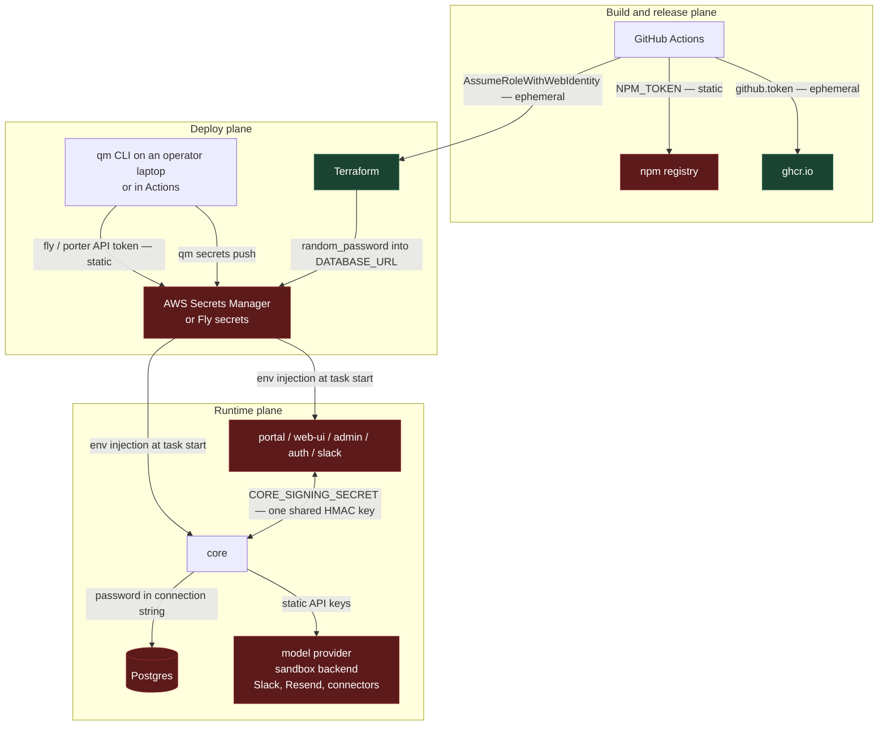
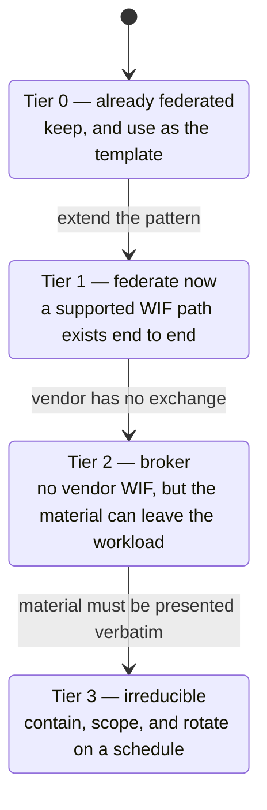
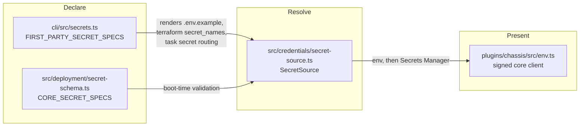
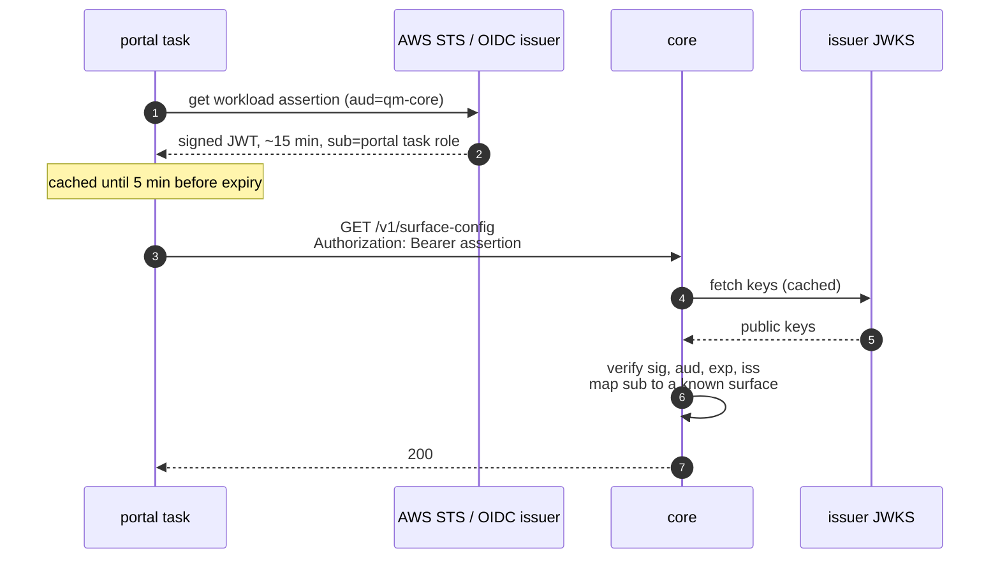
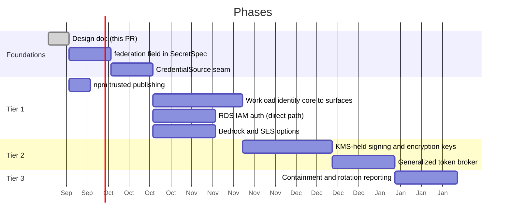

# Secretless QM

Replacing long-lived static secrets with workload identity federation.

## Context

QM deploys into an operator's own cloud account and runs as a small fleet of
services that talk to each other, to Postgres, to a model provider, and to a set
of third-party APIs. Almost all of that trust is currently carried by static
secrets: values minted once by a human, pasted into a gitignored `.env`, pushed
into Fly secrets or AWS Secrets Manager by `qm secrets push`, and then injected
as process environment for the life of the deployment.

The CLI declares 41 first-party secret names[^specs], of which roughly 31 are
true secret material. Three more arrive from outside that list:
`FLY_SANDBOX_API_TOKEN`, `SECURITY_SCREEN_PROXY_TOKEN` (required whenever
`securityScreen` is configured), and `NPM_TOKEN` in the release workflow. None
of them expire on their own. Most have no rotation procedure beyond rerunning
`qm secrets push`, which the AWS backend guards but which still requires a human
to hold the new value in a shell.

The deploy plane is already in better shape than the runtime plane. Deploying to
AWS from GitHub Actions uses `sts:AssumeRoleWithWebIdentity` against an
account-level GitHub OIDC provider, with audience and subject pinned and
wildcards rejected[^oidctrust]. Image pushes use the per-job `github.token`, and
images are signed keylessly with Fulcio and the same OIDC identity. That is the
pattern this document proposes extending to everything else.

A note on vocabulary. "OIDC" already appears throughout this codebase meaning
_human_ sign-in: the portal's relying-party configuration, the built-in `auth`
broker, `OIDC_CLIENT_ID`, `OIDC_CLIENT_SECRET`. This document uses **WIF**
(workload identity federation) for the machine-to-machine case to keep the two
apart. They share a protocol and share nothing else.

## Goals

- Eliminate every static secret that a supported identity provider can replace
  with a short-lived, audience-scoped, automatically-rotated credential.
- Shrink the operator's onboarding burden: fewer values to mint, paste, store,
  and rotate.
- Make the residual set explicit, small, and contained, rather than leaving it
  indistinguishable from the rest.
- Keep the change inside the layers every path already flows through — the CLI's
  `SecretSpec` schema, core's `SecretSource`, and the plugin chassis — so the
  system ends up smaller, not larger.

## Non-goals

- Rewriting how _user_ sign-in works. The portal, the `auth` broker, and
  connector OAuth stay as they are.
- Changing how credentials are materialized into agent sandboxes. That surface
  has its own acknowledged limitations[^security] and its own broker-delivery
  path, which this design reuses but does not redesign.
- Adding a new secrets-management product as a dependency. The design uses what
  each supported target already offers.
- Replacing secrets that no federation path exists for. Slack does not federate;
  neither does Anthropic's first-party API. Those are contained, not removed.

## Where the secrets are today



The two green nodes are reached with ephemeral, federated credentials. Every
other path rests on a value a human minted that does not expire.

### The service-to-service case is the worst of them

`CORE_SIGNING_SECRET` is a single symmetric HMAC key shared by core and _every_
surface plugin — `portal`, `web-ui`, `admin`, `auth`, `slack`, and any plugin the
deployment adds, since `computedSecrets` grants it to each plugin with
`coreAccess` left on[^computed]. The chassis reads it straight from process
environment and signs every core call with it[^chassis]. `PORTAL_IDENTITY_SECRET`
follows the same shape, and falls back to `CORE_SIGNING_SECRET` when unset.

The consequences are structural, not hypothetical:

- Verification is symmetric, so any holder can forge any other holder's
  requests. A compromised `admin` container can sign as `portal`.
- There is no per-service identity on the wire. Core cannot tell which surface
  called it, only that _a_ holder did.
- Rotation is a fleet-wide atomic event. There is no overlap window, because
  there is one key and one value.

This is the highest-value target in the inventory, and the one where WIF changes
the security model rather than merely the storage.

### Full inventory

Tiers are defined in the next section.

| Secret                                                                                   | Where it lives              | Today                                  | Tier                  |
| ---------------------------------------------------------------------------------------- | --------------------------- | -------------------------------------- | --------------------- |
| AWS deploy role                                                                          | `main.tf:311`               | GitHub OIDC, subject + audience pinned | 0                     |
| GHCR push                                                                                | `release-package.yml`       | `github.token`, per-job                | 0                     |
| Cosign signing key                                                                       | `release-package.yml`       | keyless, Fulcio + OIDC                 | 0                     |
| `NPM_TOKEN`                                                                              | `publish-cli.yml:89`        | static automation token                | 1                     |
| `CORE_SIGNING_SECRET`                                                                    | core + every surface        | shared static HMAC                     | 1                     |
| `PORTAL_IDENTITY_SECRET`                                                                 | core, portal, web-ui, admin | shared static HMAC                     | 1                     |
| `DATABASE_URL`                                                                           | Terraform → Secrets Manager | `random_password`, never rotated       | 1                     |
| `DATABASE_POOL_URL`                                                                      | operator-supplied           | same credentials, PgBouncer            | 1                     |
| `ANTHROPIC_API_KEY`                                                                      | core                        | static vendor key                      | 1 on AWS, 3 elsewhere |
| `RESEND_API_KEY` / `SMTP_PASSWORD`                                                       | auth, core                  | static vendor key                      | 1 on AWS, 3 elsewhere |
| `CONNECTOR_SECRET_KEY`                                                                   | core                        | static encryption key                  | 2                     |
| `AUTH_SIGNING_JWK`                                                                       | auth                        | static P-256 private key               | 2                     |
| `CAPABILITY_SECRET`                                                                      | core, egress-authz          | static HMAC                            | 2                     |
| `SKILL_SIGNING_SECRET`                                                                   | core                        | static HMAC                            | 2                     |
| `AUTH_TOKEN_SECRET`                                                                      | auth                        | static HMAC                            | 2                     |
| `PORTAL_SESSION_SECRET`                                                                  | portal                      | static cookie key                      | 2                     |
| `AWS_DEPLOY_GATE_SECRET`                                                                 | core                        | static HMAC                            | 2                     |
| `AUTH_CLIENT_SECRET`                                                                     | auth + portal               | CLI-generated shared secret            | 2                     |
| `FLY_DEPLOY_API_TOKEN`                                                                   | core                        | org token, `-x 8760h`                  | 2                     |
| `FLY_SANDBOX_API_TOKEN`                                                                  | core                        | app-scoped token, `-x 8760h`           | 2                     |
| `PORTER_DEPLOY_API_TOKEN`                                                                | core                        | Admin-role token, no expiry            | 2                     |
| `SPRITES_TOKEN`, `E2B_API_KEY`, `MODAL_TOKEN_*`, `SMOLMACHINES_TOKEN`, `AGENT37_API_KEY` | core                        | static vendor keys                     | 2                     |
| `SECURITY_SCREEN_PROXY_TOKEN`                                                            | core                        | static bearer token                    | 2                     |
| `OPENAI_API_KEY`, `OPENROUTER_API_KEY`                                                   | core                        | static vendor keys                     | 3                     |
| `SLACK_BOT_TOKEN`, `SLACK_APP_TOKEN`, `SLACK_SIGNING_SECRET`                             | slack                       | static, no federation offered          | 3                     |
| `GOOGLE_/DROPBOX_/LINEAR_OAUTH_CLIENT_SECRET`                                            | core                        | OAuth client secrets                   | 3                     |
| `OIDC_CLIENT_SECRET`                                                                     | portal                      | external IdP client secret             | 3                     |

An `-x 8760h` Fly token is a one-year credential. It is static in every sense
that matters.

## The tiering



**Tier 1 — federate.** The relying party accepts an OIDC assertion. The secret is
deleted outright: no value exists to store, leak, or rotate.

**Tier 2 — broker.** The vendor has no exchange, but the credential does not have
to live in the workload's environment. Either a KMS holds the key material and
the workload calls the KMS under its own workload identity (so the private key
never exists in a process), or a broker mints a short-lived downstream token per
use. The static root moves to exactly one place with an audit trail.

**Tier 3 — contain.** The credential must be presented verbatim to a vendor that
offers nothing better. Keep it out of process environment, deliver it through the
existing egress-proxy broker path where the consumer is an agent, scope it as
narrowly as the vendor allows, and give it a rotation schedule rather than an
expiry of never.

The success metric is the size of Tier 3 after the work, not the number of
mechanisms introduced.

## Proposed design

### One seam, not many

Three files already sit across every path a secret takes. The design adds
behavior at those three and touches little else.



`SecretSpec` gains one field:

```ts
federation?: { kind: "workload-identity" | "kms" | "broker"; ... }
```

A spec carrying `federation` is no longer rendered into `.env.example`, no longer
included in Terraform's `secret_names`, no longer accepted by `qm secrets push`,
and no longer required at boot by `validateCoreSecretEnv`. One declaration change
propagates to the whole pipeline, because the pipeline already derives everything
from that one list. That is the property that keeps this from becoming a new
layer.

`SecretSource` gains a sibling for credentials that must be fetched fresh rather
than read once:

```ts
export interface CredentialSource {
  get(name: string): Promise<{ value: string; expiresAt: number } | undefined>;
}
```

`createEnvSecretSource` and `createAwsSecretsManagerSource` keep working
unchanged. Federated credentials arrive through a third implementation that
already knows how to cache with a TTL, because the Secrets Manager source does
exactly that today.

### Tier 1a: workload identity for service-to-service calls

Replace the shared HMAC with a per-workload assertion that core verifies
asymmetrically.

On AWS, every workload already runs under an ECS task role, and a task role is a
verifiable identity. The catch is that the reference module does not give each
service its own: core gets `core_task`, and every other service shares a single
`task` role unless the deployment sets `taskRoleArn` or `assumeRoleArns`, which
promotes it to a per-service managed role[^taskroles]. Splitting the shared role
into one role per surface is therefore a prerequisite of this phase, not a
given. Once split, the chassis exchanges the role for a signed, audience-scoped
token, and core verifies the signature against the issuer's public keys and
reads the caller's identity out of the claims.



What this buys, beyond deleting a secret:

- Core learns _which_ surface is calling and can authorize per-surface. The
  `admin` container can no longer sign as `portal`.
- Credentials expire on their own. A leaked assertion is worth minutes.
- Rotation becomes a property of the issuer, not a fleet-wide coordinated event.

`PORTAL_IDENTITY_SECRET` is a distinct problem despite looking similar. It signs
a _user_ identity that core must trust, not a service call. It becomes an
asymmetric signature: core signs portal identity with a KMS key (Tier 2) and the
surfaces verify with the public half, which is not secret and can ship as
ordinary config.

Not every target has a verifiable per-workload issuer. Local Docker certainly
does not, and whether Fly's machine identity qualifies is open question 2. The
chassis keeps the HMAC path for targets that lack one, selected by the same
`federation` field, and that path remains the local-development path. This is a
widening of an existing branch, not a new abstraction.

### Tier 1b: RDS IAM authentication

`random_password.database` produces a 32-character password that Terraform writes
into state and into a `DATABASE_URL` secret[^dbpw]. Nothing in the repository
rotates it and no rotation procedure is documented, so in practice it is set once
at `terraform apply` and left.

With `iam_database_authentication_enabled` on the instance and an
`rds-db:connect` grant on the core task role, core generates a 15-minute auth
token at connect time from its own role. The password disappears from Terraform
state, from Secrets Manager, and from the process.

Two details make this non-trivial and worth calling out now:

- The connection string stops being a static string. The pool needs a password
  callback invoked per connection, since tokens expire mid-pool-lifetime.
- `DATABASE_POOL_URL` points at PgBouncer, which authenticates to Postgres on the
  client's behalf. PgBouncer and IAM auth interact badly; the pooled path likely
  stays password-based in the first pass and is tracked as an open question.

The current string also carries `sslmode=no-verify`. Since IAM auth requires
verified TLS, this change forces that to be fixed, which is worth having on its
own.

### Tier 1c: npm trusted publishing

`publish-cli.yml` already passes `--provenance`, which uses the job's OIDC
identity to attest the build. It still authenticates with a static
`NODE_AUTH_TOKEN`. npm's trusted publishing accepts the same OIDC identity for
_authentication_, so the token can be dropped and the workflow keeps its existing
repository and workflow pinning. Confirm the current npm requirements (registry
support, minimum CLI version, and the publisher configured on the package) before
implementing. This is the smallest change in the document and a good first
implementation PR.

### Tier 1d: provider credentials on AWS

On an AWS-target deployment, Bedrock serves Anthropic models under IAM, and SES
sends mail under IAM. Both are reachable from the core task role with no key
material at all. This does not help Fly or Porter deployments, and it is a
configuration option rather than a replacement — an operator who wants the
first-party Anthropic API keeps `ANTHROPIC_API_KEY`. The design adds the
federated path and lets `modelProvider` select it.

### Tier 2: KMS-held keys and brokered tokens

Seven secrets are keys that core or auth uses to sign or encrypt, where nothing
outside the deployment ever needs the key itself: `CONNECTOR_SECRET_KEY`,
`AUTH_SIGNING_JWK`, `CAPABILITY_SECRET`, `SKILL_SIGNING_SECRET`,
`AUTH_TOKEN_SECRET`, `PORTAL_SESSION_SECRET`, `AWS_DEPLOY_GATE_SECRET`.

For these, the key moves into KMS and the workload calls KMS under its task
identity. `CONNECTOR_SECRET_KEY` becomes envelope encryption: KMS holds the key
encryption key, each stored credential carries its own wrapped data key, and
rotating the KEK does not require rewriting every row. `AUTH_SIGNING_JWK` becomes
a KMS asymmetric key whose public half is published through the existing JWKS
endpoint. The HMAC keys become KMS `GenerateMac` / `VerifyMac`, or an asymmetric
signature where the verifier is a different workload.

For infrastructure tokens — Fly, Porter, the sandbox backends — no vendor
exchange exists. The improvement available now is bounded lifetime: mint
short-lived scoped tokens from a root credential held once, rather than handing
every deployment a one-year org token. The `AwsRoleBroker` already in the tree is
the right shape for this: it caches per-actor credentials, refreshes on a margin,
and constrains the session with an inline policy[^broker]. Generalizing it from
"AWS STS" to "a provider that mints scoped short-lived tokens" is a small
extension of existing code.

### Tier 3: contain what remains

After the above, the irreducible set is roughly: Slack's three values, OAuth
client secrets for connectors and any external portal IdP, and vendor API keys on
non-AWS targets. For these:

- Keep them in the durable connector store, entered through the admin UI and
  encrypted with the now-KMS-held key, rather than in process environment. The
  Slack pair already works this way.
- Where an agent is the consumer, prefer the keychain's `delivery: "broker"` mode
  so the egress proxy injects the credential and the sandbox never holds it.
- Give each a declared rotation interval that `qm doctor` reports on. A secret
  with a known age is materially better than one with no age at all.

## Rollout

Each phase is independently shippable and independently revertable. No phase
requires the next one to land.



Phase ordering is chosen so the two structural wins (`CORE_SIGNING_SECRET`,
`DATABASE_URL`) land early, and so the cheap, low-risk `NPM_TOKEN` change can go
first as a proof of the pattern.

Every phase that removes a secret ships with a dual-read window: the federated
path is attempted, the static value is accepted as a fallback, and the fallback
is removed only after `qm check --live` confirms no workload is using it. A
deployment that upgrades and rolls back mid-phase must keep working.

## Alternatives considered

**Leave it alone; rotate more often.** Rotation does not fix the symmetric-key
impersonation problem, and every rotation requires a human holding secret
material in a shell. The failure mode is that rotation quietly never happens,
which is the current state.

**Adopt HashiCorp Vault or a similar central secret manager.** This is a real
option and it would work. It is rejected as the primary mechanism because it adds
an operational dependency to every self-hosted deployment, and because the secret
still exists — Vault relocates it rather than deleting it. The targets QM already
supports (STS, KMS, GitHub OIDC) cover Tier 1 and Tier 2 without new
infrastructure. Vault remains a reasonable operator choice behind the
`CredentialSource` seam.

**SPIFFE/SPIRE for workload identity.** The correct answer for a large
multi-cluster fleet, and over-engineered for a handful of services that already
have platform identities. ECS task roles and Fly machine identity supply the same
guarantee with no new control plane. If QM ever runs across heterogeneous
substrates in one deployment, revisit.

**mTLS between core and surfaces.** Solves per-service identity, but trades one
certificate-rotation problem for the key-rotation problem it replaces, and does
not help with any of the other tiers. WIF reuses infrastructure already present
for the deploy plane.

## Risks

| Risk                                                                   | Mitigation                                                                                                                    |
| ---------------------------------------------------------------------- | ----------------------------------------------------------------------------------------------------------------------------- |
| A federation path fails at boot and the deployment cannot start        | Dual-read window with the static value as fallback; remove only after live verification                                       |
| RDS IAM tokens expire mid-pool and connections fail                    | Password callback per connection, not per pool; hold the direct path and pooled path separate                                 |
| KMS becomes a hard dependency on core's request path                   | Cache derived keys with a TTL, reuse the stale-tolerant pattern already in `createAwsSecretsManagerSource`                    |
| KMS call volume raises cost or hits throttling                         | Envelope encryption for data, cached MAC keys for signing; measure before Phase C                                             |
| Targets without a workload issuer diverge from AWS                     | Keep the HMAC path as an explicit `federation` variant, exercised by the same tests                                           |
| The work stalls halfway and the system carries both mechanisms forever | Each phase deletes its secret from `FIRST_PARTY_SECRET_SPECS` as its last step; a half-finished phase is visible in that list |

## Open questions

1. **PgBouncer and IAM auth.** Can the pooled path use IAM tokens at all, or does
   `DATABASE_POOL_URL` stay password-based? This determines whether Phase B3
   removes the secret or only halves it.
2. **Fly workload identity.** Fly Machines expose a per-machine identity token.
   Is it verifiable by core in a way that distinguishes one app from another
   within the same organization? If yes, Tier 1a extends to Fly. If no, Fly stays
   on HMAC and that should be stated plainly in the deployment references.
3. **Porter.** Porter deployments run on the operator's Kubernetes. Is a service
   account projected token available, which would make Tier 1a work there through
   the standard Kubernetes OIDC issuer?
4. **`AUTH_CLIENT_SECRET`.** The CLI generates it for both sides of a loopback
   between two services we control. Is a client secret needed at all, or does
   workload identity subsume it once both `auth` and `portal` have identities?
5. **Local development.** `HARNESS_SECURITY_POSTURE` and the `.env` path must
   keep working without any cloud identity. The assumption here is that
   `federation` degrades to the env source in development; that needs to be
   confirmed against the `dev-instance` flow before Phase A2.
6. **Existing deployments.** Terraform currently owns `DATABASE_URL`. Migrating a
   live deployment to IAM auth changes an RDS instance attribute and a task role.
   What does the operator-facing migration look like, and is it safe to run
   during a blue-green roll?

## References

[^specs]: `cli/src/secrets.ts:43` — `FIRST_PARTY_SECRET_SPECS`, the typed schema from which `.env.example`, Terraform `secret_names`, and per-task secret routing are all derived.

[^oidctrust]: `cli/src/backends/aws.ts:2973` — `assertGithubDeployTrust` requires exactly one trust statement, `sts:AssumeRoleWithWebIdentity` only, a pinned `sts.amazonaws.com` audience, and subjects without wildcards. The role itself is `cli/templates/aws/main.tf:311`.

[^computed]: `cli/src/secrets.ts:559` — every plugin with `coreAccess !== false` is added to `CORE_SIGNING_SECRET`'s service list.

[^chassis]: `plugins/chassis/src/env.ts:5` — the chassis reads `CORE_SIGNING_SECRET` from process environment; `PORTAL_IDENTITY_SECRET` falls back to it when unset.

[^security]: [`SECURITY.md`](../SECURITY.md) — "Sandbox credentials are plaintext while in use", and the operator assumptions around credential materialization.

[^taskroles]: `cli/templates/aws/main.tf:193` is the shared default task role and `:199` is core's; `:224` defines per-service `assume_role_task` roles, and `:26` (`effective_task_role_arns`) is the coalesce that falls back to the shared role when a service configures neither `taskRoleArn` nor `assumeRoleArns`.

[^dbpw]: `cli/templates/aws/main.tf:580` generates the password; `:617` sets it on the instance; `:778` writes it into the `DATABASE_URL` secret with `sslmode=no-verify`.

[^broker]: `src/auth/aws-role-broker.ts` — per-actor `AssumeRole` with an inline session policy, a 5-minute refresh margin, and a cache keyed by session name.
