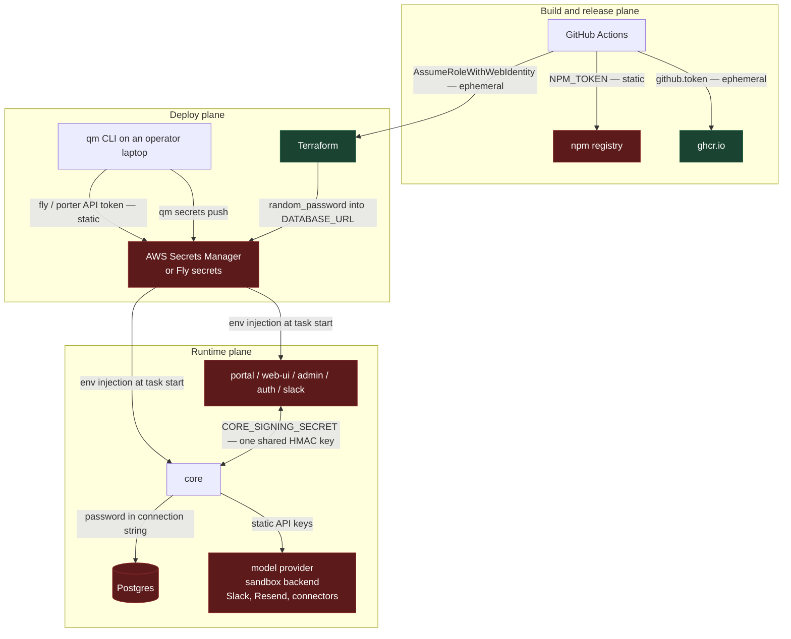
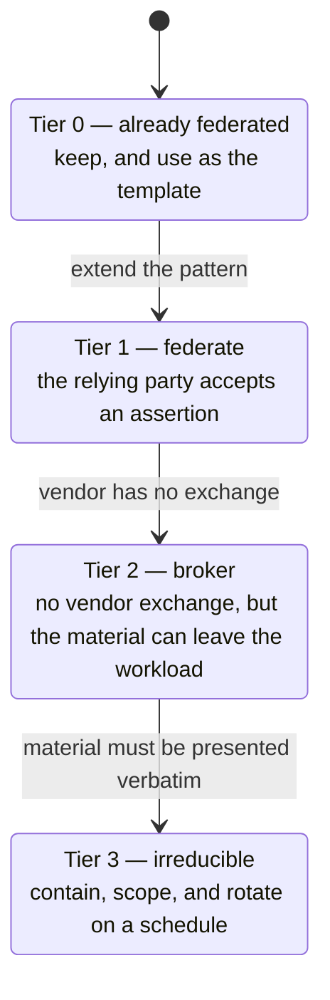
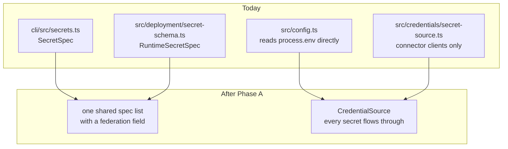
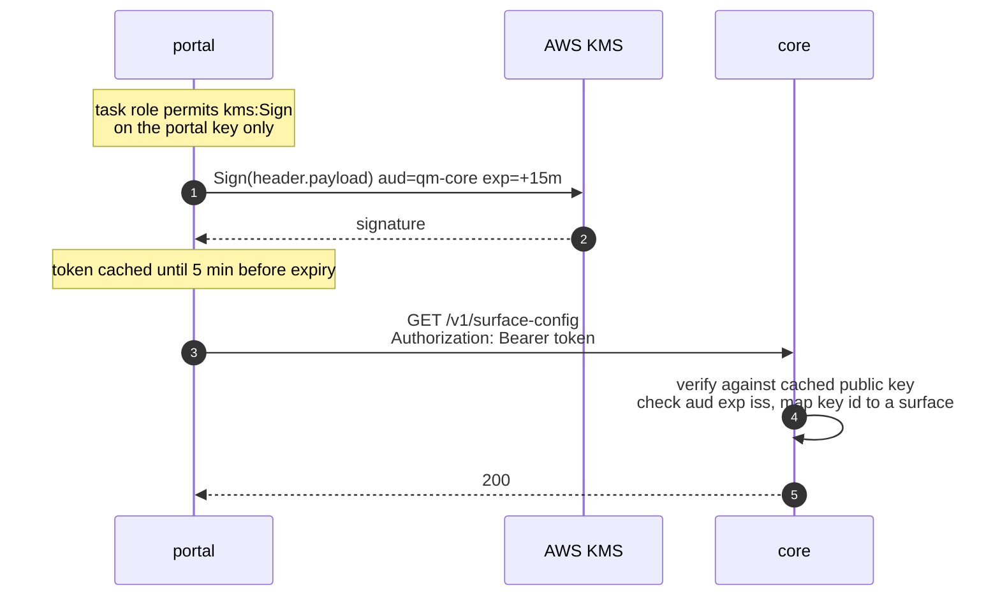
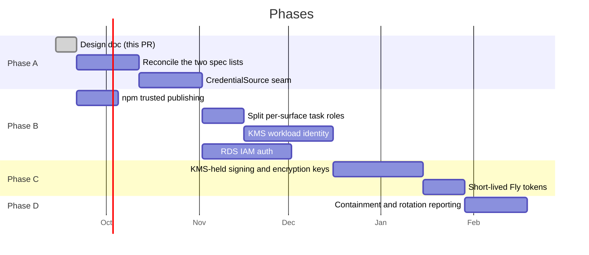

# Secretless QM

Replacing long-lived static secrets with federated, short-lived credentials.

This is the implementation plan: the full inventory, the mechanism analysis, and
the phasing. The proposal sent upstream is
[`adrs/secretless-credentials.md`](../adrs/secretless-credentials.md), which is
the same argument at proposal length. Keep the two in step when findings change.

## Context

QM deploys into an operator's own cloud account and runs as a small fleet of
services that talk to each other, to Postgres, to a model provider, and to a set
of third-party APIs. Almost all of that trust is carried by static secrets:
values minted once by a human, pasted into a gitignored `.env`, pushed into Fly
secrets or AWS Secrets Manager by `qm secrets push`, and then injected as process
environment for the life of the deployment.

The CLI declares 41 first-party secret names[^specs]. Nine of those are not
secret material at all — `PUBLIC_API_URL`, both CA certificates, `OIDC_CLIENT_ID`,
`PORTAL_EXPECTED_TEAM_ID`, `AUTH_ALLOWED_EMAILS`, `AUTH_EMAIL_FROM`, `SMTP_HOST`,
`SMTP_USERNAME` — leaving 32 real secrets. Five more live outside that list:
`FLY_SANDBOX_API_TOKEN`, `SECURITY_SCREEN_PROXY_TOKEN`, `NPM_TOKEN` in the
release workflow, and two that core requires but the CLI never declares —
`MODEL_GATEWAY_API_KEY`[^gateway] and `DEPLOY_APPS_SESSION_SECRET`[^deployapps].
None of them expire on their own. No rotation procedure exists beyond rerunning
`qm secrets push` with a human holding the value in a shell.

The deploy plane is already in better shape than the runtime plane. Deploying to
AWS from GitHub Actions uses `sts:AssumeRoleWithWebIdentity` against an
account-level GitHub OIDC provider, with audience and subject pinned and
wildcards rejected[^oidctrust]. Image pushes use the per-job `github.token`, and
images are signed keylessly with Fulcio and the same OIDC identity. That is the
pattern this document proposes extending.

A note on vocabulary. "OIDC" already appears throughout this codebase meaning
_human_ sign-in: the portal's relying-party configuration, the built-in `auth`
broker, `OIDC_CLIENT_ID`, `OIDC_CLIENT_SECRET`. This document uses **WIF**
(workload identity federation) for the machine-to-machine case to keep the two
apart. They share a protocol and share nothing else.

## Goals

- Eliminate every static secret that a supported identity provider can replace
  with a short-lived, audience-scoped, automatically-rotated credential.
- Shrink the operator's onboarding burden: fewer values to mint, paste, store,
  and rotate.
- Make the residual set explicit, small, and contained, rather than leaving it
  indistinguishable from the rest.
- Build one credential seam that every path flows through, so later work has a
  single place to change.

## Non-goals

- Rewriting how _user_ sign-in works. The portal, the `auth` broker, and
  connector OAuth stay as they are.
- Changing how credentials are materialized into agent sandboxes. That surface
  has its own acknowledged limitations[^security] and its own broker-delivery
  path, which this design reuses but does not redesign.
- Adding a new secrets-management product as a dependency. The design uses what
  each supported target already offers.
- Replacing secrets that no federation path exists for. Slack does not federate;
  neither does Anthropic's first-party API. Those are contained, not removed.

## Where the secrets are today



The two green nodes are reached with ephemeral, federated credentials. Every
other path rests on a value a human minted that does not expire.

### The service-to-service case is the worst of them

`CORE_SIGNING_SECRET` is a single symmetric HMAC key shared by core and _every_
surface plugin — `portal`, `web-ui`, `admin`, `auth`, `slack`, and any plugin the
deployment adds, since `computedSecrets` grants it to each plugin with
`coreAccess` left on[^computed]. The chassis reads it from process environment
and signs every core call with it[^chassis].

The consequences are structural, not hypothetical:

- Verification is symmetric, so any holder can forge any other holder's
  requests. A compromised `admin` container can sign as `portal`.
- The signature carries no caller identity[^sourceauth]. Core cannot tell which
  surface called it, only that _a_ holder did.
- Rotation is a fleet-wide atomic event. There is no overlap window, because
  there is one key and one value.

`PORTAL_IDENTITY_SECRET` looks like the same problem and is not quite. The
chassis will fall back to `CORE_SIGNING_SECRET` when it is unset, but that is a
development path only: core refuses to start in production if
`PORTAL_IDENTITY_SECRET` is unset or equal to either `CORE_SIGNING_SECRET` or
`CAPABILITY_SECRET`[^portalguard]. So it is a genuinely distinct key. It is still
symmetric and still shared across four services.

### Full inventory

Tiers are defined in the next section.

| Secret                                                                                   | Where it lives              | Today                                             | Tier |
| ---------------------------------------------------------------------------------------- | --------------------------- | ------------------------------------------------- | ---- |
| AWS deploy role                                                                          | `main.tf:311`               | GitHub OIDC, subject + audience pinned            | 0    |
| GHCR push                                                                                | `release-package.yml`       | `github.token`, per-job                           | 0    |
| Cosign signing key                                                                       | `release-package.yml`       | keyless, Fulcio + OIDC                            | 0    |
| `NPM_TOKEN`                                                                              | `publish-cli.yml:89`        | static automation token                           | 1    |
| `CORE_SIGNING_SECRET`                                                                    | core + every surface        | shared static HMAC                                | 1    |
| `DATABASE_URL`                                                                           | Terraform → Secrets Manager | `random_password`, no rotation path               | 1    |
| `PORTAL_IDENTITY_SECRET`                                                                 | core, portal, web-ui, admin | shared static HMAC                                | 2    |
| `CONNECTOR_SECRET_KEY`                                                                   | core                        | static encryption key                             | 2    |
| `AUTH_SIGNING_JWK`                                                                       | auth                        | static P-256 private key                          | 2    |
| `CAPABILITY_SECRET`                                                                      | core, egress-authz          | static HMAC                                       | 2    |
| `SKILL_SIGNING_SECRET`                                                                   | core                        | static HMAC                                       | 2    |
| `AUTH_TOKEN_SECRET`                                                                      | auth                        | static HMAC                                       | 2    |
| `PORTAL_SESSION_SECRET`                                                                  | portal                      | static cookie key                                 | 2    |
| `DEPLOY_APPS_SESSION_SECRET`                                                             | core                        | static cookie key, undeclared by the CLI          | 2    |
| `AWS_DEPLOY_GATE_SECRET`                                                                 | core                        | static HMAC                                       | 2    |
| `AUTH_CLIENT_SECRET`                                                                     | auth + portal               | CLI-generated shared secret                       | 2    |
| `FLY_DEPLOY_API_TOKEN`                                                                   | core                        | org token, minted at `-x 8760h`                   | 2    |
| `FLY_SANDBOX_API_TOKEN`                                                                  | core                        | app-scoped token, minted at `-x 8760h`            | 2    |
| `DATABASE_POOL_URL`                                                                      | operator-supplied           | must carry the same credentials as `DATABASE_URL` | 2    |
| `ANTHROPIC_API_KEY`                                                                      | core                        | static vendor key                                 | 3    |
| `OPENAI_API_KEY`, `OPENROUTER_API_KEY`                                                   | core                        | static vendor keys                                | 3    |
| `MODEL_GATEWAY_API_KEY`                                                                  | core                        | static bearer, undeclared by the CLI              | 3    |
| `SLACK_BOT_TOKEN`, `SLACK_APP_TOKEN`                                                     | slack                       | static, encrypted in the durable store            | 3    |
| `SLACK_SIGNING_SECRET`                                                                   | slack                       | static, env only — no stored path                 | 3    |
| `PORTER_DEPLOY_API_TOKEN`                                                                | core                        | Admin-role token                                  | 3    |
| `SPRITES_TOKEN`, `E2B_API_KEY`, `MODAL_TOKEN_*`, `SMOLMACHINES_TOKEN`, `AGENT37_API_KEY` | core                        | static vendor keys, dashboard-minted              | 3    |
| `SECURITY_SCREEN_PROXY_TOKEN`                                                            | core                        | static bearer to a third-party screen             | 3    |
| `RESEND_API_KEY`                                                                         | auth, core                  | static vendor key                                 | 3    |
| `SMTP_PASSWORD`                                                                          | auth                        | static relay credential                           | 3    |
| `GOOGLE_/DROPBOX_/LINEAR_OAUTH_CLIENT_SECRET`                                            | core                        | OAuth client secrets                              | 3    |
| `OIDC_CLIENT_SECRET`                                                                     | portal                      | external IdP client secret                        | 3    |

The Fly tokens are shown at `-x 8760h` because that is what the CLI's own
guidance mints[^flytokens]. A one-year token is static in every sense that
matters, but the expiry is a CLI-side parameter, which is what makes them
Tier 2 rather than Tier 3.

## The tiering



**Tier 1 — federate.** The relying party accepts a signed assertion in place of a
secret. The secret is deleted outright: no value exists to store, leak, or
rotate.

**Tier 2 — broker.** The vendor has no exchange, but the credential does not have
to live in the workload's environment. Either a KMS holds the key material and
the workload calls the KMS under its own platform identity, so the private key
never exists in a process, or the credential is minted short-lived and scoped
from a root held in exactly one place with an audit trail.

**Tier 3 — contain.** The credential must be presented verbatim to a vendor that
offers nothing better. Keep it out of process environment, deliver it through the
existing egress-proxy broker path where the consumer is an agent, scope it as
narrowly as the vendor allows, and give it a rotation schedule rather than an
expiry of never.

The success metric is the size of Tier 3 after the work, not the number of
mechanisms introduced.

## Proposed design

### Phase A: build the seam that does not exist yet

The most tempting framing of this work is that QM already has a chokepoint for
secrets and only needs to teach it federation. That framing is wrong, and the
plan depends on being honest about it.

There are three candidate chokepoints and none of them is universal:

| Candidate                                                  | Actual reach                                                                                                                                                                                                                                              |
| ---------------------------------------------------------- | --------------------------------------------------------------------------------------------------------------------------------------------------------------------------------------------------------------------------------------------------------- |
| `FIRST_PARTY_SECRET_SPECS` (`cli/src/secrets.ts:43`)       | Deploy-side only: renders `.env.example`, Terraform `secret_names`, and task secret routing. Nothing in `src/` imports it.                                                                                                                                |
| `CORE_SECRET_SPECS` (`src/deployment/secret-schema.ts:29`) | Boot-time validation only, and it is a _separate list with a separate type_. Nothing in `cli/` imports it.                                                                                                                                                |
| `SecretSource` (`src/credentials/secret-source.ts`)        | Connector OAuth clients only[^secretsource]. Core's own secrets never pass through it — `CORE_SIGNING_SECRET`, `CONNECTOR_SECRET_KEY`, `SKILL_SIGNING_SECRET`, `DATABASE_URL` and the model keys are read straight from `process.env` in `src/config.ts`. |

So the first phase is not a federation phase. It is reconciling two secret
declaration lists into one and widening `SecretSource` until core actually reads
its own secrets through it.



Only once that holds does the payoff sentence become true: marking a spec
federated removes it from `.env.example`, from Terraform's `secret_names`, from
`qm secrets push`, and from boot validation, in one edit.

The runtime interface gains expiry, which the existing one has no notion of:

```ts
export interface CredentialSource {
  get(name: string): Promise<{ value: string; expiresAt: number } | undefined>;
}
```

`createEnvSecretSource` and `createAwsSecretsManagerSource` become implementations
of it. The Secrets Manager source already caches with a 60-second TTL and
tolerates staleness for 15 minutes, so the caching shape federated credentials
need is already written.

### Phase B1: per-workload identity for service-to-service calls

Replace the shared HMAC with a per-workload signature that core verifies
asymmetrically. Two prerequisites, both real work, neither optional:

**Every surface needs its own role.** The reference module does not give each
service one. Core gets `core_task`; every other service shares a single `task`
role unless the deployment sets `taskRoleArn` or `assumeRoleArns`, which promotes
it to a per-service managed role[^taskroles]. With one shared role the caller
identity is identical for `admin` and `portal`, and the whole point is lost.
Splitting the role is step one of this phase.

**ECS has no OIDC issuer.** This is the constraint that shapes the design. AWS
STS _consumes_ a web identity token; it does not mint one, and AWS publishes no
JWKS for ECS task roles. Projected OIDC service-account tokens are a Kubernetes
feature (IRSA / EKS Pod Identity), not an ECS one. Any design that has a surface
"ask STS for a JWT" is describing something that does not exist.

Two mechanisms do exist. The recommendation is KMS.

| Mechanism                                | How it works                                                                                                                                                                                                  | Cost                                    | Notes                                                                                                         |
| ---------------------------------------- | ------------------------------------------------------------------------------------------------------------------------------------------------------------------------------------------------------------- | --------------------------------------- | ------------------------------------------------------------------------------------------------------------- |
| **KMS asymmetric signing** (recommended) | Each surface gets a KMS key whose key policy permits `kms:Sign` only from its own task role. The surface mints a short-lived JWT and signs it through KMS. Core verifies locally against a cached public key. | One KMS call per token, not per request | Works identically on any substrate with KMS reach. Public half is not secret and ships as config.             |
| **SigV4 + `sts:GetCallerIdentity`**      | The surface presents a pre-signed `GetCallerIdentity` request. Core replays it against STS, which returns the caller's role ARN.                                                                              | One STS call per verification           | The Vault `aws-iam` pattern. No new key infrastructure, but core takes an STS dependency on its request path. |



What this buys, beyond deleting a secret:

- Core learns _which_ surface is calling and can authorize per-surface. The
  `admin` container can no longer sign as `portal`.
- Credentials expire on their own. A leaked token is worth minutes.
- Rotation becomes a KMS key rotation, not a fleet-wide coordinated event.

`PORTAL_IDENTITY_SECRET` is a separate problem despite looking similar. It signs
a _user_ identity core must trust, not a service call, so it becomes an
asymmetric signature under the same mechanism: core signs with a KMS key and the
surfaces verify with the public half.

Not every target has KMS or a workload issuer. Local Docker does not, and whether
Fly's machine identity is verifiable per app is open question 2. The chassis
keeps the HMAC path for targets that lack one, selected by the `federation`
field, and that path remains the local-development path.

### Phase B2: RDS IAM authentication

`random_password.database` produces a 32-character password that Terraform writes
into state and into the `DATABASE_URL` secret[^dbpw]. Nothing in the repository
rotates it and no rotation procedure is documented, so in practice it is set once
at `terraform apply` and left.

With `iam_database_authentication_enabled` on the instance and an `rds-db:connect`
grant on core's task role, core generates a 15-minute auth token at connect time
from its own role. Three things this does **not** do, which matter for scoping:

- **It does not remove the master password.** RDS requires one at instance
  creation. What it removes is core's _use_ of it. Getting it out of Terraform
  state additionally requires `manage_master_user_password`, which relocates the
  value into an AWS-managed, auto-rotating Secrets Manager secret rather than
  deleting it.
- **It needs a bootstrap.** `GRANT rds_iam TO <user>` requires a prior
  password-authenticated session, and the module currently connects as the master
  user. The migration needs a separate application role.
- **It does not fix the pooled path.** `DATABASE_POOL_URL` points at PgBouncer,
  which authenticates to Postgres on the client's behalf. Worse,
  `pooledDatabaseUrl` hard-rejects a pooled URL whose username, password, or
  database differ from the direct one[^poolinvariant] — so "direct path goes IAM,
  pooled path stays password-based" is not currently expressible. That invariant
  has to change or the pooled path has to move with it.

The connection string also stops being a static string: the pool needs a password
callback invoked per connection, because tokens expire mid-pool-lifetime.

Separately, the generated URL carries `sslmode=no-verify`. That is worth fixing
on its own merits, and the supported fix already exists in `DATABASE_CA_CERT`,
which keeps verification on. It is not gated on this phase, and this phase should
not claim credit for it.

### Phase B3: npm trusted publishing

`publish-cli.yml` already passes `--provenance`, which uses the job's OIDC
identity to attest the build. It still authenticates with a static
`NODE_AUTH_TOKEN`. npm's trusted publishing accepts an OIDC identity for
_authentication_, which would drop the token.

One caveat specific to this repository: `publish-cli.yml` is a `workflow_call`
workflow invoked from `release.yml`. Trusted publishing matches on workflow
identity claims, and reusable-workflow support has been a moving target. Confirm
against current npm documentation before committing to this as the easy first
PR — if reusable workflows are not supported, the publish step has to be inlined
into the calling workflow first, which is a larger change than it looks.

### Phase C: KMS-held keys and brokered tokens

Eight secrets are keys that core or auth uses to sign or encrypt, where nothing
outside the deployment ever needs the key itself: `CONNECTOR_SECRET_KEY`,
`AUTH_SIGNING_JWK`, `CAPABILITY_SECRET`, `SKILL_SIGNING_SECRET`,
`AUTH_TOKEN_SECRET`, `PORTAL_SESSION_SECRET`, `DEPLOY_APPS_SESSION_SECRET`, and
`AWS_DEPLOY_GATE_SECRET`.

The key moves into KMS and the workload calls KMS under its task identity.
`CONNECTOR_SECRET_KEY` becomes envelope encryption: KMS holds the key encryption
key, each stored credential carries its own wrapped data key, and rotating the
KEK does not require rewriting every row. `AUTH_SIGNING_JWK` becomes a KMS
asymmetric key whose public half is published through the existing JWKS endpoint.
The HMAC keys become KMS `GenerateMac` / `VerifyMac`, or an asymmetric signature
where the verifier is a different workload.

For infrastructure tokens the picture is thinner than it first appears. Fly
genuinely supports scoped, time-boxed tokens — the CLI already mints app-scoped
deploy tokens, just with a one-year expiry — so shortening the lifetime and
minting per-deploy is available today. For Porter and the sandbox backends
(`SPRITES_TOKEN`, `E2B_API_KEY`, `MODAL_TOKEN_*`, `SMOLMACHINES_TOKEN`,
`AGENT37_API_KEY`) the repository records only dashboard or console key creation,
and nothing establishes that any of them offers sub-token minting. They are
Tier 3 until someone confirms otherwise, and confirming it is cheap research
worth doing before Phase C plans around them.

Where a vendor does support minting, the `AwsRoleBroker` already in the tree is
the right shape: it caches per-actor credentials, refreshes on a margin, and
constrains the session with an inline policy[^broker].

### Phase D: contain what remains

Tier 3 is the honest remainder: Slack, OAuth client secrets, vendor API keys, the
security-screen bearer, and the model gateway key. For these:

- Keep them in the durable connector store, entered through the admin UI and
  encrypted with the now-KMS-held key, rather than in process environment. The
  Slack **bot and app tokens** already work this way[^slackstore].
  `SLACK_SIGNING_SECRET` does not — it is read only from environment, and giving
  it a stored path is a small piece of real work, not a no-op.
- Where an agent is the consumer, prefer the keychain's `delivery: "broker"` mode
  so the egress proxy injects the credential and the sandbox never holds it.
- Declare `MODEL_GATEWAY_API_KEY` and `DEPLOY_APPS_SESSION_SECRET` in the CLI
  spec list. A secret core requires but the deployment tooling has never heard of
  cannot be validated, routed, or rotated.
- Give each a declared rotation interval that `qm doctor` reports on. A secret
  with a known age is materially better than one with no age at all.

### What about Bedrock and SES?

On AWS, Bedrock serves Anthropic models under IAM and SES sends mail under IAM,
both reachable from a task role with no key material. That is genuinely
attractive and it is genuinely not close. `MODEL_PROVIDERS` is
`["anthropic", "openai", "openrouter"]`[^providers] with no Bedrock
implementation anywhere in the tree, and the existing SES route is the SMTP
interface, which the CLI explicitly tells operators to configure with "the SMTP
credential, not an AWS access key"[^ses]. Each is a new provider or transport
implementation, not a configuration flag, and neither helps Fly or Porter
deployments. They are listed here as a deliberate deferral rather than a phase.

## Rollout

Each phase is independently shippable and independently revertable.



`NPM_TOKEN` is scheduled first because it is independent of the seam work, with
the caveat in Phase B3 understood as a real risk to that ordering.

Every phase that removes a secret ships with a dual-read window: the federated
path is attempted and the static value is accepted as a fallback. Removing the
fallback needs evidence that nothing is using it, and **that evidence does not
exist today** — `check --live` verifies running identity, rendered config,
health, and secret _routing_, not whether a given value was read[^checklive]. So
the dual-read window depends on instrumenting the fallback read path to report
when it fires. That instrumentation is part of Phase A, not an afterthought.

## Alternatives considered

**Leave it alone; rotate more often.** Rotation does not fix the symmetric-key
impersonation problem, and every rotation requires a human holding secret
material in a shell. The failure mode is that rotation quietly never happens,
which is the current state.

**Adopt HashiCorp Vault or a similar central secret manager.** A real option that
would work. Rejected as the primary mechanism because it adds an operational
dependency to every self-hosted deployment, and because the secret still exists —
Vault relocates it rather than deleting it. What AWS already offers (STS, KMS,
GitHub OIDC) covers Tier 1 and Tier 2 without new infrastructure. Vault remains a
reasonable operator choice behind the `CredentialSource` seam. Its `aws-iam` auth
method is also the source of the SigV4 alternative in Phase B1.

**SPIFFE/SPIRE for workload identity.** The right answer for a large
multi-cluster fleet, and heavy for a handful of services. Worth revisiting if QM
ever spans heterogeneous substrates in one deployment — but note that the usual
argument against it, that the platform already supplies identities, is weaker
here than it looks: ECS supplies a _credential_, not a verifiable assertion,
which is exactly why Phase B1 needs KMS.

**mTLS between core and surfaces.** Solves per-service identity, and trades the
key-rotation problem for a certificate-rotation problem. It also does not help
any other tier, whereas KMS signing in Phase B1 is the same mechanism Phase C
needs anyway.

## Risks

| Risk                                                                        | Mitigation                                                                                                       |
| --------------------------------------------------------------------------- | ---------------------------------------------------------------------------------------------------------------- |
| Phase A lands and the later phases do not, leaving refactor without benefit | Schedule `NPM_TOKEN` and RDS IAM independently of the seam so value lands either way                             |
| A federation path fails at boot and the deployment cannot start             | Dual-read window with the static value as fallback, plus the fallback instrumentation Phase A adds               |
| RDS IAM tokens expire mid-pool and connections fail                         | Password callback per connection, not per pool                                                                   |
| The pooled-path invariant blocks partial migration                          | Resolve open question 1 before starting Phase B2, not during                                                     |
| KMS becomes a hard dependency on core's request path                        | Sign short-lived tokens, not individual requests; verify locally against a cached public key                     |
| KMS call volume raises cost or hits throttling                              | Envelope encryption for data, cached MAC keys for signing; measure before Phase C                                |
| Targets without KMS or a workload issuer diverge from AWS                   | Keep the HMAC path as an explicit `federation` variant, exercised by the same tests                              |
| The work stalls halfway and the system carries both mechanisms forever      | Each phase deletes its secret from the spec list as its last step; a half-finished phase is visible in that list |

## Open questions

1. **The pooled-path invariant.** `pooledDatabaseUrl` requires `DATABASE_POOL_URL`
   to carry the same credentials as `DATABASE_URL`. Can PgBouncer use IAM tokens
   at all, and if not, does the invariant relax or does the pooled path get
   dropped? This gates Phase B2 and is the single most likely thing to change its
   shape.
2. **Fly workload identity.** Fly Machines expose a per-machine identity token.
   Is it verifiable by core in a way that distinguishes one app from another
   within the same organization? If yes, Phase B1 extends to Fly. If no, Fly
   stays on HMAC and the deployment references should say so plainly.
3. **Porter.** Porter deployments run on the operator's Kubernetes, which _does_
   have a projected-token OIDC issuer. That makes Porter potentially the easiest
   target for true WIF rather than the hardest — worth checking early, because it
   would change the recommended mechanism ordering.
4. **`AUTH_CLIENT_SECRET`.** The CLI generates it for both sides of a loopback
   between two services we control. Is a client secret needed at all once both
   `auth` and `portal` have verifiable identities?
5. **Sandbox vendor tokens.** Do any of Porter, Sprites, E2B, Modal,
   smolmachines, or Agent37 support scoped sub-token minting? Cheap to answer and
   it decides whether five secrets are Tier 2 or Tier 3.
6. **Local development.** The `.env` path must keep working with no cloud
   identity. The assumption is that `federation` degrades to the env source in
   development; confirm against the `dev-instance` flow before Phase A2.
7. **Existing deployments.** Migrating a live deployment to IAM auth changes an
   RDS instance attribute, a task role, and the bootstrap user. What does the
   operator-facing migration look like, and is it safe during a blue-green roll?

## References

[^specs]: `cli/src/secrets.ts:43` — `FIRST_PARTY_SECRET_SPECS`, the typed schema from which `.env.example`, Terraform `secret_names`, and per-task secret routing are derived. Deploy-side only; nothing under `src/` imports it.

[^gateway]: `src/config.ts:934` — `${name} is required when model gateway routing is configured`, used as `apiKey` at `:951`. Not declared in `cli/src/secrets.ts`.

[^deployapps]: `src/config.ts:609` — a cookie-signing secret that falls back to `PORTAL_SESSION_SECRET`. Not declared in `cli/src/secrets.ts`.

[^oidctrust]: `cli/src/backends/aws.ts:2973` — `assertGithubDeployTrust` requires exactly one trust statement, `sts:AssumeRoleWithWebIdentity` only, a pinned `sts.amazonaws.com` audience, and subjects without wildcards. The role itself is `cli/templates/aws/main.tf:311`.

[^computed]: `cli/src/secrets.ts:559` — every plugin with `coreAccess !== false` is added to `CORE_SIGNING_SECRET`'s service list.

[^chassis]: `plugins/chassis/src/env.ts:5` reads the value; the signing itself is `plugins/chassis/src/source-auth-sign.ts` and `plugins/chassis/src/core-client.ts`.

[^sourceauth]: `src/auth/source-auth.ts:36` — `verifySignature` checks signature, timestamp freshness, and replay only. No caller identity is carried or checked.

[^portalguard]: `src/api/server.ts:536` — under `production`, core throws if `PORTAL_IDENTITY_SECRET` or `CAPABILITY_SECRET` is unset, equals `CORE_SIGNING_SECRET`, or equals the other.

[^security]: [`SECURITY.md`](../SECURITY.md) — "Sandbox credentials are plaintext while in use", and the operator assumptions around credential materialization.

[^flytokens]: `cli/src/secrets.ts:119` (`fly tokens create org -o <fly-org> -x 8760h`) and `cli/src/preflight.ts:96` (`fly tokens create deploy -a <app> -x 8760h`).

[^secretsource]: `src/wiring.ts:999` builds the source and passes it only to `createConnectorClientResolver`. Other importers are `src/connectors/oauth.ts:457`, `src/connectors/connector-client-store.ts:127`, `src/credentials/connector-token.ts:16`, `src/api/routes/connectors.ts:48`. Core's own secrets are read from `process.env` in `src/config.ts` — `:1209` `DATABASE_URL`, `:1320` `CORE_SIGNING_SECRET`, `:1328` `CONNECTOR_SECRET_KEY`, `:1339` `SKILL_SIGNING_SECRET`.

[^taskroles]: `cli/templates/aws/main.tf:193` is the shared default task role and `:199` is core's; `:224` defines per-service `assume_role_task` roles, and `:26` (`effective_task_role_arns`) is the coalesce that falls back to the shared role. `manage_task_role` defaults to false (`cli/templates/aws/variables.tf:139`) and is set only for a non-core service with `assumeRoleArns` (`cli/src/terraform.ts:180`).

[^dbpw]: `cli/templates/aws/main.tf:580` generates the password; `:617` sets it on the instance; `:778` writes it into the `DATABASE_URL` secret with `sslmode=no-verify`.

[^poolinvariant]: `src/persistence/pg-pool.ts:85` — `DATABASE_POOL_URL must preserve the DATABASE_URL database and credentials`.

[^broker]: `src/auth/aws-role-broker.ts:46` — per-actor `AssumeRole` with an inline session policy, a 5-minute refresh margin, and a cache keyed by session name.

[^slackstore]: `src/surfaces/slack-installation.ts:2` imports `encryptSecret`/`deriveConnectorKey`; `createSlackInstallationStore` (`:59`) stores `botTokenEnc` and `appTokenEnc`. `SLACK_SIGNING_SECRET` is read only from environment (`src/slack/config.ts:48`).

[^providers]: `cli/src/config.ts:116` — `MODEL_PROVIDERS = ["anthropic", "openai", "openrouter"]`.

[^ses]: `cli/src/commands/setup.ts:92` — "for SES, the SMTP credential, not an AWS access key".

[^checklive]: `cli/src/cli.ts:137` describes `--live` as "verify running identity, rendered config, and health"; the implementation emits `fly.live-readiness` / `<target>.live-drift` clauses and throws for unsupported targets at `:334`.
